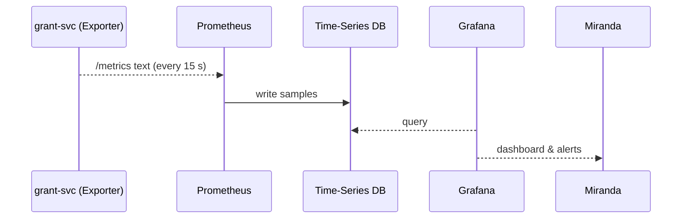
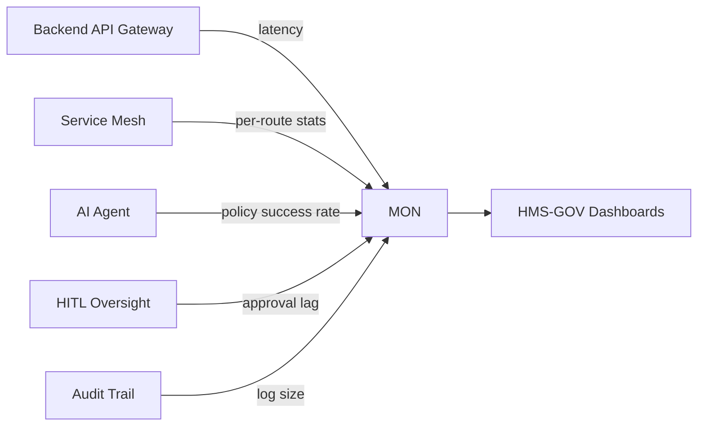

# Chapter 12: Metrics & Monitoring Pipeline  
*(Follow-up to [Data Governance & Audit Trail](11_data_governance___audit_trail_.md))*  

---

## 1. Why Do We Need a “Fitness Tracker” for Government Apps?

Meet **Miranda**, an ops lead at the **Energy Information Administration (EIA)**.  
Yesterday the AI agent (see [HMS-A2A](04_ai_representative_agent__hms_a2a__.md)) suggested a tweak that halves the “Energy-Grant” form steps. Minutes after going live:

* Phone-bank hold time **jumped** from 2 → 9 minutes.  
* API latency for `grant-svc` **spiked** to 4 seconds.  

Without instant feedback Miranda would notice only when citizens flood social media.  
**Metrics & Monitoring Pipeline (HMS-MON)** is the *fitness tracker* that tells her—in real time—whether an AI or human change is helping or hurting.

---

## 2. Key Concepts in Plain English

| Word | Everyday Analogy | What It Means Here |
|------|------------------|--------------------|
| Metric | Heart-rate number | Single value like `api_latency_ms` |
| Dimension / Label | Treadmill speed | Extra context (`endpoint="/pay"`, `agency="EIA"`) |
| Exporter | Fitness watch | Library/sidecar that collects & exposes numbers |
| Collector (Prometheus) | Smartphone app | Scrapes exporters, stores time-series |
| Dashboard (Grafana / Kibana) | Health chart | Visualises latency, throughput, satisfaction |
| Alert | Doctor’s pager | Triggers when a metric crosses a limit |
| SLO (Service Level Objective) | Fitness goal | e.g., 95 % of requests under 500 ms |

---

## 3. 4-Minute Hands-On: Watch Latency in Real Time

### 3.1 Spin Up the Demo Stack

```bash
git clone https://github.com/hms-sme/examples.git
cd examples/metrics-demo
docker compose up   # starts prometheus + grafana + demo-svc
```

Stack components (all auto-wired):

* `demo-svc` – tiny Express API with metrics exporter  
* `prometheus` – scrapes `demo-svc:9102/metrics` every 15 s  
* `grafana` – pre-loaded dashboard at http://localhost:3000  

### 3.2 Hit the Endpoint

```bash
curl http://localhost:7000/pay   # triggers some work
```

Refresh the *“Demo Service”* Grafana board → you’ll see:

* `request_duration_ms` rising with each call.  
* Throughput (`requests_total`) bumping up.  

Congratulations—your government API now wears a heart-rate monitor!

---

## 4. Adding Metrics to Your Own Service (≤ 18 Lines)

```ts
// services/grant-svc/src/metrics.ts
import client from 'prom-client';

export const httpDur = new client.Histogram({
  name: 'http_request_duration_ms',
  help: 'How long each API call takes',
  labelNames: ['route','status'],
  buckets: [50, 100, 250, 500, 1000, 5000]
});

// expose /metrics
export function registerMetrics(app){
  app.get('/metrics', async (_, res)=>{
     res.set('Content-Type', client.register.contentType);
     res.end(await client.register.metrics());
  });
}
```

Explanation for beginners:  

1. `Histogram` groups durations into helpful buckets (50 ms, 100 ms …).  
2. `labelNames` add context (route & HTTP status).  
3. Route `/metrics` outputs plain text for Prometheus to scrape—no DB needed in your service.

Hook it up in your main server:

```ts
import express from 'express';
import { httpDur, registerMetrics } from './metrics';
const app = express();

app.use(async (req,res,next)=>{
  const end = httpDur.startTimer({route:req.path});
  res.on('finish', ()=> end({status:res.statusCode}));
  next();
});

registerMetrics(app);
app.listen(7000);
```

---

## 5. When Things Go Wrong: Auto-Alerts in 6 Lines

```yaml
# alert.rules.yml
groups:
- name: latency
  rules:
  - alert: HighLatency
    expr: histogram_quantile(0.95,
          sum(rate(http_request_duration_ms_bucket[5m])) by (le))
          > 0.8
    for: 2m
    labels: {severity: "critical", agency: "EIA"}
    annotations:
      summary: "95th-percentile latency > 800 ms for 2 min"
```

Load into Prometheus (`docker exec -it prometheus kill -HUP 1`) and connect an e-mail/slack webhook. Now Miranda gets pinged **before** Twitter explodes.

---

## 6. What Actually Happens? (Step-By-Step)



No exporters talk to Grafana directly; Prometheus is the single source of truth.

---

## 7. Under-the-Hood Code Peeks (≤ 15 Lines Each)

### 7.1 Simple Exporter Text (What Prometheus Reads)

```
# HELP http_request_duration_ms How long each call takes
# TYPE http_request_duration_ms histogram
http_request_duration_ms_bucket{le="50",route="/pay",status="200"} 14
http_request_duration_ms_bucket{le="100",route="/pay",status="200"} 27
…
```

Each line = time-series point. Human-readable & diff-friendly for audits.

### 7.2 Collector Scrape Loop (Go Pseudo-Code)

```go
for _, tgt := range cfg.ScrapeTargets {
   resp, _ := http.Get(tgt + "/metrics")
   samples := parse(resp.Body)
   db.Append(samples)
   time.Sleep(15 * time.Second)
}
```

No networking magic—plain HTTP GET every interval.

---

## 8. How HMS-MON Connects to Other Chapters



* Numbers feed **dashboards** inside the [Gov / Admin Portal](01_gov___admin_portal__hms_gov__.md).  
* The **AI Agent** uses live metrics to decide whether its last recommendation was good—closing the loop.  
* Every alert fires an event that is itself written to the [Audit Trail](11_data_governance___audit_trail_.md) for historical evidence.

---

## 9. Typical Beginner Questions

| Question | Quick Answer |
|----------|--------------|
| Do I need Prometheus *and* Grafana? | Prometheus stores the data, Grafana draws the pretty charts. Use both. |
| How do I track “citizen satisfaction”? | In surveys/apps log a `satisfaction_score` (1-5) metric; Grafana can average it. |
| Can exporters push instead of being scraped? | Yes—use the Prometheus **Pushgateway** for short-lived jobs (batch scripts). |
| Will metrics slow my API? | Exporter call adds ~0.2 µs. Negligible compared to DB or network time. |
| Where are metrics stored? | Default demo uses local disk; production points Prometheus to an S3-backed **remote-write** store. |

---

## 10. Recap & Next Steps

You now know how to:

• Instrument a service with **three lines** of histogram code.  
• Launch a full **Prometheus + Grafana** stack in one command.  
• Set an alert so AI or human changes can’t silently ruin citizen experience.  
• See how metrics weave through every HMS-SME layer.

Next we’ll explore how different states & data formats get normalised before entering or leaving the platform in the [Domain Adapter Layer](13_domain_adapter_layer_.md).

---

Generated by [AI Codebase Knowledge Builder](https://github.com/The-Pocket/Tutorial-Codebase-Knowledge)