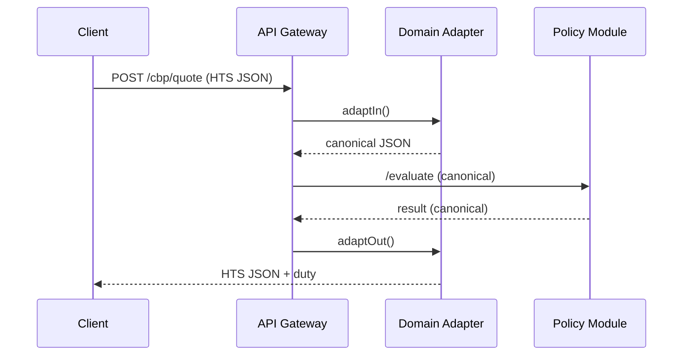
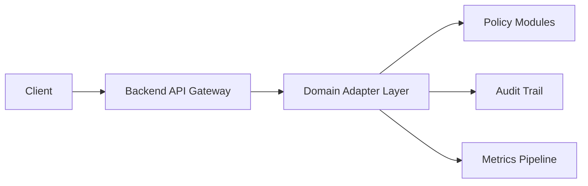

# Chapter 13: Domain Adapter Layer  

*(A gentle sequel to [Metrics & Monitoring Pipeline](12_metrics___monitoring_pipeline_.md))*  

---

## 1. Why Do We Need “Translation Booths” Inside HMS-SME?

Meet **Officer Gianna**, a customs inspector at **U.S. Customs and Border Protection (CBP)**.

* CBP’s *tariff-code* world speaks **“HTS-2023-6-digit codes”** (`020130` = Bovine meat).  
* The core HMS-SME rule engine (see [Policy & Process Modules](07_policy___process_modules__hms_svc__.md)) speaks **plain JSON fields** (`commodity="beef"`).  
* An incoming container manifest must be evaluated for *duties* **before** the ship docks.

If every micro-service learned *every* domain vocabulary…

```
→ Huge code duplication
→ Impossible upgrades when a domain standard changes
```

**Domain Adapter Layer (DAL)** is the **pair of comfy “noise-cancelling headsets”** that let:

* Core plumbing talk in **simple, canonical JSON**.  
* Each agency keep its **native jargon** (tariff codes, ICD-10, maritime chart IDs…).  

Result: rapid development **without** wrecking decades of legacy knowledge.

---

## 2. Key Concepts (Plain English)

| Concept | Beginner Analogy | One-Sentence Meaning |
|---------|------------------|----------------------|
| Canonical Model | Esperanto | Small, platform-wide JSON spec (`commodity`, `weightKg`, …) |
| Domain Vocabulary | Local dialect | Agency-specific codes (HTS, ICD-10, NOAA chart #) |
| Adapter | Live translator | Code that converts **to / from** the canonical model |
| Mapping Table | Bilingual dictionary | CSV/JSON that pairs `020130` ↔ `beef` |
| Validation Plug-in | Spell-checker | Ensures incoming domain data is legal before translating |

---

## 3. A 6-Minute End-to-End Demo

### 3.1 Use-Case: Calculate Import Duty for a Beef Container  

Goal: POST a **tariff-code** manifest and get a duty quote **without** teaching the core service tariff codes.

### 3.2 Create a Mapping Table (10 lines)

```csv
# hts_map.csv
hts_code,commodity,duty_rate
020130,beef,0.044
160100,sausage,0.062
040310,yogurt,0.017
```

### 3.3 Define an Adapter (TypeScript ≤ 18 lines)

```ts
// adapters/cbp.hts.adapter.ts
import { defineAdapter } from '@hms-sme/dal';

export default defineAdapter({
  id: 'cbp.hts.v1',
  domain: 'HTS-2023',
  toCanonical: rec => ({
    commodity: rec.hts_code,          // temp placeholder
    weightKg:  rec.weight_kg
  }),
  fromCanonical: res => ({
    hts_code: res.commodity,
    estimatedDutyUSD: res.dutyUSD
  }),
  validate: rec => /^[0-9]{6}$/.test(rec.hts_code)
});
```

Explanation  
1. `toCanonical` maps **incoming** HTS fields to the canonical schema.  
2. `fromCanonical` maps **outgoing** results back to HTS-flavoured JSON.  
3. `validate` guarantees the HTS code looks sane (6 digits).

### 3.4 Register the Adapter (1 CLI line)

```bash
hms-dal deploy adapters/cbp.hts.adapter.ts --map hts_map.csv
```

The CLI:

* Stores the adapter in **DAL Registry**.  
* Uploads `hts_map.csv` for look-ups.  
* Emits an audit event to [Data Governance & Audit Trail](11_data_governance___audit_trail_.md).

### 3.5 Call the Public API

```bash
curl -X POST https://localhost:8443/api/cbp/quote \
  -H "Content-Type: application/json" \
  -d '{"hts_code":"020130","weight_kg":1000}'
```

Response:

```json
{
  "hts_code": "020130",
  "estimatedDutyUSD": 44.0
}
```

What happened behind the curtain? See §5!

---

## 4. Using DAL in Your Own Service (≤ 15 lines)

```ts
// services/duty-quote.ts
import { adaptIn, adaptOut, lookup } from '@hms-sme/dal';

router.post('/quote', async (req, res) => {
  const canon = await adaptIn('cbp.hts.v1', req.body);   // 1
  const row   = await lookup('hts_map.csv', canon.commodity); // 2
  const duty  = row.duty_rate * canon.weightKg;          // 3
  const out   = await adaptOut('cbp.hts.v1',              // 4
                    {...canon, dutyUSD: duty});
  res.json(out);
});
```

Line-by-line  

1. **Translate IN** – HTS → canonical JSON.  
2. **Find duty rate** in mapping table.  
3. Multiply by weight.  
4. **Translate OUT** – canonical JSON → HTS view.

No tariff logic pollutes the core service!

---

## 5. What Actually Happens? (Step-By-Step)



Pieces you already know:  
* Gateway = door ([Backend API Gateway](08_backend_api_gateway_.md))  
* SVC = rule brick ([Policy & Process Modules](07_policy___process_modules__hms_svc__.md))  
* DAL sits *between* them, invisible to both.

---

## 6. Internal Implementation Peek

### 6.1 Adapter Interface (TypeScript ≤ 14 lines)

```ts
// dal/Adapter.ts
export interface Adapter {
  id: string;
  domain: string;
  toCanonical(rec: any): any;
  fromCanonical(res: any): any;
  validate?(rec: any): boolean;
}
```

### 6.2 Minimal Adapt-In Logic (≤ 18 lines)

```ts
// dal/runtime/inbound.ts
export async function adaptIn(id: string, rec: any){
  const adp = registry.get(id);
  if (!adp) throw 'Adapter missing';
  if (adp.validate && !adp.validate(rec)) throw 'Domain record invalid';
  const canon = adp.toCanonical(rec);
  canon.domain = adp.domain;
  return canon;
}
```

### 6.3 Registry (Go pseudo-code, ≤ 15 lines)

```go
var store = map[string]Adapter{}

func Register(a Adapter) { store[a.Id] = a }

func Get(id string) Adapter {
   return store[id]
}
```

Adapters are **hot-reloaded**; no service restart required.

---

## 7. Validating & Versioning Adapters

* **Version suffix** (`v1`, `v2`) follows the same pattern you used in [Policy Modules](07_policy___process_modules__hms_svc__.md).  
* Deprecated adapters live side-by-side until all clients migrate.  
* Validation failures are routed to [Human-in-the-Loop Oversight](05_human_in_the_loop_oversight__hitl__.md) before data is rejected.

---

## 8. Frequently Asked (Beginner) Questions

| Question | Quick Answer |
|----------|--------------|
| Can one adapter call another? | Yes, but keep chains short to avoid debugging nightmares. |
| Where do mapping tables live? | In an S3 bucket with **version tags**; DAL caches locally for <30 s. |
| How big can a mapping table be? | Tested to 1 M rows. Use **binary search index** generated on upload. |
| What if the domain standard changes? | Publish a new adapter `cbp.hts.v2`, pin old clients to `v1`. |
| Does DAL slow the request? | Typical in-memory lookup ≤0.3 ms. Negligible vs network. |

---

## 9. Where Domain Adapter Layer Sits in the Big Picture



* DAL emits every conversion as a metric (`adapt_latency_ms`) to [Metrics & Monitoring Pipeline](12_metrics___monitoring_pipeline_.md) and as an event to the [Audit Trail](11_data_governance___audit_trail_.md).  
* No upstream or downstream service ever needs to know HTS vs ICD-10 again.

---

## 10. Recap & Next Steps  

You learned:

• **Why** translation booths prevent a Tower-of-Babel codebase.  
• **How** to create an adapter in 18 lines, register it, and call it.  
• **What** happens internally—sequence diagram + tiny runtime.  

Up next we’ll see how HMS-SME shakes hands with **external** legacy systems to pull or push data, now that we have neat translation booths in place.  
👉 Continue to [External System Connector & Sync](14_external_system_connector___sync_.md)

---

Generated by [AI Codebase Knowledge Builder](https://github.com/The-Pocket/Tutorial-Codebase-Knowledge)