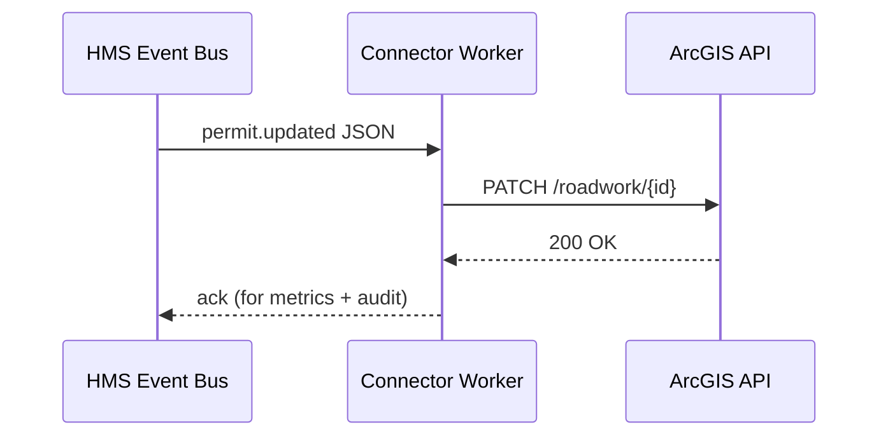
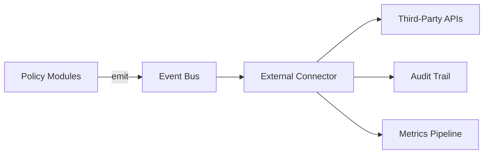

# Chapter 14: External System Connector & Sync  
*(Sequel to [Domain Adapter Layer](13_domain_adapter_layer_.md))*  

---

## 1. Why Do We Need a “Universal Power-Adapter”?

Imagine **Rosa**, a transportation engineer at **Washington D.C.’s Department of Transportation (DDOT)**.  
She relies on three outside tools:

1. A **GIS map** (ArcGIS Online) that shows every active road-work permit.  
2. A **scheduling suite** (Google Calendar) that crews follow.  
3. A **payment rail** (Stripe) that collects special-lane fees.

Yesterday a supervisor used the HMS-GOV portal to:

```text
• Approve Permit #RW-481 → start date moved from May 12 to May 10
```

If the GIS map, crew calendar, and Stripe invoice don’t update **within seconds**, crews arrive on the wrong day and citizens get surprised tolls.

**External System Connector & Sync (HMS-SYNC)** is the *universal power-adapter* that keeps every third-party tool **in perfect lock-step** with changes inside HMS-SME.  
Think of it as a set of smart electrical outlets—plug any outside gadget in, and it instantly speaks the platform’s language.

---

## 2. Key Concepts (Plain English)

| Word | Friendly Analogy | What It Means Here |
|------|------------------|--------------------|
| Event | Phone notification | “Permit #RW-481 updated” |
| Connector | Outlet plug | Small worker that translates an event to a 3rd-party API call |
| Sync Direction | One-way vs two-way street | `outbound` (HMS ➜ external) or `inbound` (external ➜ HMS) |
| Mapping | Address book | Rules that pair HMS fields with external ones |
| Delivery Guarantee | Certified mail | At-least-once send with retry & back-off |

---

## 3. The 5-Minute “Hello-GIS” Walk-through

We’ll push the permit update to ArcGIS in real time.

### 3.1 Declare a Connector (18 lines)

```yaml
# connectors/gis-ddot.yaml
id: ddot.gis.outbound.v1
type: outbound
trigger: 
  topic: permit.updated           # HMS event bus
  filter: object.agency == "DDOT"
map:
  from: canonical                 # see Chapter 13
  to: 
    url: "https://services.arcgis.com/item/roadwork/{permitId}"
    method: PATCH
    headers: { "Authorization": "Bearer ${ARC_TOKEN}" }
    body:
      start_date: "{{ startDate }}"        # template vars
      end_date:   "{{ endDate }}"
      status:     "{{ status }}"
retry:
  max: 5
  backoffMs: 3000
```

Beginner notes  
1. `trigger` → listen to the **internal event bus**.  
2. `map` → simple Mustache templates turn HMS JSON into ArcGIS JSON.  
3. `retry` → built-in reliability.

### 3.2 Register & Start

```bash
hms-sync deploy connectors/gis-ddot.yaml
hms-sync up            # runs on http://localhost:7500
```

### 3.3 Simulate a Permit Update

```bash
# pretend service emits an event
hms-bus publish permit.updated \
  --data '{"permitId":"RW-481","agency":"DDOT","startDate":"2024-05-10","status":"APPROVED"}'
```

Console output from HMS-SYNC:

```
[ddot.gis.outbound.v1] PATCH https://services.arcgis.com/… 200 OK
```

ArcGIS map refreshes—Rosa celebrates. 🥳

---

## 4. Anatomy of a Sync (Step-By-Step)



Only **three hops**; latency is typically < 2 s.

---

## 5. Using Connectors in Your Code (≤ 12 Lines)

Want to send **payment-due** events to Stripe?

```ts
import { emit } from '@hms-sme/bus';

export async function chargePermit(id: string, amount: number){
  // 1. Core logic – create fee object
  await db.fees.insert({id, amount, status:'PENDING'});
  // 2. Fire event; connector handles Stripe
  await emit('fee.created', {id, amount});
}
```

No Stripe SDK in your service—connector does it later.

---

## 6. Internal Implementation Peek

### 6.1 Tiny Worker Loop (Node.js, 18 lines)

```ts
// worker/run.ts
import bus   from '@hms-sme/bus';
import queue from './retryQueue';
import { render } from 'mustache';

export function start(conn){               // conn = parsed YAML
  bus.subscribe(conn.trigger.topic, async ev => {
    if (!match(ev, conn.trigger.filter)) return;
    const body = JSON.parse(render(JSON.stringify(conn.map.body), ev));
    try{
      await fetch(render(conn.map.to.url, ev), {
          method: conn.map.to.method,
          headers: conn.map.to.headers,
          body: JSON.stringify(body)
      });
      metrics.ok.inc();                    // success counter
    }catch(e){
      queue.push({conn, ev, tries:0});     // handle retries
    }
  });
}
```

### 6.2 Exponential Retry (Go pseudo-code, 14 lines)

```go
func process(msg Message){
  if msg.Tries >= conn.Retry.Max { logFail(msg); return }
  err := doHttp(msg)
  if err != nil {
      msg.Tries++
      delay := backoff(msg.Tries, conn.Retry.BackoffMs)
      time.AfterFunc(delay, func(){ process(msg) })
  }
}
```

Both snippets ignore logging/metrics details for brevity.

---

## 7. Safety & Governance Hooks

| Guardrail | Where Implemented | Related Chapter |
|-----------|------------------|------------------|
| AuthN/AuthZ to external APIs | Connector YAML (`headers`) + HMS-SYS Auth service tokens | [Role & Identity Management](10_role___identity_management__hms_sys_auth__.md) |
| Schema check before send | Auto-generated JSON Schema from mapping | [Domain Adapter Layer](13_domain_adapter_layer_.md) |
| Tamper-evident log | Each send writes an `external.sync` event to the ledger | [Data Governance & Audit Trail](11_data_governance___audit_trail_.md) |
| Latency / failure metrics | `sync_latency_ms`, `sync_fail_total` | [Metrics & Monitoring Pipeline](12_metrics___monitoring_pipeline_.md) |
| Human override on repeated failure | Auto-enqueue to HITL after 5 fails | [Human-in-the-Loop Oversight](05_human_in_the_loop_oversight__hitl__.md) |

---

## 8. Common Beginner Questions

**Q:** *Do I write custom code for every SaaS?*  
**A:** Often **no**—most SaaS needs only a YAML connector using HTTP + templates.

**Q:** *How do I sync *into* HMS (two-way)?*  
Add `type: inbound` and point `source.webhookUrl` to the external system; HMS-SYNC will verify the signature and publish an event inside.

**Q:** *What if ArcGIS is down?*  
Connector retries with exponential back-off; after `max` attempts it parks the job and alerts reviewers.

**Q:** *Can I test connectors offline?*  
Yes: `hms-sync test connectors/gis-ddot.yaml < sample_event.json>` prints the outgoing HTTP request without sending it.

---

## 9. Where HMS-SYNC Sits in the Ecosystem



The **Domain Adapter Layer** already normalized data; HMS-SYNC just forwards it to the rest of the world.

---

## 10. Recap & What’s Next

Today you:

• Saw why synchronising **external** tools prevents real-world chaos.  
• Deployed a GIS connector in under 20 lines of YAML.  
• Learned the event-to-HTTP flow and retry safety nets.  
• Noted how HMS-SYNC plugs into Auth, Audit, Metrics, and HITL.

Behind the scenes a **coordinator** keeps hundreds of connectors flowing in the right order, handling dependencies and rollbacks.  
That conductor is the focus of the next chapter:  
👉 [Synchronization Orchestrator](15_synchronization_orchestrator_.md)

---

Generated by [AI Codebase Knowledge Builder](https://github.com/The-Pocket/Tutorial-Codebase-Knowledge)