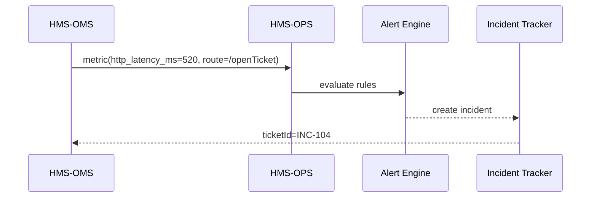

# Chapter 15: Operations & Observability Suite (HMS-OPS)

*(Just finished wiring old mainframes with the [External System Sync Adapter](14_external_system_sync_adapter_.md)?  
Great! Now let’s **watch the whole constellation** of services, agents, and adapters in a single “Mission-Control” view.)*

---

## 1. Why Do We Need HMS-OPS?

### A 60-Second Story

1. The **Delta Regional Authority (DRA)** launches a job-training portal.  
2. Within an hour, citizens report time-outs.  
3. DevOps opens HMS-OPS and instantly sees:  
   * Latency spike in the **Agent Framework** pod.  
   * A red alert from **HMS-SYNC**: payroll mainframe unreachable.  
   * Error traces pointing to one bad ENV variable.

One click rolls back the deployment, outages vanish, and the post-mortem is auto-filed for auditors.

Without HMS-OPS, DRA staff would juggle six dashboards and still guess which micro-service broke. **OPS unifies logs, metrics, and alerts across the entire HMS-SME stack—like NORAD tracking every blip in U.S. airspace.**

---

## 2. Key Concepts (Plain English)

| Air-Traffic Analogy | HMS-OPS Term | Why Beginners Care |
|---------------------|--------------|--------------------|
| Radar Screen        | **Live Dashboard** | Uptime & latency charts for every service. |
| Flight Plan         | **Service Manifest** | Declares what “good” looks like (SLA, error budget). |
| Red Blip            | **Alert** | When reality violates the manifest. |
| Black Box Recorder  | **Trace** | Step-by-step path of one request. |
| Tower Log           | **Incident Timeline** | Immutable record of alerts, actions, resolution. |

You can be productive with just **Live Dashboard** + **Alert**; the rest are free perks.

---

## 3. Hands-On: Find & Fix a Latency Spike in < 30 Lines

> Goal: Detect a slow endpoint in **HMS-OMS** and open a ticket for the on-call engineer.

### 3.1 Emit a Custom Metric (Service Side)

```ts
// oms/metrics.ts  (≤15 lines)
import { record } from "hms-ops-sdk";

export async function time<T>(label:string, fn:()=>Promise<T>){
  const start = Date.now();
  const result = await fn();
  record({
    service: "HMS-OMS",
    metric:  "http_latency_ms",
    value:   Date.now() - start,
    tags:    { route: label }
  });
  return result;
}
```

Beginners’ takeaway: wrap any async call with `time()`—OPS now sees every latency.

---

### 3.2 Watch a Live Chart

```ts
// ops_watch.ts   (≤12 lines)
import { chart } from "hms-ops-sdk";

chart({
  service: "HMS-OMS",
  metric:  "http_latency_ms",
  groupBy: "route",
  rollup:  "p95",          // 95th percentile
  span:    "10m"
});
```

Running the script opens a browser tab showing a real-time line chart.  
If the **/openTicket** route suddenly crosses 400 ms (our SLA), OPS will fire an alert.

---

### 3.3 Alert & Auto-Ticket

```ts
// alert.yml  (≤18 lines)
alert:
  name: "OMS latency breach"
  if:   "http_latency_ms{route='/openTicket',p95}>400"
  for:  "2m"                # sustain 2 minutes
  then:
    - notify: "oncall@dra.gov"
    - createTicket:
        workflow: "Incident"
        payload:
          severity: "major"
          symptom:  "High latency /openTicket"
```

Upload this YAML via the OPS UI → alerts become live in seconds.

---

## 4. What Happens Behind the Scenes?



Four actors, four hops—no manual wiring.

---

## 5. Peeking Inside OPS (Tiny Code)

### 5.1 Metric Ingest (Python, 14 Lines)

```py
# ops/ingest.py
def push(metric):
    key = (metric["service"], metric["metric"])
    bucket = STORE.setdefault(key, [])
    bucket.append((now(), metric["value"], metric.get("tags", {})))
```

A dict of lists—simple enough for beginners.

---

### 5.2 Alert Evaluator (TypeScript, 18 Lines)

```ts
// ops/alert.ts
export function evaluate(rule, samples){
  const window = samples.filter(s => s.ts > Date.now() - 120_000);
  const p95 = percentile(window.map(s=>s.value), 95);
  return eval(rule.if.replace("p95", p95.toString()));
}
```

Replace `{p95}` with real numbers, `eval()` the boolean, fire actions if true.

---

## 6. How OPS Talks to Everyone Else

| Neighbor Module | What OPS Watches |
|-----------------|------------------|
| [HMS-ACT](07_action_orchestration_service__hms_act__.md) | Job queue depth, SLA timer breaches. |
| [HMS-AGT/AGX](05_agent_framework__hms_agt_agx__.md) | Agent error counts, CPU, memory. |
| [HMS-A2A](13_inter_agency_exchange_protocol__hms_a2a__.md) | Envelope latency, key-rotation failures. |
| [HMS-SYNC](14_external_system_sync_adapter_.md) | Connector retries, replay log growth. |
| [HMS-ACH](10_financial_clearinghouse__hms_ach__.md) | Settlement success-rate, fraud rule hits. |

All services just import `hms-ops-sdk` and call `record()`—OPS does the heavy lifting.

---

## 7. Mini-FAQ

**Q: Do I need Prometheus or Grafana knowledge?**  
A: No. OPS bundles Prometheus-compatible scraping **and** a built-in Grafana UI—zero config.

**Q: Can citizens see any of this?**  
A: Only uptime summaries (e.g., “Portal 99.98 % available last 30 days”). Sensitive traces stay internal.

**Q: What about security events?**  
A: OPS treats them as metrics `type=security_event`; you can alert on “>5 failed logins/min”.

**Q: How noisy are alerts?**  
A: Built-in *alert fatigue* guard: mute identical alerts after N repeats/hr.

---

## 8. Recap & Next Steps

In this final chapter you:

• Learned why **HMS-OPS** is the **NORAD** of the HMS-SME ecosystem.  
• Instrumented latency metrics in **two tiny functions**, visualized a live chart, and auto-opened an incident ticket—all under 30 lines of code.  
• Peeked inside the metric store and alert evaluator.  
• Saw how OPS keeps every module—from payments to mainframes—operating smoothly and transparently.

### Where to Go From Here

Congratulations—you’ve toured every major subsystem of HMS-SME!  
Revisit any chapter via the [Table of Contents](../README.md) or start building your own extensions, confident that **HMS-OPS** will keep watch as you innovate.

*Happy shipping, and may your dashboards stay green!*

---

Generated by [AI Codebase Knowledge Builder](https://github.com/The-Pocket/Tutorial-Codebase-Knowledge)