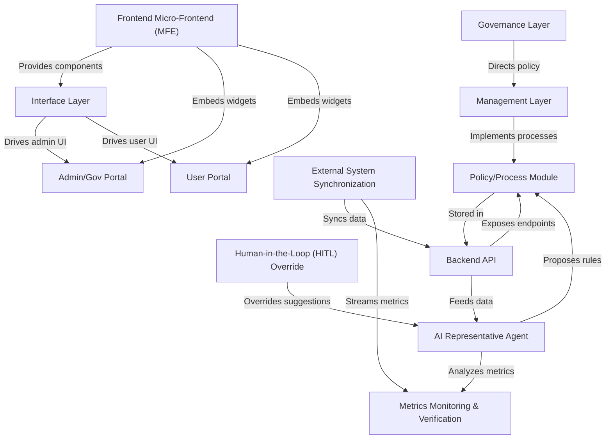

# Tutorial: HMS-SME

**HMS-SME** is a *subject matter expert management* platform that integrates AI and human workflows for streamlined policy creation, citizen services, and agency operations. It **combines governance rules**, **AI-driven proposals**, and **human oversight** to help governments manage programs and processes efficiently. The system offers **modular APIs** and **micro-frontend components** for building rich *user* and *admin* portals, while ensuring compliance, transparency, and real-time synchronization with external services.

**Source Repository:** [None](None)

## Chapters

1. [Governance Layer
](01_governance_layer_.md)
2. [Management Layer
](02_management_layer_.md)
3. [Policy/Process Module
](03_policy_process_module_.md)
4. [AI Representative Agent
](04_ai_representative_agent_.md)
5. [Human-in-the-Loop (HITL) Override
](05_human_in_the_loop__hitl__override_.md)
6. [Metrics Monitoring & Verification
](06_metrics_monitoring___verification_.md)
7. [Backend API
](07_backend_api_.md)
8. [External System Synchronization
](08_external_system_synchronization_.md)
9. [Interface Layer
](09_interface_layer_.md)
10. [Frontend Micro‐Frontend (MFE)
](10_frontend_micro_frontend__mfe__.md)
11. [Admin/Gov Portal
](11_admin_gov_portal_.md)
12. [User Portal
](12_user_portal_.md)

---

Generated by [AI Codebase Knowledge Builder](https://github.com/The-Pocket/Tutorial-Codebase-Knowledge)