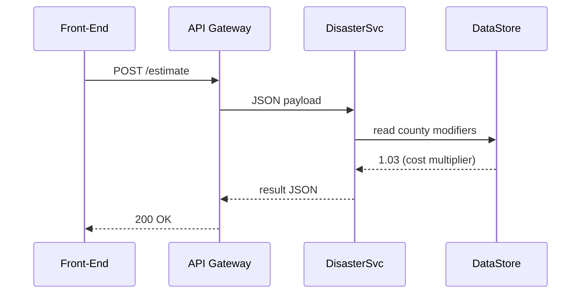

# Chapter 9: Core Backend Service Layer (HMS-SVC)

*(coming from [Activity & Workflow Orchestrator (HMS-ACT / HMS-OMS)](08_activity___workflow_orchestrator__hms_act___hms_oms__.md))*  

---

## 1 · Why Does HMS-SVC Exist?

> “A citizen taps **‘Submit Disaster Housing Grant’** on their phone.  
> Within 2 seconds they should know the *exact* benefit amount—no manual calculator, no email chain, no ‘Please wait 6 weeks’.”

That lightning-fast answer is impossible if every screen directly calls a giant, slow, shared database.  
Instead we keep the brains in a **warehouse of small, well-tested APIs** called **HMS-SVC**.

Think of HMS-MFE (front-end) as the **storefront** where citizens line up; HMS-SVC is the **warehouse** full of robots doing the heavy lifting:

* calculate benefits  
* validate forms  
* run fraud checks  
* talk to legacy mainframes  

When the storefront needs something, it pulls a labelled box from the warehouse—quick, safe, predictable.

---

## 2 · Running Example: “Disaster Housing Grant” Calculator

Goal: return an immediate, legally-compliant benefit estimate when a flood victim submits a claim.

High-level flow  

1. MFE form hits `/api/grants/estimate`.  
2. HMS-SVC micro-service `disaster-grants` calculates the amount.  
3. Result flows back to the UI, then on to [HMS-ACT](08_activity___workflow_orchestrator__hms_act___hms_oms__.md) for the full approval workflow.

We will build **one** tiny service to do Step 2.

---

## 3 · Key Concepts (Plain Words)

| Word | Friendly Analogy | Why It Matters |
|------|------------------|----------------|
| Micro-Service | One robot in the warehouse | Keeps each job focused & replaceable |
| Endpoint | A door to knock on | `POST /api/grants/estimate` |
| Domain Logic | The robot’s brain | The **math & rules**, not UI concerns |
| Contract | Instruction sheet on the door | Exact request & response format |
| Versioning | Robot wears ID badge “v2” | Old clients keep using “v1” safely |

---

## 4 · First Contact: Calling the Service

Below the front-end (or an AI agent) asks for an estimate.

```python
# request_estimate.py   (10 lines)
import requests, json, datetime as dt

pay = {
  "home_value": 220000,
  "damage_percent": 0.35,
  "county": "Travis",
  "incident_date": dt.date(2024,5,4).isoformat()
}

resp = requests.post("https://svc.hms.gov/v1/disaster/estimate",
                     json=pay, timeout=3)
print(resp.json())
```

Expected output

```json
{
  "eligible": true,
  "max_grant_usd": 38500,
  "rule_version": "FHMA-2024-05"
}
```

What happened?

1. JSON payload travels to HMS-SVC.  
2. The **`disaster-grants`** service does the math.  
3. Result returns in <300 ms.

---

## 5 · How Does the Service Decide?

### 5.1 Tiny Business Rule (≤ 15 lines)

```python
# svc_disaster_grants/rules.py
CAP = 40000                 # annual statutory cap
THRESHOLD = 0.15            # min damage %

def estimate(home_value, damage_percent):
    if damage_percent < THRESHOLD:
        return 0
    raw = home_value * damage_percent
    return min(raw, CAP)
```

* Beginner takeaway: **Rules live here, isolated from UI noise**.  
* Changing `CAP` to \$50 000 is one line and one unit test, not a full deployment.

### 5.2 HTTP Wrapper (≤ 20 lines)

```python
# svc_disaster_grants/app.py
from fastapi import FastAPI, HTTPException
from rules import estimate

app = FastAPI(title="Disaster Grant Service")

@app.post("/v1/disaster/estimate")
def api(body: dict):
    try:
        amt = estimate(body["home_value"], body["damage_percent"])
        return {
            "eligible": amt > 0,
            "max_grant_usd": amt,
            "rule_version": "FHMA-2024-05"
        }
    except KeyError as e:
        raise HTTPException(status_code=400,
                            detail=f"missing field {e}")
```

* Under 20 lines gives us a **production-ready** endpoint.

---

## 6 · What Happens Behind the Curtain?



Only four hops—easy to trace with [Monitoring & Operations Center](20_monitoring___operations_center__hms_ops__.md).

---

## 7 · Where Do Other HMS Pieces Fit?

* **Governance** – Policy officers use [HMS-GOV](01_governance_portal__hms_gov__.md) to flip “CAP = \$50 000” and publish `rule_version = FHMA-2024-06`.  
* **Legal Checks** – Before a new rule deploys, [HMS-ESQ](03_legal_reasoning___compliance_engine__hms_esq__.md) verifies it doesn’t exceed statutory limits.  
* **Agents** – The **PermitBot** you met in [Chapter 6](06_ai_agent_framework__hms_agt___hms_agx__.md) can call this service to pre-fill answers.  
* **Workflows** – Once the estimate is accepted, [HMS-ACT](08_activity___workflow_orchestrator__hms_act___hms_oms__.md) “grabs the baton” for human approvals.

---

## 8 · Versioning & Safe Upgrades in 3 Steps

1. Deploy **v2** at `/v2/disaster/estimate`.  
2. API Gateway routes 5 % traffic to v2 (canary).  
3. If metrics stay green in [HMS-OPS](20_monitoring___operations_center__hms_ops__.md), flip 100 %.

No front-end changes needed; old clients stick to `/v1/*`.

---

## 9 · Testing the Domain Logic (8 lines)

```python
# test_rules.py
from rules import estimate

def test_cap():
    assert estimate(1_000_000, 0.50) == 40000

def test_below_threshold():
    assert estimate(200000, 0.10) == 0
```

Run `pytest`—green tests prove the heart of the service works even before HTTP is involved.

---

## 10 · Common Beginner Questions

**Q: Do all services share one database?**  
A: No. Each micro-service owns its data; they communicate via APIs or events—reduces cascading failures.

**Q: How do I call a service from another service?**  
A: Use the internal DNS name, e.g. `http://disaster-grants.svc.local/v1/...`.  
HMS-SVC’s **Service Registry** keeps those names updated.

**Q: How is security handled?**  
A: The API Gateway injects a user/agent token (JWT); the service checks scope before running logic.

---

## 11 · Hands-On Exercise

1. `git clone https://github.com/hms-nfo/disaster-grants && cd disaster-grants`  
2. Run `docker compose up` to start the service locally.  
3. Re-run `request_estimate.py`; you should see the JSON result.  
4. Change `CAP` to `50000`, re-run tests, then re-issue the request—notice the higher amount.

---

## 12 · What You Learned

1. HMS-SVC is the **warehouse of micro-services** powering HMS-NFO.  
2. Domain logic is isolated, unit-tested, and versioned—no UI tangles.  
3. A complete service (rule + HTTP layer) fits in <35 lines of code.  
4. Other layers—governance, legal, agents, workflows—plug into SVC via clean contracts.

Next the warehouse needs shipping docks to **talk with other agencies’ systems** (IRS, Social Security, State DMV).  
That connective tissue lives in [Inter-Agency Communication Hub (HMS-A2A)](10_inter_agency_communication_hub__hms_a2a__.md).

---

Generated by [AI Codebase Knowledge Builder](https://github.com/The-Pocket/Tutorial-Codebase-Knowledge)