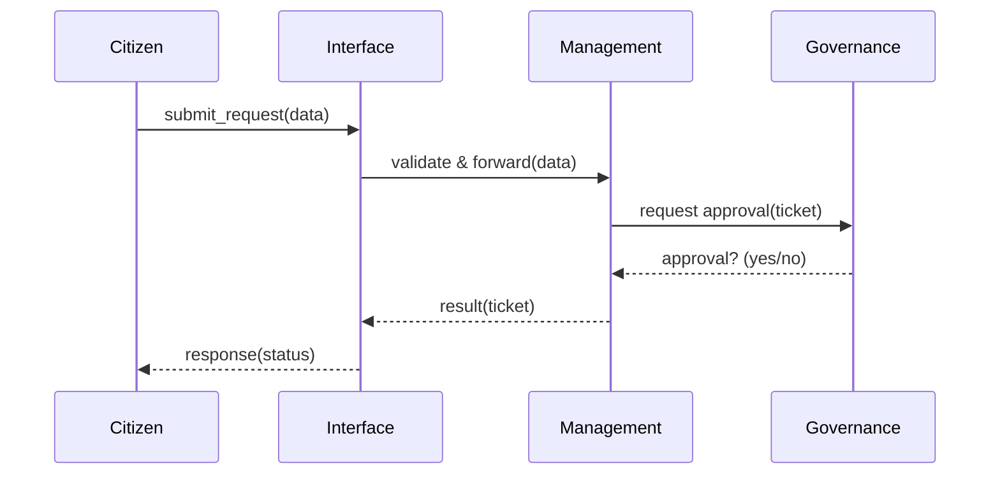
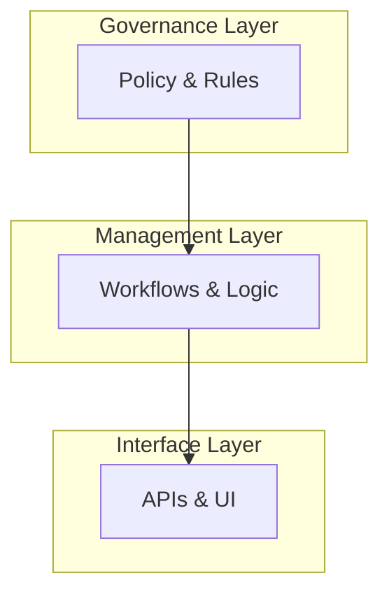

# Chapter 1: Hierarchical Architecture

Welcome to HMS-UHC! In this chapter, we introduce the **Hierarchical Architecture**—a three-layered design that keeps complex government software organized, much like a federal agency’s organizational chart.

---

## Why a Hierarchy?

Imagine you’re building an app for processing citizen grant applications across agencies (like the NTIA or EOIR). You need:

1. **Clear policies** (“Who approves this grant?”)  
2. **Reliable operations** (“How do we track an application?”)  
3. **Friendly interfaces** (“How does a user check status?”)  

The Hierarchical Architecture splits responsibility into:

- **Governance Layer**: policy and rules  
- **Management Layer**: business logic and workflows  
- **Interface Layer**: APIs and UIs for citizens

This separation helps teams work independently and scales as your system grows.

---

## Key Concepts

1. **Governance Layer**  
   - Defines policies, roles, permissions  
   - Example: “Only supervisors can finalize a grant”  
   - See [Governance Layer](02_governance_layer_.md)

2. **Management Layer**  
   - Executes workflows according to policies  
   - Example: “Start application → validate data → route for review”  
   - See [Management Layer](04_management_layer_.md)

3. **Interface Layer**  
   - Exposes endpoints and UIs for users  
   - Example: “/submit-application” REST API or web form  
   - See [Interface Layer](07_interface_layer_.md)

---

## Solving Our Use Case

Let’s walk through a simple example: a citizen submits a “Spectrum Use” request to the NTIA.  

1. **Citizen** calls `submit_request()`.  
2. **Interface Layer** validates input and forwards to Management.  
3. **Management Layer** applies the workflow (e.g., check documents, queue for review).  
4. **Governance Layer** enforces that only certified staff can approve.  

### Code Snippet: High-Level Flow

```rust
// File: src/hierarchy.rs
struct Hierarchy {
    governance: Governance,
    management: Management,
    interface: Interface,
}

impl Hierarchy {
    fn submit_request(&self, req: Request) -> Response {
        // 1. Interface validates
        let valid = self.interface.validate(&req);
        if !valid { return Response::error("Invalid"); }

        // 2. Management processes
        let ticket = self.management.process(&req);

        // 3. Governance checks approval
        if !self.governance.can_approve(&ticket) {
            return Response::pending("Awaiting approval");
        }
        Response::ok("Submitted successfully")
    }
}
```
> This code shows how a request flows top-to-bottom, enforcing checks at each layer.

---

## Inside the Layers: Step-by-Step

Here’s what happens when `submit_request` is called:  



1. **Interface** parses and sanitizes input.  
2. **Management** drives the business workflow.  
3. **Governance** enforces policy decisions.  
4. **Interface** sends final response back to the citizen.

---

## Under the Hood: Simplified Implementation

### File References
- **src/interfaces.rs**  
- **src/management.rs**  
- **src/governance.rs**  

#### src/interfaces.rs
```rust
pub struct Interface;
impl Interface {
    pub fn validate(&self, req: &Request) -> bool {
        // e.g. check required fields, schema, etc.
        !req.data.is_empty()
    }
}
```
> The Interface layer ensures only well-formed requests proceed.

#### src/management.rs
```rust
pub struct Management;
impl Management {
    pub fn process(&self, req: &Request) -> Ticket {
        // e.g. assign ID, save to queue, etc.
        Ticket { id: 42, approved: false }
    }
}
```
> Management creates a work ticket and tracks status.

#### src/governance.rs
```rust
pub struct Governance;
impl Governance {
    pub fn can_approve(&self, ticket: &Ticket) -> bool {
        // e.g. check user role, policy rules, etc.
        ticket.id % 2 == 0
    }
}
```
> Governance consults policy rules to allow or defer approval.

---

## Visualizing the Layers



- **Top (G)**: sets rules  
- **Middle (M)**: runs processes  
- **Bottom (I)**: interacts with users  

---

## Conclusion

You’ve learned how **Hierarchical Architecture** breaks a complex government system into three clear layers. This design keeps policies safe at the top, workflows solid in the middle, and user interactions friendly at the bottom.

Next, we'll dive deeper into the policies themselves.  
[Chapter 2: Governance Layer](02_governance_layer_.md)

---

Generated by [AI Codebase Knowledge Builder](https://github.com/The-Pocket/Tutorial-Codebase-Knowledge)