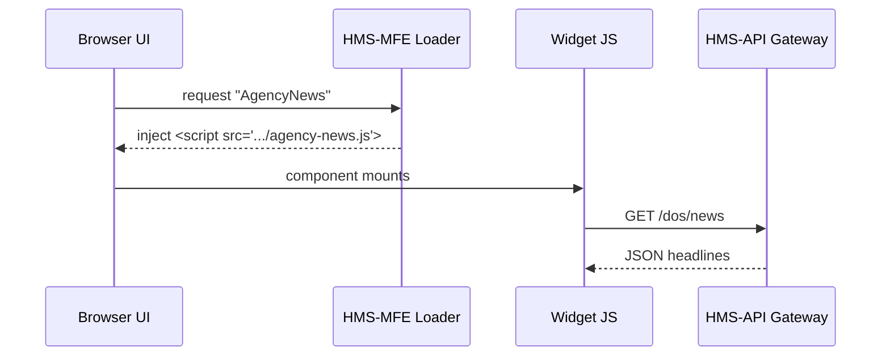

# Chapter 1: Interface Layer (HMS-MFE, sector portals)

> “The front door of government should feel as easy as ordering a pizza online.”  
> — Every frustrated citizen, ever

---

## 1. Why an Interface Layer?

Imagine Maya, a small-business owner in Iowa, who needs:

1. A Rural Development **loan** to expand her farm store.  
2. A quick way to **pay quarterly taxes**.  
3. Updated **health guidelines** for her employees.

Today she would visit three completely different government websites, learn three sign-in systems, and re-enter the same data again and again. The **Interface Layer** fixes this by becoming a *single, friendly storefront*—one site, many services.

---

## 2. What exactly is HMS-MFE?

HMS-MFE (Health-Management System – **Micro-Frontend Engine**) is our toolbox for building that storefront. It lets us snap together tiny, self-contained UI pieces (widgets) like LEGO bricks:

• A “Pay My Taxes” widget  
• A “Loan Status Tracker” widget  
• A “Vaccination Record” widget  

Each widget is built and deployed by its own team but still looks and feels native thanks to shared design rules from the Governance Layer (covered later in [Governance Layer (HMS-GOV)](04_governance_layer__hms_gov__.md)).

---

## 3. Key Concepts, One by One

| Term | Plain-English meaning |
|------|----------------------|
| **Sector portal** | A themed page (Health, Finance, Education) made of widgets. |
| **Widget** | A mini-app that focuses on one task (e.g., “Check Passport Status”). |
| **Micro-frontend** | Technical term for loading many widgets in one page. |
| **Governance style guide** | The “visual law” that keeps every widget consistent. |
| **API consumer** | Code inside a widget that pulls data from back-end services. |

---

## 4. Building Your First Widget

Let’s build the simplest possible “Agency News” widget that fetches headlines from the U.S. Department of State.

### 4.1 Skeleton File

`/widgets/agency-news/index.js`

```js
import { useEffect, useState } from "react";

export default function AgencyNews() {
  const [news, setNews] = useState([]);

  useEffect(() => {
    fetch("/api/dos/news")        // <— 1. call backend gateway
      .then(r => r.json())        // <— 2. parse JSON
      .then(setNews)              // <— 3. store in state
      .catch(console.error);      // <— 4. basic error log
  }, []);

  return (
    <ul>
      {news.map(item => <li key={item.id}>{item.title}</li>)}
    </ul>
  );
}
```

**What happened above?**

1. When the widget mounts, it calls an API route (`/api/dos/news`).  
2. The result is saved into state.  
3. React re-renders the list automatically.  

### 4.2 Registering the Widget

In HMS-MFE, widgets self-register so a portal can discover them.

`/widgets/agency-news/manifest.json`

```json
{
  "name": "AgencyNews",
  "description": "Latest headlines from State Department",
  "route": "/health/news",
  "permissions": ["public"]
}
```

Now any sector portal that includes this manifest can lazy-load the widget.

---

## 5. Gluing Widgets into a Sector Portal

A sector portal is just a page that **requests** a set of manifests and renders them in slots.

```js
// /portals/foreign-affairs/page.js
import loadWidget from "hms-mfe-core";

export default function ForeignAffairsPortal() {
  return (
    <>
      <h1>Foreign Affairs Services</h1>
      {loadWidget("AgencyNews")}
      {loadWidget("PassportStatus")}      // another widget
    </>
  );
}
```

Both widgets follow the same design tokens (colors, fonts) dictated by governance, so they look coherent.

---

## 6. What Happens Under the Hood?

Below is a condensed, non-code walkthrough for **loadWidget("AgencyNews")**:



1. The loader fetches the widget bundle on demand.  
2. The widget requests data through the unified [Backend API Gateway (HMS-API)](12_backend_api_gateway__hms_api__.md).  

---

## 7. Internal Implementation Peek

HMS-MFE keeps a *widget registry* so portals can stay light:

```js
// hms-mfe-core/registry.js
const cache = {};

export async function loadWidget(name) {
  if (cache[name]) return cache[name];

  // 1. fetch manifest
  const manifest = await fetch(`/manifests/${name}.json`).then(r => r.json());

  // 2. dynamic import
  const module = await import(manifest.entry);

  // 3. remember & return component
  return (cache[name] = module.default);
}
```

Explanation:

• **cache** prevents double downloads.  
• **dynamic import** lets each widget ship independently.  
• This file is tiny on purpose so new devs can read it in minutes.

---

## 8. Testing the Widget Locally

```bash
# 1. run dev server
npm run portal:dev

# 2. open browser
http://localhost:3000/foreign-affairs
```

Expected result: A page that shows “Foreign Affairs Services” with a bullet list of State Department headlines.

---

## 9. Common Pitfalls & Tips

1. **CORS errors**  
   Always call back-end routes via the API Gateway instead of raw federal URLs.

2. **Inconsistent styles**  
   Import `@hms/design-system` tokens at the top of every widget.

3. **Widget size**  
   Keep each bundle under 100 KB for fast mobile loading.

---

## 10. Where to Next?

You now know how to:

• Understand what the Interface Layer is.  
• Build and register a micro-frontend widget.  
• Assemble widgets into a sector portal.  

In the next chapter, we’ll see how users *find* these widgets using keywords like “renew passport” or “apply for loan” rather than clicking through menus. That’s the power of [Intent-Driven Navigation](02_intent_driven_navigation_.md).

---

### Quick Recap

The Interface Layer is the **smiling clerk at the front desk**. Thanks to HMS-MFE, that clerk can:

• Wear many hats (health, finance, education)  
• Speak one design language  
• Call the same back-end logic underneath  

Master this layer, and adding new public-facing features becomes as simple as dropping a LEGO brick onto the page.

Ready to guide users effortlessly? Jump to [Intent-Driven Navigation](02_intent_driven_navigation_.md)!

---

Generated by [AI Codebase Knowledge Builder](https://github.com/The-Pocket/Tutorial-Codebase-Knowledge)