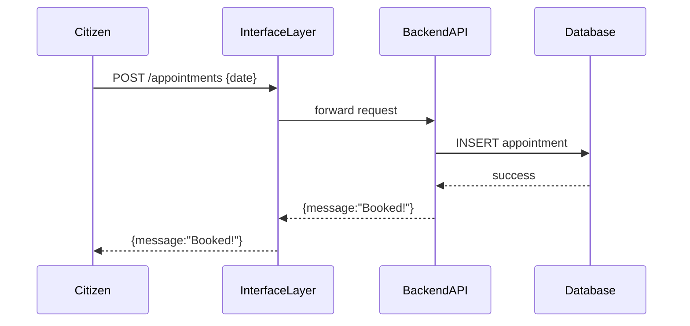
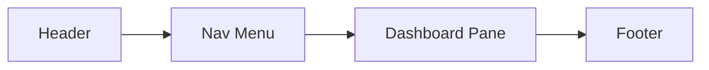

# Chapter 1: Interface Layer

Welcome to the first chapter of **HMS-UHC**! In this chapter, we’ll explore the **Interface Layer**, the “front door” of our platform. Think of it as the public town hall where citizens, administrators, and decision-makers come together to interact with services.

---

## 1. Why Do We Need an Interface Layer?

Imagine you’re a citizen wanting to book a vaccination appointment online. You go to a clean, simple portal—fill in a few fields, click a button, and you’re done. Behind the scenes, dozens of systems, checks, and data flows fire off, but you never see that complexity. That’s exactly what the **Interface Layer** solves:

- It provides user-friendly **portals and dashboards** for different audiences (patients, managers, policy makers).
- It hides backend details and enforces a consistent **look & feel** with shared UI components.
- It routes requests from browsers or mobile apps to the correct backend service.

In a healthcare setting:
- The **HMS-MFE patient portal** could power appointment booking.
- The **HMS-GOV portal** might let agency managers review policy proposals.

---

## 2. Key Concepts

1. **Portals & Dashboards**  
   - Single entry points (web pages or apps) for each user group.  
   - Examples: patient portal, admin dashboard, policy review interface.

2. **Shared UI Components**  
   - Buttons, forms, and navigation menus used across portals to keep branding and interactions consistent.

3. **Request Routing**  
   - A lightweight server or gateway that forwards user actions (e.g., “book appointment”) to backend APIs.

---

## 3. Using the Interface Layer: A Simple Booking Example

### 3.1. Frontend Snippet (React-style)

```jsx
// File: BookAppointment.jsx
import React, { useState } from 'react';
import api from './api'; // simple fetch wrapper

export default function BookAppointment() {
  const [date, setDate] = useState('');
  const [status, setStatus] = useState('');

  async function handleSubmit(e) {
    e.preventDefault();
    const result = await api.post('/appointments', { date });
    setStatus(result.message);
  }

  return (
    <form onSubmit={handleSubmit}>
      <label>Choose Date:</label>
      <input type="date" value={date} onChange={e => setDate(e.target.value)} />
      <button type="submit">Book Appointment</button>
      <p>{status}</p>
    </form>
  );
}
```

Explanation:  
- User picks a date and clicks **Book Appointment**.  
- The component calls our Interface Layer’s `/appointments` endpoint.  
- The response message is shown to the user.

---

## 4. What Happens Under the Hood?

### 4.1 Sequence Diagram



### 4.2 Step-by-Step Walkthrough

1. **User action**: Citizen submits the booking form.  
2. **Interface Layer**: Receives request at `/appointments`.  
3. **Route forwarding**: Sends the payload to the correct backend service (e.g., `HMS-SVC`).  
4. **Backend processing**: Service writes to the database.  
5. **Response**: Travels back up and is shown to the user.

---

## 5. Inside the Interface Layer Code

Here’s a minimal Node.js Express example that forwards appointment requests:

```js
// File: interface-layer/server.js
const express = require('express');
const fetch = require('node-fetch');
const app = express();
app.use(express.json());

// Route: Book appointment
app.post('/appointments', async (req, res) => {
  // Forward to backend service
  const resp = await fetch('http://hms-svc/appointments', {
    method: 'POST',
    body: JSON.stringify(req.body),
    headers: {'Content-Type':'application/json'}
  });
  const data = await resp.json();
  res.json(data);
});

// Start server
app.listen(3000, () => console.log('Interface Layer up on 3000'));
```

Explanation:  
- We listen on port **3000**.  
- When `/appointments` is hit, we forward that JSON to the backend.  
- The backend’s response is passed right back to the user.

---

## 6. Shared UI Component Illustration



- **Header**: Agency logo, user info.  
- **Nav Menu**: Links to “Book Appointment”, “My Profile”, “Settings”.  
- **Dashboard Pane**: Main content area where pages render.  
- **Footer**: Legal links, support contacts.

---

## 7. Summary & Next Steps

In this chapter, you learned:

- The **Interface Layer** is the user’s “front door” to HMS-UHC.  
- It offers portals, shared UI components, and routes requests to backend services.  
- We walked through a simple appointment-booking use case, saw the sequence of calls, and peeked at minimal code.

Up next, we’ll dive deeper into the actual portals themselves: how to build the **HMS-MFE** and **HMS-GOV** interfaces.

Continue to [Frontend Interfaces (HMS-MFE / HMS-GOV)](02_frontend_interfaces__hms_mfe___hms_gov__.md) to explore those portals!

---

Generated by [AI Codebase Knowledge Builder](https://github.com/The-Pocket/Tutorial-Codebase-Knowledge)