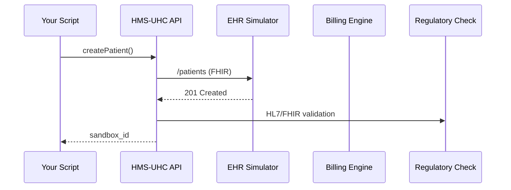

# Chapter 1: Universal Health Care Module (HMS-UHC)

*Welcome! This first chapter introduces the Universal Health Care Module (HMS-UHC), the foundation for everything else we will build in this tutorial series.*

---

## 1  Why HMS-UHC?

Imagine your state health agency has been asked to **pilot a “Medicare-for-All” style program for gig-economy workers**.  
To succeed, the agency needs to:

1. Talk to dozens of hospital Electronic Health Record (EHR) systems.  
2. Check every doctor’s bill against federal rules (HL7, FHIR, CPT, ICD-10).  
3. Prove to Congress that the program is safe—without touching real production data.

HMS-UHC bundles all of those headaches into **one friendly module**.  
Think of it as a secure “sandbox city” where new universal-care ideas can play with real-world traffic lights but without real-world car crashes.

---

## 2  Key Concepts (Beginner Friendly)

| Concept | In Plain English | Government Analogy |
|---------|-----------------|--------------------|
| **EHR Connector** | Talks to hospital databases. | Like a secure fax that automatically dials every hospital. |
| **Billing Bridge** | Translates bills into standard codes. | A tax form pre-parer for medical invoices. |
| **Regulatory Guardrails** | Makes sure every record follows HL7/FHIR rules. | An auditor standing at the Capitol’s door. |
| **Sandbox vs. Production Toggle** | One click to move from test data to real patients. | Congressional “pilot program” authority vs. full law. |

---

## 3  Your First Mini-Project

Goal: **Enroll a new patient and submit one claim**—all inside the sandbox.

### 3.1  Setup

```bash
# 1) Install SDK
pip install hms-uhc

# 2) Authenticate (dummy token for sandbox)
export HMS_UHC_TOKEN="demo-sandbox-token"
```

### 3.2  Enroll a Patient

```python
from hms_uhc import SandboxClient

uc = SandboxClient(token="demo-sandbox-token")

patient_id = uc.patients.create(
    first_name="Ana",
    last_name="García",
    ssn="123-45-6789",  # In sandbox only!
    coverage_plan="Gig-Worker 2024"
)
print("New patient:", patient_id)
```

Explanation:  
1. We import a tiny helper class.  
2. We call `.patients.create(...)`.  
3. HMS-UHC gives us a **sandbox ID**, not a real SSN.

### 3.3  Submit a Claim

```python
claim_id = uc.claims.submit(
    patient_id=patient_id,
    diagnosis_code="J11.1",      # Influenza
    procedure_code="99213",      # Office visit
    amount=120.00
)
print("Claim queued:", claim_id)
```

HMS-UHC will:

1. Convert the codes to the latest CMS spec.  
2. Forward the data to the EHR simulator.  
3. Store an audit trail for later congressional review.

### 3.4  Check Claim Status

```python
status = uc.claims.status(claim_id)
print(status)       # e.g., "VALIDATED" or "REJECTED: missing diagnosis"
```

---

## 4  What Happens Under the Hood?

Below is a 5-step birds-eye view. (No deep dives yet!)



Key takeaway: **Your code never talks directly to hospitals or auditors—HMS-UHC does.**

---

## 5  Peek at the Codebase

Open `hms-uhc_main.txt` and you will literally see:

```text
# This is a placeholder file for HMS-UHC documentation.
```

That’s on purpose! We will gradually replace this placeholder as you learn more.  
For now, all logic lives in the SDK you just used.

A simplified internal function (trimmed to 10 lines):

```python
# hms_uhc/core/patients.py
def create(first_name, last_name, ssn, coverage_plan):
    payload = {
        "resourceType": "Patient",
        "name": [{"given": [first_name], "family": last_name}],
        "identifier": [{"system": "SSN", "value": ssn}],
        "extension": [{"url": "coveragePlan", "valueString": coverage_plan}]
    }
    # POST to internal FHIR endpoint
    return _post("/patients", payload)["id"]
```

Explanation:  
• The payload follows the **FHIR Patient** schema.  
• `_post` is a tiny wrapper that handles auth, retries, and sandbox routing.

---

## 6  Troubleshooting Tips

| Symptom | Likely Cause | Quick Fix |
|---------|--------------|-----------|
| `401 Unauthorized` | Missing or bad token | `export HMS_UHC_TOKEN=...` |
| `REJECTED: code xyz` | Out-of-date medical code | Call `uc.codes.lookup("xyz")` for suggestion |
| No internet | ❄️ Government shutdown? | Use offline JSON mock bundled in SDK |

---

## 7  Recap

In this chapter you:

1. Learned **why** HMS-UHC exists.  
2. Enrolled a patient and submitted a claim in the sandbox.  
3. Saw a high-level diagram of internal flows.

You now have a working mental model of the module that powers universal-health experiments.

Ready to guide users through multi-step experiences?  
Jump to [Intent-Driven Navigation & Guided Journeys](02_intent_driven_navigation___guided_journeys_.md).

---

Generated by [AI Codebase Knowledge Builder](https://github.com/The-Pocket/Tutorial-Codebase-Knowledge)