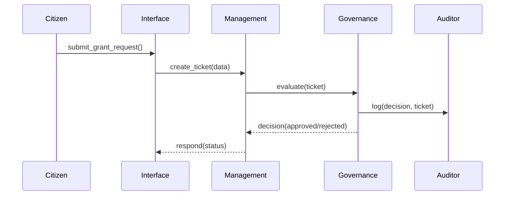
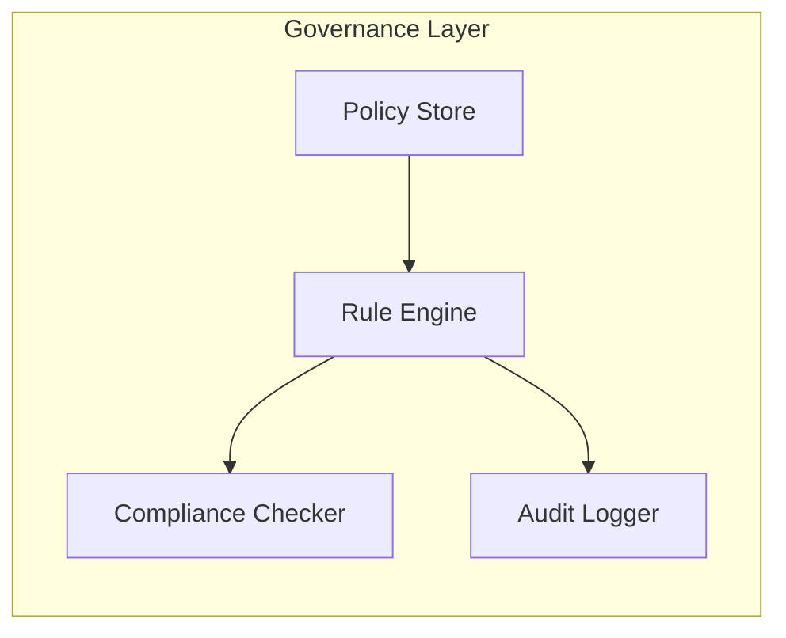

# Chapter 2: Governance Layer

Welcome back! In [Chapter 1: Hierarchical Architecture](01_hierarchical_architecture_.md), we saw how a three‐tier design keeps our government software organized. Now, we’ll zoom in on the **Governance Layer**—the “legislative body” of HMS-UHC that sets rules, checks ethics, and ensures compliance.

---

## Why Do We Need a Governance Layer?

Imagine you’re building an AI system to recommend grant awards for AmeriCorps Seniors programs. You want to be sure:

- Only approved AI models get used  
- Recommendations are fair (no hidden bias)  
- We meet federal regulations (e.g., data privacy, transparency)  
- Every decision is logged for auditing  

The **Governance Layer** sits at the top, like Congress or the Federal Geographic Data Committee, to define and enforce these rules.

---

## Concept in Action: Approving an AI Model

Use Case: A grant officer submits a “recommendation ticket” for an AI model named `GrantAI-v1`. The Governance Layer must:

1. Check that `GrantAI-v1` passed safety and bias tests.  
2. Verify the officer’s role permits using that model.  
3. Log the check for auditors.  

If all checks pass, the ticket moves on. Otherwise, it’s rejected with a clear reason.

---

## Key Concepts

1. **Policy Store**  
   - Holds rules: e.g. “Only models with `fairness_score >= 0.8` can run.”  

2. **Rule Engine**  
   - Evaluates tickets against policies.  

3. **Compliance Checker**  
   - Ensures regulations (GDPR, FOIA) are met.  

4. **Audit Logger**  
   - Records every decision for transparency.  

5. **Ethics Committee Module**  
   - Optionally flags tricky cases for human review.

---

## How to Use the Governance Layer

Here’s a minimal example in Rust‐style pseudocode. We create a `Governance` instance, build a ticket, then evaluate it.

```rust
let governance = Governance::new();              // Load policies, set up logger
let ticket = Ticket {
    id: 202,
    model_name: "GrantAI-v1".into(),
    user_role: Role::Officer,
};
let decision = governance.evaluate(&ticket);
println!("{:?}", decision);  // -> Ok("Approved") or Err("Model not certified")
```

Explanation:  
- `evaluate` returns `Ok("Approved")` if all checks pass.  
- If any rule fails, it returns `Err(reason)`.  

---

## Step-by-Step Sequence

When `governance.evaluate` runs, here’s the flow:



1. **Interface** builds a ticket.  
2. **Management** calls `governance.evaluate(...)`.  
3. **Governance** checks rules and logs to **Audit Logger**.  
4. **Governance** returns the decision.  

---

## Inside the Governance Layer

Let’s peek under the hood:

### 1. Policy Store (`src/policy_store.rs`)

```rust
pub struct PolicyStore {
    rules: Vec<Rule>,  // e.g. minimum fairness score, role checks
}

impl PolicyStore {
    pub fn load() -> Self {
        // Load from JSON, database, or code
        let rules = vec![
            Rule::MinFairness(0.8),
            Rule::RoleAllowed(Role::Officer),
        ];
        PolicyStore { rules }
    }
}
```

> We store a list of simple rules. In a real system, you might load these from a policy database.

### 2. Governance Engine (`src/governance.rs`)

```rust
pub struct Governance {
    policies: PolicyStore,
}

impl Governance {
    pub fn new() -> Self {
        Governance {
            policies: PolicyStore::load(),
        }
    }

    pub fn evaluate(&self, ticket: &Ticket) -> Result<&'static str, String> {
        for rule in &self.policies.rules {
            if let Err(reason) = rule.check(ticket) {
                // Log failure, then stop
                AuditLogger::log(ticket, &reason);
                return Err(reason);
            }
        }
        AuditLogger::log(ticket, "Approved");
        Ok("Approved")
    }
}
```

> The engine loops through each rule. On failure, it logs and returns an error.

### 3. Audit Logger (`src/audit_logger.rs`)

```rust
pub struct AuditLogger;
impl AuditLogger {
    pub fn log(ticket: &Ticket, decision: &str) {
        // e.g. write to file or send to monitoring service
        println!("Audit: ticket {} -> {}", ticket.id, decision);
    }
}
```

> Every decision is recorded. Auditors can later review these logs.

---

## Visualizing Governance Internals



- **Policy Store**: where rules live  
- **Rule Engine**: applies rules to tickets  
- **Compliance Checker**: extra legal/regulatory checks  
- **Audit Logger**: keeps a permanent record  

---

## Conclusion

You’ve learned how the **Governance Layer** acts like a legislative body—defining policies, enforcing ethics and safety, and logging every decision. This ensures your AI-driven citizen services remain transparent and compliant.

Up next, we’ll see how to build concrete processes around these rules in the [Policy and Process Module](03_policy_and_process_module_.md).

---

Generated by [AI Codebase Knowledge Builder](https://github.com/The-Pocket/Tutorial-Codebase-Knowledge)