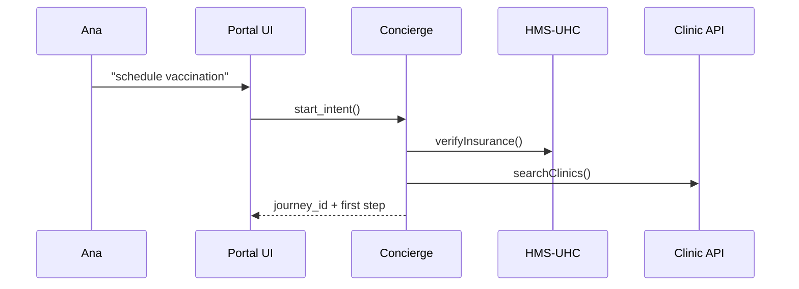

# Chapter 2: Intent-Driven Navigation & Guided Journeys

*A GPS for government services—minus the traffic jams*

---

[← Back to Chapter 1: HMS-UHC](01_universal_health_care_module__hms_uhc__.md)

---

## 1 Why Should I Care?

Picture Ana (the sandbox patient you met in Chapter 1).  
She opens your agency’s portal and types:

> “I need a free flu shot before my trip.”

Today she would click through 7 different pages—find a clinic, check insurance, download a CDC consent form, etc.

With **Intent-Driven Navigation (IDN)** she just states the outcome.  
An **AI Concierge**:

1. Figures out the legal route (HIPAA + state vaccine policy).  
2. Orchestrates calls to HMS-UHC, appointment APIs, and payment rules.  
3. Hands Ana a single **guided journey**—like Google Maps for bureaucracy.

Result: 90 seconds vs. 20 minutes, zero dead-ends, and every detour still respects policy.

---

## 2 Your First “Guided Journey” in 15 Lines

We’ll keep using the sandbox token from Chapter 1.

### 2.1 Install the tiny helper

```bash
pip install hms-nav
```

### 2.2 One-line intent

```python
from hms_nav import Concierge

bot = Concierge(token="demo-sandbox-token")

journey_id = bot.start_intent(
    intent       ="schedule vaccination",   # plain English
    citizen_id   ="sandbox-ana-123",
    zipcode      ="20009"
)
print("Journey:", journey_id)
```

**What just happened?**  
• The Concierge parsed the sentence, verified Ana’s insurance via HMS-UHC, queried nearby clinics, and built a legal path.  
• It stored the steps under `journey_id`.

### 2.3 Show the next action to the user

```python
step = bot.next_step(journey_id)
print(step)
```

Example output:

```json
{
  "label": "Choose a clinic within 5 miles",
  "options": [
    {"id": "c-101", "name": "Dupont Health Center"},
    {"id": "c-204", "name": "Adams Morgan Walk-In"}
  ]
}
```

Display the list in your UI. When Ana picks one, call:

```python
bot.complete_step(journey_id, selection_id="c-101")
```

The Concierge moves to consent-form signing, then creates the appointment—no menu mazes required.

---

## 3 Key Concepts (Plain English)

| Term | What It Means | Real-World Analogy |
|------|---------------|--------------------|
| **Intent** | A user’s desired outcome (“renew license”). | Saying a destination to your GPS. |
| **AI Concierge** | Service that plans the path and enforces policy. | The GPS engine calculating the route. |
| **Journey Map** | Ordered list of steps (forms, approvals, API calls). | Turn-by-turn directions. |
| **Waypoint** | One actionable step inside a journey. | “Turn left at Main St.” |
| **Guardrail** | Legal or policy rule the path must respect. | Speed limit sign on the highway. |

---

## 4 What Happens Behind the Scenes?



Key takeaway: **Your front-end only talks to the Concierge.**  
All policy checks and multi-agency calls are hidden inside.

---

## 5 Inside the Codebase (Simplified)

File: `hms_nav/intents.py`

```python
def start_intent(intent, citizen_id, zipcode):
    # 1. Parse the sentence
    canon = _classify_intent(intent)         # → "vaccination.schedule"

    # 2. Fetch policy graph
    graph = _load_policy(canon)              # pre-modelled YAML

    # 3. Resolve dynamic data
    ctx = _gather_context(citizen_id, zipcode)

    # 4. Build journey
    journey = _plan_route(graph, ctx)

    return _save(journey)                    # returns journey_id
```

Explanation (one liner per step):

1. **Classify** the phrase with a tiny BERT model.  
2. **Retrieve** a policy blueprint (kept in YAML for non-coders).  
3. **Gather** data (insurance, clinic list).  
4. **Plan** the legal route, attaching guardrails.  
5. **Persist** and return an ID.

---

## 6 Troubleshooting

| Symptom | Cause | Quick Fix |
|---------|-------|-----------|
| `INTENT_NOT_FOUND` | Typo or unsupported request | Call `bot.list_intents()` to inspect allowed phrases. |
| Steps stall at “Awaiting Consent” | User never signed form | Use `bot.remind(journey_id)` to resend link. |
| `403 GUARDRAIL_BLOCK` | Policy violation (e.g., out-of-state clinic) | Check `bot.journey_audit(journey_id)` for rule name. |

---

## 7 Where Does This Plug Into Everything Else?

• HMS-UHC (Chapter 1) handles health records & billing.  
• The upcoming [AI Agent Framework (HMS-AGT)](04_ai_agent_framework__hms_agt__.md) teaches the Concierge new skills.  
• Legal rules come from the [Legal & Compliance Reasoner (HMS-ESQ)](08_legal___compliance_reasoner__hms_esq__.md).

You’ll see these connections unfold in later chapters.

---

## 8 Recap & Next Steps

You learned how a single English sentence can launch a fully-compliant, multi-agency workflow.  
You:

1. Started an intent.  
2. Stepped through a guided journey.  
3. Peeked under the hood at policy-driven routing.

Ready to surface these journeys inside a modern web UI?  
Head over to [Micro-Frontend Library (HMS-MFE)](03_micro_frontend_library__hms_mfe__.md).

---

---

Generated by [AI Codebase Knowledge Builder](https://github.com/The-Pocket/Tutorial-Codebase-Knowledge)