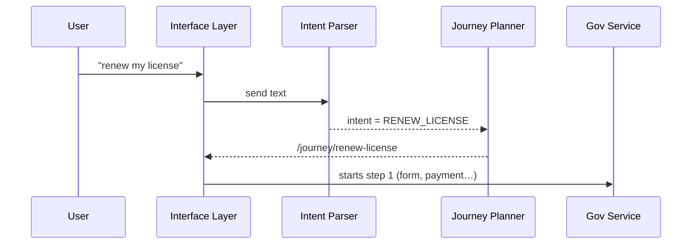

# Chapter 2: Intent-Driven Navigation  
*(a GPS for government tasks)*  

[← Back to Chapter 1: Interface Layer](01_interface_layer__hms_mfe__sector_portals__.md)

---

## 1. Why Do We Need “Intent-Driven” Anything?

Picture Sam, who just moved to Colorado.  
He needs to:

1. Update his **address** for tax records.  
2. **Renew** his out-of-state driver’s license.  
3. Register his **small drone** with the FAA.  

Today, Sam must stumble through three unrelated websites, re-entering the same home address over and over.  
What if, instead, the portal simply asked:

> “Hi Sam, what do you need to get done today?”

Sam types **“renew my license”**.  
The platform instantly:

* Finds the right state agency.  
* Prefills his new address from profile data.  
* Tells him the soonest test slot and fee.  
* Tracks progress until the renewed license ships.  

That magic is **Intent-Driven Navigation (IDN)**.

---

## 2. The 3-Part Recipe

| Term | Beginner-friendly meaning |
|------|---------------------------|
| **Intent** | The plain-language goal typed or spoken by the user (“renew my license”). |
| **Journey** | The step-by-step path that fulfills that intent (forms, payments, confirmations). |
| **Navigator Engine** | A mini-AI that maps an Intent to the fastest compliant Journey. |

Analogy:  
Intent = destination address  
Journey = turn-by-turn directions  
Navigator Engine = your phone’s GPS

---

## 3. A 60-Second Demo

Below is an ultra-minimal widget added to any sector portal built in Chapter 1.  
When the user presses Enter, we call the Navigator Engine.

```jsx
// /widgets/intent-box/index.js
export default function IntentBox() {
  const ask = async e => {
    if (e.key !== "Enter") return;
    const goal = e.target.value;          // ① grab intent text
    const res  = await fetch("/api/route",{ // ② call engine
        method:"POST",
        body: JSON.stringify({goal})
    });
    const {journeyUrl} = await res.json();
    window.location = journeyUrl;         // ③ launch journey
  };
  return <input placeholder="What do you need?" onKeyUp={ask}/>;
}
```

What happens:  
1. Grab the user’s sentence.  
2. Ask the backend for a matching journey.  
3. Redirect the browser to that guided flow.

*Code length: 14 lines ✔️*

---

## 4. Under the Hood (no code yet)



Step-by-step:

1. **Intent Parser** (tiny NLP model + rules) converts text to a canonical intent code.  
2. **Journey Planner** looks up the shortest compliant set of actions.  
3. The portal loads that Journey as a series of widgets (forms, checklists, payments).  

---

## 5. Peek into the Navigator Engine

### 5.1 Intent Parser (very simplified)

```js
// /services/navigator/intent-parser.js
const catalog = {
  "renew my license": "RENEW_LICENSE",
  "update address":   "CHANGE_ADDRESS"
};
export function parse(text){
  text = text.toLowerCase().trim();
  return catalog[text] || "UNKNOWN_INTENT";
}
```

Explanation:  
• For the tutorial we hard-code two phrases.  
• Real life swaps this for the [AI Representative Agent](06_ai_representative_agent_.md) + ML model.

### 5.2 Journey Planner

```js
// /services/navigator/journey-planner.js
const journeys = {
  RENEW_LICENSE: "/journey/renew-license",
  CHANGE_ADDRESS: "/journey/change-address"
};
export function plan(intent){
  return journeys[intent] || "/help";
}
```

Explanation:  
• Maps canonical intent → Journey URL.  
• Later we’ll fetch procedures from the [Policy / Process Module](08_policy___process_module_.md).

### 5.3 Glue Endpoint

```js
// /api/route.js
import {parse}  from "../services/navigator/intent-parser.js";
import {plan}   from "../services/navigator/journey-planner.js";

export default function handler(req,res){
  const {goal} = JSON.parse(req.body);
  const intent  = parse(goal);        // ①
  const url     = plan(intent);       // ②
  res.json({journeyUrl:url});         // ③
}
```

Total lines: 11 ✔️

---

## 6. Connecting to Other Layers

• **Interface Layer** – hosts the search box and renders the journey widgets.  
• **Governance Layer** – enforces that every journey follows legal rules.  
• **User Group Portal** – will soon customize suggestions based on Sam’s profile (next chapter!).  

Use cross-links when you want more depth:

* Design tokens? See [Governance Layer (HMS-GOV)](04_governance_layer__hms_gov__.md)  
* How does the AI model learn? See [AI Representative Agent](06_ai_representative_agent_.md)

---

## 7. Common Pitfalls & Tips

1. “Unknown Intent” responses  
   • Always fall back to a friendly `/help` Journey instead of a 404.  

2. Ambiguous phrases  
   • Ask one clarifying question (“Are you renewing a driver or boating license?”).  

3. Compliance drift  
   • Keep Journey definitions in the [Policy / Process Module](08_policy___process_module_.md) so they update automatically when laws change.

---

## 8. Try It Yourself (Local Test)

```bash
npm run portal:dev
# open http://localhost:3000
# type "renew my license" in the box
```

Expected: Browser redirects to `/journey/renew-license` which could show a multi-step form.

---

## 9. What You Learned

✔️ Why asking for *intent* beats menu hunting  
✔️ The three moving parts: Intent → Journey → Navigator  
✔️ A minimal front-end and back-end implementation  

Next we will see how different **user groups** (veterans, farmers, students) get personalized dashboards that plug right into these journeys.

[→ Chapter 3: User Group Portal](03_user_group_portal_.md)

---

---

Generated by [AI Codebase Knowledge Builder](https://github.com/The-Pocket/Tutorial-Codebase-Knowledge)