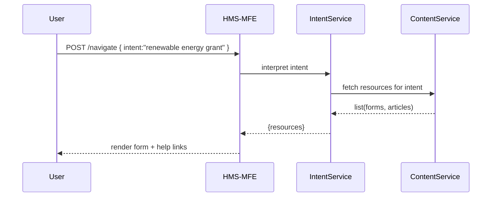

# Chapter 3: Intent-Driven Navigation

Welcome back! In [Chapter 2: Frontend Interfaces (HMS-MFE / HMS-GOV)](02_frontend_interfaces__hms_mfe___hms_gov__.md) we built user‐focused portals. Now let’s make them *smart*—like a GPS that guides citizens to exactly what they need based on their goal.

---

## 1. Why Intent-Driven Navigation?

Imagine a citizen opening a benefits portal and typing “apply for renewable energy grant” into a search box. Instead of showing a generic help page, the system:

- Detects that the user wants the **renewable energy grant** form.
- Presents the exact **application form**, relevant **help articles**, and **next steps**.
- Tailors the flow to reduce confusion and speed up completion.

This is Intent-Driven Navigation: we interpret a user’s natural language or chosen objective and plot the best “route” through our portal.

---

## 2. Key Concepts

1. **Intent Detection**  
   We analyze the user’s words (e.g., “renewable energy grant”) to figure out their goal.

2. **Navigation Mapping**  
   We map each intent to a set of pages, forms, or articles that fulfill that goal.

3. **Content Routing**  
   We dynamically load the right modules (forms, help content) in the UI.

4. **Personalized Journey**  
   We remember user preferences (language, agency) to tweak what’s shown.

---

## 3. Intent Navigation Flow

Here’s how a single intent travels through our system:



1. **User** submits an intent.  
2. **HMS-MFE** forwards it to our **IntentService**.  
3. **IntentService** asks **ContentService** which pages/forms match.  
4. The resources list returns and we render them in the portal.

---

## 4. Frontend Integration

Below is a minimal React widget that handles user intent:

```jsx
// File: IntentSearch.jsx
import React, {useState} from 'react';
import api from './api'; // wraps fetch

export default function IntentSearch() {
  const [resources, setResources] = useState([]);
  async function handleSearch(e) {
    e.preventDefault();
    const intent = e.target.intent.value;
    const res = await api.post('/navigate', {intent});
    setResources(res.resources);
  }
  return (
    <form onSubmit={handleSearch}>
      <input name="intent" placeholder="What do you want to do?" />
      <button>Go</button>
      <ul>
        {resources.map(r => <li key={r.id}>{r.title}</li>)}
      </ul>
    </form>
  );
}
```

Explanation:  
- The user types an intent and clicks **Go**.  
- We call `/navigate`, get back a list of `resources` (forms, articles).  
- We render them as a simple list.

---

## 5. Under the Hood: Internal Implementation

### 5.1 Step-by-Step

1. **HMS-MFE** POSTs intent to **IntentService**.  
2. **IntentService** runs a tiny NLP check or keyword lookup.  
3. It builds a list of resource IDs and titles.  
4. It returns them to the frontend.  
5. CMS or a microservice hosts the actual forms and content.

### 5.2 Code: IntentService (Node.js)

```js
// File: intent-service/index.js
const express = require('express');
const mapIntent = require('./mapping');
const app = express();
app.use(express.json());

app.post('/navigate', (req, res) => {
  const {intent} = req.body;
  // Simple keyword-based mapping
  const resources = mapIntent(intent);
  res.json({resources});
});

app.listen(4000, () => console.log('IntentService on 4000'));
```

### 5.3 Code: mapping.js

```js
// File: intent-service/mapping.js
const catalog = {
  "renewable energy grant": [
    {id:1, title:"Grant Application Form", path:"/forms/energy-grant"},
    {id:2, title:"How to Apply Guide", path:"/help/energy-grant"}
  ],
  // add more intents here
};

module.exports = (intent) => {
  const key = intent.toLowerCase();
  return catalog[key] || [{id:0, title:"No match found", path:"/help"}];
};
```

Explanation:  
- We keep a simple **catalog** mapping intent phrases to resources.  
- If no match, we return a fallback help link.  
- In a real system, you could swap this for an NLP model or database lookup.

---

## 6. Summary & Next Steps

In this chapter you learned how to:

- Interpret user goals as “intents” (like a GPS destination).  
- Map those intents to the exact forms and help content citizens need.  
- Wire up a simple frontend widget and a lightweight IntentService.

Next, we’ll expand our intelligence by adding autonomous agents in [Chapter 4: AI Agents Framework (HMS-A2A)](04_ai_agents_framework__hms_a2a__.md).

---

Generated by [AI Codebase Knowledge Builder](https://github.com/The-Pocket/Tutorial-Codebase-Knowledge)