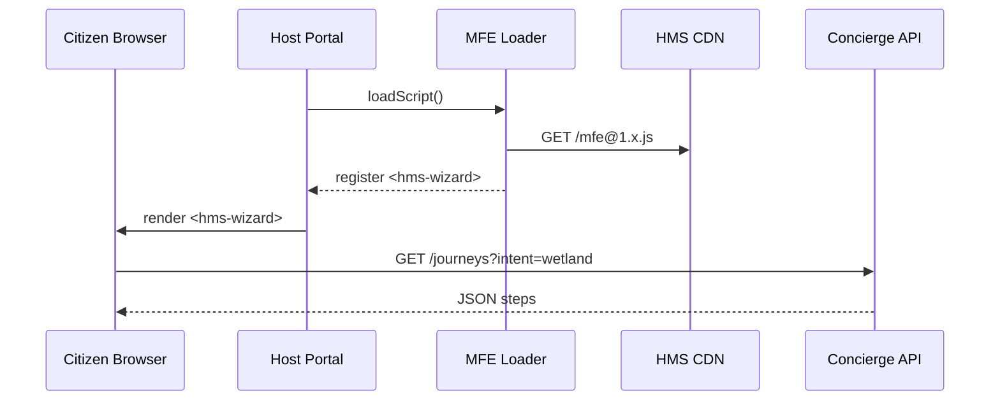

# Chapter 3: Micro-Frontend Library (HMS-MFE)


[← Back to Chapter 2: Intent-Driven Navigation & Guided Journeys](02_intent_driven_navigation___guided_journeys_.md)

---

## 1 Why Do We Need Yet-Another UI Toolkit?

Picture a small agency—say the **Migratory Bird Conservation Commission**.  
They want to add a “Book a Wetland Tour” wizard to their `.gov` site:

1. The wizard must **look** and **behave** exactly like every other federal service (fonts, colors, spacing).  
2. It must be **accessible** (meets WCAG 2.2 AA) without the dev team being accessibility experts.  
3. It should drop into *any* tech stack—React today, plain HTML tomorrow—without a rewrite.  
4. It has to integrate seamlessly with the guided journeys you built in [Chapter 2](02_intent_driven_navigation___guided_journeys_.md).

HMS-MFE is the answer.  
Think of it as a government-grade box of LEGO bricks—**buttons, charts, forms, wizards—ready to snap in**.

---

## 2 Big Picture in One Sentence

> HMS-MFE = A CDN-hosted bundle of WCAG-compliant web components + a tiny runtime that lets any agency portal compose them like LEGO—no global CSS wars, no framework lock-in.

---

## 3 Key Concepts (Plain English)

| Term | What It Really Means | Government Analogy |
|------|---------------------|--------------------|
| **Web Component** | A self-contained HTML tag (`<hms-button>`) that brings its own style & behavior. | A pre-stamped government form—always the same wherever you print it. |
| **Host Portal** | The agency’s existing website or SPA that *consumes* the components. | A local DMV office that hands out the forms. |
| **Module Federation Loader** | Script that fetches & wires the components at run-time. | A courier that delivers the forms just-in-time. |
| **Design Token** | Tiny variable like `--hms-color-primary` that controls theme. | The federal blue ink used on all forms. |
| **Accessibility Harness** | Auto-added ARIA labels & keyboard shortcuts. | Braille overlays pre-applied to every sign. |

---

## 4 Your First “Tour Booking” Widget in 3 Steps

We assume you already have an HTML or React page.

### 4.1 Add the Loader Script

```html
<!-- 1) Place in <head> -->
<script src="https://cdn.hms.gov/mfe/loader@1.x.js"></script>
```

Explanation:  
This 3 KB script downloads the component bundle from the HMS CDN and registers every `<hms-*>` tag with the browser.

---

### 4.2 Drop a Component Tag

```html
<!-- 2) Somewhere in your page -->
<hms-wizard id="tourWizard"
            journey-id="auto"
            intent="book wetland tour">
</hms-wizard>
```

What happens?  
1. The wizard asks the Concierge API (see Chapter 2) for the **“book wetland tour”** journey.  
2. It renders each step (choose date, enter info, confirm) using built-in forms.  
3. All styles are scoped, so your site’s CSS can’t accidentally break it.

---

### 4.3 Listen for Completion

```html
<script>
  document
    .getElementById('tourWizard')
    .addEventListener('finished', (e) => {
      console.log('Journey done:', e.detail.journeyId);
      alert('See you in the marshlands!');
    });
</script>
```

When the citizen finishes, you get a custom event with the `journeyId` for audits.

---

## 5 Under the Hood (High-Level)



Key takeaway: **Only ~2 network hops** to light up a rich, policy-aware wizard.

---

## 6 A Peek at the Component Source

File: `packages/wizard/src/index.ts` (simplified)

```ts
import { LitElement, html, css } from 'lit';

export class HMSWizard extends LitElement {
  static properties = { journeyId: {}, intent: {} };

  async connectedCallback() {
    super.connectedCallback();
    // 1) Auto-start guided journey if not provided
    if (!this.journeyId) {
      const res = await fetch(`/api/concierge/start?intent=${this.intent}`);
      this.journeyId = (await res.json()).id;
    }
    this._loadStep();
  }

  async _loadStep() {
    const res = await fetch(`/api/concierge/next/${this.journeyId}`);
    this.step = await res.json();
  }

  render() {
    if (!this.step) return html`Loading…`;
    return html`
      <h2>${this.step.label}</h2>
      ${this.step.options?.map(
        o => html`<button @click=${() => this._select(o.id)}>${o.name}</button>`
      )}
    `;
  }

  _select(id: string) {
    fetch(`/api/concierge/complete/${this.journeyId}`, {
      method: 'POST', body: JSON.stringify({ selectionId: id })
    }).then(() => this.dispatchEvent(new CustomEvent('finished',
      { detail: { journeyId: this.journeyId } })));
  }
}
customElements.define('hms-wizard', HMSWizard);
```

Explanation (one-liners):

1. **LitElement** gives us a tiny 4 KB base class.  
2. `connectedCallback()` auto-starts or resumes a journey.  
3. `_loadStep()` fetches the next action.  
4. `render()` outputs buttons for choices.  
5. `_select()` completes the step and fires a `finished` event.

---

## 7 Styling & Theming in Two Lines

```css
/* host-portal.css */
:root {
  --hms-color-primary: #003366; /* official federal blue */
  --hms-font-family: "Public Sans", Arial, sans-serif;
}
```

Every HMS component will instantly adopt these tokens—no overrides needed.

---

## 8 Accessibility Comes “For Free”

Behind each component, HMS-MFE auto-adds:

* `role="button"` or `role="dialog"` as needed.  
* Keyboard focus traps in modal steps.  
* `aria-live` regions for dynamic updates.  

Result: You pass WCAG 2.2 AA audits without extra coding.

---

## 9 Troubleshooting Cheatsheet

| Symptom | Probable Cause | Quick Fix |
|---------|----------------|-----------|
| Component appears unstyled | Loader not inserted first | Move `<script src="…loader.js">` into `<head>` before other JS. |
| Screen reader skips a label | Custom CSS hid the off-screen label | Remove `display:none` on `.sr-only` spans. |
| `CORS` error on journey calls | Portal on different domain than API | Proxy `/api/concierge/*` through your server. |
| Duplicate fonts loaded | Host and HMS both import *Public Sans* | Use `rel="preload"` once; the browser will dedupe. |

---

## 10 Where This Fits in the HMS Landscape

• Pulls journey steps from the Concierge in [Chapter 2](02_intent_driven_navigation___guided_journeys_.md)  
• Soon, autonomous helpers from [AI Agent Framework (HMS-AGT)](04_ai_agent_framework__hms_agt__.md) will inject *smart hints* right inside the components.  
• Compliance checks are still enforced by [Legal & Compliance Reasoner (HMS-ESQ)](08_legal___compliance_reasoner__hms_esq__.md) on the server side.

---

## 11 Recap

You:

1. Loaded the HMS-MFE script from the CDN.  
2. Dropped a single `<hms-wizard>` tag to run a policy-aware journey.  
3. Saw how styles, accessibility, and theming come baked in.  
4. Peeked at the 30-line LitElement source.

With just one HTML tag, you delivered a fully-compliant citizen experience—no CSS wrestling, no accessibility panic.

Ready to make these widgets *intelligent*—capable of tweaking themselves based on user behavior?  
March on to [Chapter 4: AI Agent Framework (HMS-AGT)](04_ai_agent_framework__hms_agt__.md).

---

---

Generated by [AI Codebase Knowledge Builder](https://github.com/The-Pocket/Tutorial-Codebase-Knowledge)