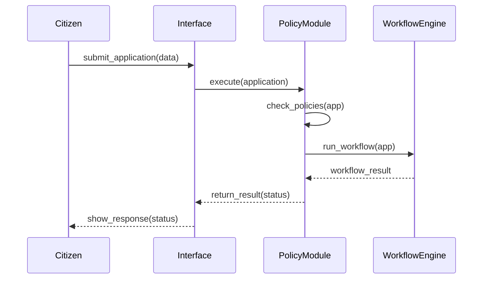
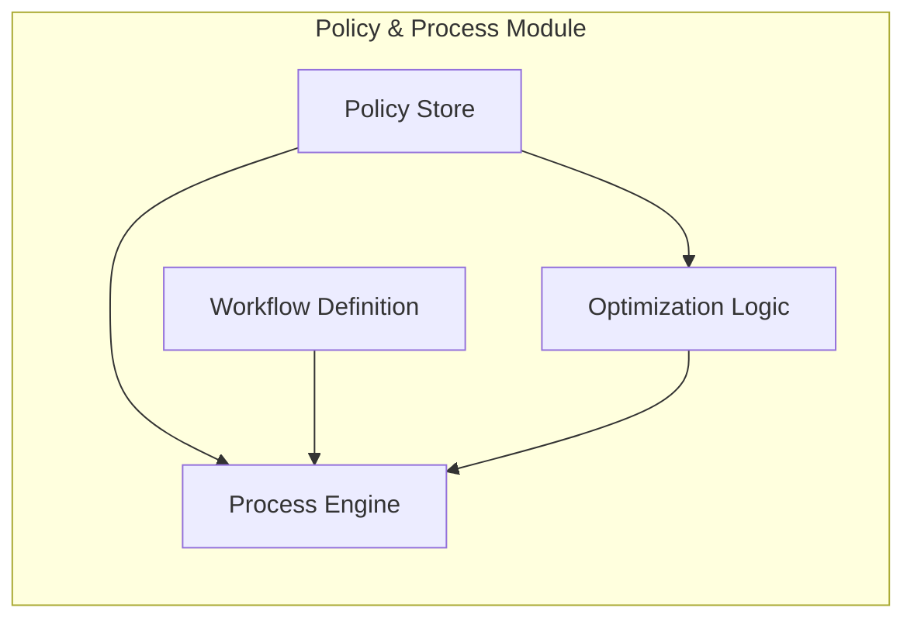

# Chapter 3: Policy and Process Module

Welcome back! In [Chapter 2: Governance Layer](02_governance_layer_.md), we saw how rules and audits live at the top of our system. Now, we’ll explore the **Policy and Process Module**—the engine that turns those rules into real-world workflows like a policy library combined with an office procedure manual.

---

## Why Do We Need a Policy & Process Module?

Imagine a citizen applies online for a passport renewal. We need to:

1. Check eligibility rules (age, existing passport).  
2. Verify uploaded documents.  
3. Schedule an appointment at a passport center.  
4. Fast-track urgent requests when necessary.  

The **Policy and Process Module** coordinates these steps, using:

- A **Policy Library** for versioned rules.  
- A **Workflow Engine** for step-by-step procedures.  
- **Optimization Logic** to prioritize or route cases.

Together, they ensure every application follows the correct, up-to-date rules and steps.

---

## Key Concepts

1. **Policy Library**  
   - Stores rules like “passport must expire in < 6 months”  
   - Versioned so you can update rules without breaking old cases  

2. **Workflow Engine**  
   - Defines sequences (e.g., Eligibility → DocumentCheck → Scheduling)  
   - Runs each step in order, handles success/failure  

3. **Optimization Logic**  
   - Automatically fast-tracks high-priority applications  
   - Balances load across processing centers  

4. **Process Orchestrator**  
   - Glues policies and workflows together  
   - Takes an application, applies rules, runs the workflow, returns a result  

---

## Using the Module: A Simple Example

Here’s how a passport renewal might run:

```rust
let module = PolicyProcess::new();  
let app = Application {
    citizen_id: 1001,
    doc_type: "passport".into(),
    data: /* form data */ Default::default(),
};
let result = module.execute(&app);
println!("{:?}", result);  
// -> Ok("Appointment scheduled on 2024-07-10")
// or Err("Missing proof of address")
```

Explanation:
- `new()` loads policies and workflows.  
- `execute` runs rules and steps, then returns either:
  - `Ok(message)` when all steps succeed, or  
  - `Err(reason)` if a policy or workflow step fails.

---

## Step-by-Step Flow

Here’s a simple sequence when a request comes in:



1. **Interface** forwards the application.  
2. **PolicyModule** validates policies.  
3. **WorkflowEngine** executes each defined step.  
4. Final status is returned to the citizen.

---

## Under the Hood

### 1. Policy Store (src/policy_store.rs)

```rust
pub struct PolicyStore {
    rules: Vec<Rule>,
}
impl PolicyStore {
    pub fn load() -> Self {
        // In reality, load from JSON or DB
        Self { rules: vec![
            Rule::MustExpireInMonths(6),
            Rule::RequireAddressProof,
        ]}
    }
}
```

> Holds a list of simple rules. You can version this store so new rules don’t break old cases.

### 2. Workflow Definition (src/workflow.rs)

```rust
pub struct Workflow {
    steps: Vec<Step>,
}
impl Workflow {
    pub fn default() -> Self {
        // Order of steps for passport renewal
        Self { steps: vec![
            Step::EligibilityCheck,
            Step::DocumentVerification,
            Step::AppointmentScheduling,
        ]}
    }
}
```

> Defines the ordered steps. You can swap in different workflows for different services.

### 3. Process Engine (src/process_engine.rs)

```rust
pub struct PolicyProcess {
    policies: PolicyStore,
    workflow: Workflow,
}
impl PolicyProcess {
    pub fn new() -> Self {
        Self {
            policies: PolicyStore::load(),
            workflow: Workflow::default(),
        }
    }

    pub fn execute(&self, app: &Application) -> Result<String, String> {
        // 1. Policy check
        for rule in &self.policies.rules {
            rule.check(app)?;  
        }
        // 2. Workflow execution
        for step in &self.workflow.steps {
            step.run(app)?;  
        }
        Ok("Appointment scheduled".into())
    }
}
```

> The engine first loops through policies, then runs each workflow step. Any failure returns an `Err` with a message.

---

## Visualizing the Module



- **Policy Store**: versioned rules  
- **Workflow Definition**: ordered steps  
- **Optimization Logic**: routing/prioritization  
- **Process Engine**: ties everything together

---

## Conclusion

You’ve seen how the **Policy and Process Module** acts as a digital policy library plus procedure guide—loading rules, running workflows, and optimizing flows. Next, we’ll dive into how the **Management Layer** drives higher-level business logic around these processes.  

[Chapter 4: Management Layer](04_management_layer_.md)

---

Generated by [AI Codebase Knowledge Builder](https://github.com/The-Pocket/Tutorial-Codebase-Knowledge)