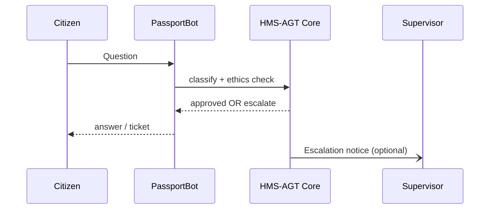

# Chapter 4: AI Agent Framework (HMS-AGT)

[← Back to Chapter 3: Micro-Frontend Library (HMS-MFE)](03_micro_frontend_library__hms_mfe__.md)

---

## 1 Why Do We Need “Digital Employees”?

Imagine the **Office of Consular Affairs** has a 3-month backlog of passport renewal e-mails.  
Human clerks spend precious time:

1. Answering the same “What documents do I need?” question.  
2. Flagging suspicious applications for fraud review.  
3. Escalating edge-cases to a supervisor.

What if we could **hire a pool of AI coworkers**—each with a job grade, ethics policy, and audit trail—exactly like human federal staff?  
That pool is **HMS-AGT**.

*Think of it as the government’s own “digital GS schedule.”*

---

## 2 Chapter Roadmap

1. Key ideas in plain English.  
2. Create your first agent (“PassportBot”).  
3. Watch it answer, decide, and escalate.  
4. Peek under the hood.  
5. How this ties into the rest of HMS.

---

## 3 Key Concepts (Beginner Friendly)

| Term | What It Means | Real-World Analogy |
|------|---------------|--------------------|
| **Agent** | One AI instance with skills + policy | A single civil-service employee |
| **Job Classification** | Pre-set role & permissions (e.g., GS-9 Scheduler) | A line item on an SF-50 HR form |
| **Core Skills** | Secure chat, decision logging, escalation | Mandatory federal training |
| **Ethics Code** | Rules the agent must follow (privacy, bias) | OGE ethics manual |
| **Performance File** | Auto-generated metrics & incidents | Official personnel folder |

---

## 4 Setup: Hire “PassportBot” in 15 Lines

### 4.1 Install & Authenticate

```bash
pip install hms-agt
export HMS_AGT_TOKEN="demo-sandbox-token"
```

### 4.2 Create the Agent

```python
from hms_agt import Agency

ca = Agency(token="demo-sandbox-token")

passport_bot = ca.agents.create(
    name="PassportBot",
    classification="GS-9_Screener",
    skills=["faq_answer", "fraud_check", "escalate"],
    ethics_template="STANDARD_CIVIL_SERVICE"
)
print(passport_bot.id)   # e.g., agt-101
```

Explanation (3 bullet points):  
• We call `agents.create(...)`—just like HR onboarding.  
• `classification` grants read-only access to passport databases.  
• `ethics_template` loads default privacy & bias rules.

---

## 5 Chatting With Your New Coworker

```python
reply = passport_bot.chat("I lost my passport, what do I do?")
print(reply.text)
```

Sample output:

```
You’ll need Form DS-11, proof of citizenship, and a photo. 
Would you like the PDF emailed to you?
```

Behind the scenes HMS-AGT:

1. Checks if the question is within the agent’s scope.  
2. Logs the interaction to the performance file.  
3. Sends the response.

### 5.1 Automatic Escalation

```python
msg = passport_bot.chat("My birth certificate looks different, please advise.")
print(msg.status)   # → "ESCALATED_SUPERVISOR"
```

The agent’s fraud-check skill noticed a potential issue and created an **escalation ticket** automatically.

---

## 6 What Happens Under the Hood?



Key takeaway: **All sensitive logic (ethics, permissions, logging) lives in HMS-AGT Core**, not inside your app.

---

## 7 A Gentle Peek at the Codebase

File: `hms_agt/core/agent.py` (trimmed to 12 lines)

```python
class Agent:
    def __init__(self, profile):
        self.profile = profile  # job classification, ethics, ACL

    def chat(self, text):
        log("incoming", text, agent_id=self.profile.id)

        intent = _classify(text)               # NLU step
        if _violates_ethics(text, self.profile):
            return _block_response()

        if intent in sensitive_intents(self.profile):
            return _escalate(text)

        answer = _generate_answer(intent)
        log("outgoing", answer, agent_id=self.profile.id)
        return answer
```

One-liner explanation per numbered comment:  
1. Store the agent’s HR profile.  
2. Log the citizen’s message.  
3. Detect intent (tiny model).  
4. Run ethics guardrails.  
5. Escalate if needed.  
6. Generate answer with GPT-style model.  
7. Log and return.

---

## 8 Common Troubleshooting

| Symptom | Likely Cause | Fix |
|---------|--------------|-----|
| `403 ROLE_DENIED` | Agent lacks permission | Use a higher classification or add ACL. |
| Endless “I’m not sure” replies | Missing skill pack | `ca.agents.update_skills(id, ["faq_answer"])` |
| Escalations never reach supervisor | No supervisor e-mail set | `ca.settings.set_supervisor_email("chief@state.gov")` |

---

## 9 How HMS-AGT Connects to Other Chapters

• The web widgets from [Micro-Frontend Library (HMS-MFE)](03_micro_frontend_library__hms_mfe__.md) can embed chat with these agents.  
• Next, you’ll see how the **Model Context Protocol** standardizes the data each agent feeds to its language model—preventing “hallucinations gone wild.”

---

## 10 Recap & Next Steps

You have:

1. Hired a digital GS-9.  
2. Watched it answer routine questions.  
3. Observed built-in ethics checks and escalations.  

Ready to learn how these agents keep track of *what* they know and *why* they answer the way they do?  
Head to [Chapter 5: Model Context Protocol (HMS-MCP)](05_model_context_protocol__hms_mcp__.md).

---

---

Generated by [AI Codebase Knowledge Builder](https://github.com/The-Pocket/Tutorial-Codebase-Knowledge)