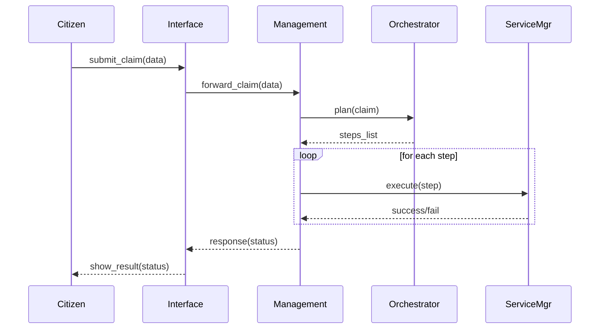
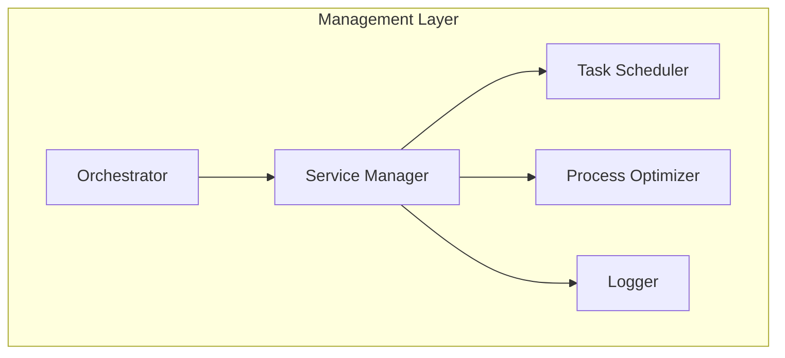

# Chapter 4: Management Layer

Welcome back! In [Chapter 3: Policy and Process Module](03_policy_and_process_module_.md), we learned how rules and workflows get defined. Now, we’ll dive into the **Management Layer**—the “agency office floor” where those rules become real actions and tasks get organized, tracked, and optimized.

---

## Why a Management Layer?

Imagine a state unemployment office processing a citizen’s claim:

1. A citizen submits a claim online.  
2. Policies check eligibility (`Policy & Process Module`).  
3. The office needs to:  
   - Verify identity  
   - Compute benefit amount  
   - Schedule an interview  
   - Send notifications  

The **Management Layer** is like the caseworker’s desk that orchestrates each of these steps, retries failed tasks, balances work across clerks, and watches the clock to ensure service-level targets are met.

---

## Key Concepts

1. **Orchestrator**  
   - Plans the sequence of tasks based on the workflow   
   - E.g., identity → eligibility → computation → scheduling  

2. **Service Manager**  
   - Calls external or internal services (ID check API, email service)  
   - Handles retries and error reporting  

3. **Task Scheduler**  
   - Enforces deadlines and retry intervals  
   - Ensures time-based steps (e.g., send reminder after 3 days)  

4. **Process Optimizer**  
   - Balances load across workers  
   - Fast-tracks urgent cases (e.g., veterans)  

5. **Monitoring & Logging**  
   - Tracks each task’s status  
   - Raises alerts if a step takes too long  

---

## Solving Our Use Case

Let’s see a very simple Rust-style pseudocode for processing an unemployment claim:

```rust
struct Management {
    orchestrator: Orchestrator,
    services: ServiceManager,
}

impl Management {
    fn process_claim(&self, claim: &Claim) -> Result<String, String> {
        // 1. Plan steps (identity, eligibility, compute, schedule)
        let steps = self.orchestrator.plan(&claim)?;
        // 2. Execute each step in order
        for step in steps {
            self.services.execute(&step)?;
        }
        Ok("Claim processed successfully".into())
    }
}
```
> First, we ask the **Orchestrator** to plan the steps. Then we loop through each step, asking the **Service Manager** to execute it. Any error bubbles up as an `Err`.

---

## Step-by-Step Flow

Here’s what happens when `process_claim` is called:



1. **Interface** hands off the claim.  
2. **Management** asks the **Orchestrator** for a plan.  
3. **Management** loops over each step and calls the **Service Manager**.  
4. **Interface** returns the final status to the citizen.

---

## Inside the Management Layer

### 1. Orchestrator (src/orchestrator.rs)

```rust
pub struct Orchestrator;
impl Orchestrator {
    pub fn plan(&self, claim: &Claim) -> Result<Vec<Step>, String> {
        // Decide sequence based on claim type
        Ok(vec![
            Step::VerifyIdentity,
            Step::CheckEligibility,
            Step::ComputeAmount,
            Step::ScheduleInterview,
        ])
    }
}
```
> The orchestrator looks at the claim and returns an ordered list of steps.

### 2. Service Manager (src/service_manager.rs)

```rust
pub struct ServiceManager;
impl ServiceManager {
    pub fn execute(&self, step: &Step) -> Result<(), String> {
        match step {
            Step::VerifyIdentity    => self.call_id_api(),
            Step::CheckEligibility  => self.call_policy_module(),
            Step::ComputeAmount     => self.compute_benefit(),
            Step::ScheduleInterview => self.send_calendar_invite(),
        }
    }
    // Dummy implementations
    fn call_id_api(&self) -> Result<(), String> { Ok(()) }
    fn call_policy_module(&self) -> Result<(), String> { Ok(()) }
    fn compute_benefit(&self) -> Result<(), String> { Ok(()) }
    fn send_calendar_invite(&self) -> Result<(), String> { Ok(()) }
}
```
> Each step maps to a method that calls an external API or internal module.

### 3. Task Scheduler & Optimizer


- **Task Scheduler**: retries or delays steps.  
- **Process Optimizer**: reorders or fast-tracks based on priority.  
- **Logger**: records each step start/end.

---

## Conclusion

You’ve seen how the **Management Layer** acts like a busy government office floor: planning tasks, calling services, scheduling retries, and tracking progress. This middle tier brings your defined policies and workflows into real execution.

Next, we’ll expose these capabilities through our [Backend API](05_backend_api_.md), so other systems and UIs can trigger claim processing directly.

---

Generated by [AI Codebase Knowledge Builder](https://github.com/The-Pocket/Tutorial-Codebase-Knowledge)