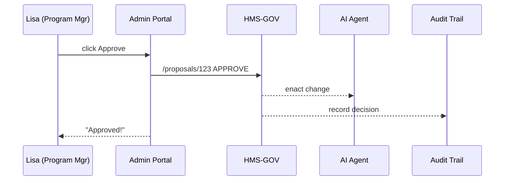

# Chapter 5: Admin / Gov Portal  
*(the cabinet room for digital government)*  

[← Back to Chapter 4: Governance Layer](04_governance_layer__hms_gov__.md)

---

## 1. Why Another Portal?  

Meet **Lisa**, Program Manager at the Occupational Safety and Health Administration (OSHA).  
Every Monday morning she wants to:

1. See **how many workplace-safety permits** were filed last week.  
2. Review an AI-generated **policy tweak** that could cut processing time.  
3. Check whether any widget violated the **“No SSN in logs”** rule.  
4. Trigger an **audit** on a contractor whose error rate spiked.

Before HMS-UHC she juggled five dashboards, three email threads, and endless spreadsheets.  
The **Admin / Gov Portal** puts all of that in one secure “cabinet room” tab.

---

## 2. Key Concepts (Plain English)  

| Term | What it means | Analogy |
|------|---------------|---------|
| **Dashboard** | Real-time metrics card (e.g., “Permits processed today: 128”) | Digital whiteboard |
| **Proposal Inbox** | Queue of AI or human suggestions awaiting action | Inbox on the desk |
| **Compliance Alert** | Red flag when a rule from [HMS-GOV](04_governance_layer__hms_gov__.md) is broken | Smoke detector |
| **Audit Trigger** | One-click job that gathers logs & evidence | Fire drill |
| **Decision Log** | Immutable record of every “approve/modify/reject” | Meeting minutes |

Keep these five in mind—they power 90 % of the portal.

---

## 3. A One-Minute Tour (Live Code Demo)

Below are two micro-frontend widgets you can drop into the Admin Portal.  
Together they demonstrate Lisa’s morning routine.

### 3.1 “Permits Dashboard” widget (15 lines)

```jsx
// /widgets/permits-dashboard/index.js
export default function PermitsDashboard() {
  const {data=[]} = useFetch("/api/metrics/permits");
  return (
    <section>
      <h3>Workplace-Safety Permits</h3>
      <ul>
        {data.slice(0,4).map(m=>(
          <li key={m.label}>{m.label}: <b>{m.value}</b></li>
        ))}
      </ul>
    </section>
  );
}
```

What happens?  
`useFetch` pulls 4 key numbers (today, week, backlog, avg time) and lists them.

---

### 3.2 “Proposal Inbox” widget (18 lines)

```jsx
// /widgets/proposal-inbox/index.js
export default function ProposalInbox() {
  const {data=[], refetch} = useFetch("/api/proposals/pending");

  const act = async (id,action) => {
    await fetch(`/api/proposals/${id}`,{
      method:"POST",
      body: JSON.stringify({action})
    });
    refetch();     // refresh list
  };

  return (
    <section>
      <h3>Pending AI Proposals</h3>
      {data.length===0 && <p>No suggestions 🎉</p>}
      {data.map(p=>(
        <div key={p.id}>
          <p>{p.summary}</p>
          <button onClick={()=>act(p.id,"APPROVE")}>Approve</button>
          <button onClick={()=>act(p.id,"REJECT")}>Reject</button>
        </div>
      ))}
    </section>
  );
}
```

Lisa clicks **Approve**; the row disappears and the Decision Log is updated.

---

## 4. How Does “Approve” Work Behind the Scenes?  



1. Portal forwards the decision to the **Governance Layer**.  
2. HMS-GOV tells the **AI Representative Agent** to roll out the change.  
3. The event is written to the **Compliance & Audit Trail**.  

No extra emails, no lost attachments.

---

## 5. A Peek Inside the Server Code  

### 5.1 Approve / Reject Endpoint (17 lines)

```js
// /api/proposals/[id].js
import {saveDecision} from "../../services/audit";
import {applyProposal} from "../../services/ai-bridge";

export default async function handler(req,res){
  const {id} = req.query;
  const {action} = JSON.parse(req.body);  // APPROVE or REJECT

  // 1. mark proposal
  await db.proposals.update(id,{status:action});

  // 2. if approved, enact via AI agent
  if (action==="APPROVE") await applyProposal(id);

  // 3. always record in audit log
  await saveDecision({id,action,user:req.user.name});

  res.json({ok:true});
}
```

Explanation:  
• Updates database, maybe calls AI, definitely logs the event—nothing more.

---

### 5.2 Minimal “applyProposal” Bridge (10 lines)

```js
// /services/ai-bridge.js
export async function applyProposal(id){
  const prop = await db.proposals.find(id);
  await fetch("http://ai-agent.internal/apply",{
    method:"POST",
    body: JSON.stringify(prop.payload)
  });
}
```

It simply forwards the stored instructions to the [AI Representative Agent](06_ai_representative_agent_.md).

---

## 6. Integration With Other Layers  

• **Governance Layer** – supplies the compliance rules that become alerts.  
• **AI Representative Agent** – receives approved proposals.  
• **Compliance & Audit Trail** – immutable Decision Log lives here.  
• **Access & Authorization Framework** – ensures only authorized roles see this portal.  

Cross-links for deeper dives:  
* Policies & tokens: [Governance Layer](04_governance_layer__hms_gov__.md)  
* AI follow-up: [AI Representative Agent](06_ai_representative_agent_.md)  
* Audit storage: [Compliance & Audit Trail](15_compliance___audit_trail_.md)

---

## 7. Common Pitfalls & Quick Fixes  

1. **“Approve” button grayed out**  
   – Check if your account has the `ROLE_DECIDER` in the [Access Framework](11_access___authorization_framework_.md).  

2. **Metrics look stale**  
   – Metrics widgets cache for 60 s; press the built-in refresh button.  

3. **Too many alerts**  
   – Create custom filters (`/settings/alerts`) so only high-severity rules show.

---

## 8. Try It Locally (3 Commands)

```bash
git clone hms-uhc-demo && cd hms-uhc-demo
npm run admin:dev          # starts Admin Portal at :4000
# Visit http://localhost:4000  (demo creds: lisa / demo123)
```

Approve one of the mock proposals—watch the Decision Log update in real time!

---

## 9. What You Learned  

✔️ The Admin / Gov Portal is the single **command center** for program managers.  
✔️ Key pieces: Dashboards, Proposal Inbox, Compliance Alerts, Audit Triggers.  
✔️ A 17-line endpoint is enough to approve a proposal end-to-end.  

Next we’ll look inside the **AI Representative Agent** that actually *executes* those approved changes.

[→ Chapter 6: AI Representative Agent](06_ai_representative_agent_.md)

---

Generated by [AI Codebase Knowledge Builder](https://github.com/The-Pocket/Tutorial-Codebase-Knowledge)