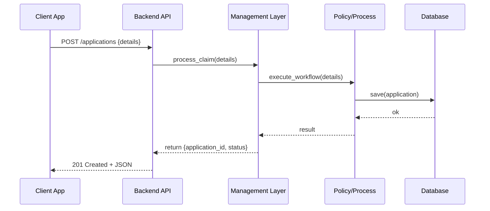
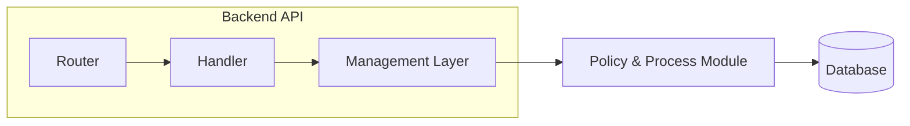

# Chapter 5: Backend API

In [Chapter 4: Management Layer](04_management_layer_.md), we saw how our system plans and runs each business step. Now we’ll learn how to expose those capabilities to the outside world through a **Backend API**—a set of secure “mailboxes” (programmatic endpoints) where government departments send and retrieve documents, policy updates, applications, and more.

---

## Why a Backend API?

Imagine the Foreign Agricultural Service (FAS) needs to request an export certificate for a shipment of citrus fruit. Instead of filling out paper forms, the FAS client app:

1. Sends a request to **HMS-API** to create a new certificate application.  
2. Polls **HMS-API** for status updates.  
3. Retrieves the approved certificate document when ready.

Under the hood, these HTTP calls trigger our **Management Layer** and **Policy & Process Module**, store data in our database, and enforce governance rules. The API is the doorway that ties everything together.

---

## Key Concepts

1. **Endpoints & Resources**  
   - `/applications`: create or list applications  
   - `/policies`: manage policy definitions  

2. **HTTP Verbs**  
   - `POST` to create  
   - `GET` to read  
   - `PUT`/`PATCH` to update  
   - `DELETE` to remove  

3. **HMS-API vs HMS-MKT**  
   - **HMS-API**: core endpoints for applications, policies, processes  
   - **HMS-MKT**: marketing or metadata endpoints (e.g., dropdown lists, reference data)  

4. **Authentication & Authorization**  
   - Each request carries a token identifying the agency or user role  
   - Middleware checks permissions before calling business logic  

5. **Request/Response Model**  
   - JSON payloads with simple models  
   - Standard HTTP codes: `201 Created`, `200 OK`, `400 Bad Request`, `401 Unauthorized`

---

## Using the Backend API

Here’s how a client might create and check an export-certificate application.

1. Create a new application:

   ```bash
   curl -X POST https://hms.gov/api/applications \
     -H "Authorization: Bearer $TOKEN" \
     -H "Content-Type: application/json" \
     -d '{
       "citizen_id": 12345,
       "shipment_details": "Citrus to EU"
     }'
   ```

   Response:
   ```json
   {
     "application_id": "app-789",
     "status": "PendingReview"
   }
   ```

2. Poll for status:

   ```bash
   curl -X GET https://hms.gov/api/applications/app-789 \
     -H "Authorization: Bearer $TOKEN"
   ```

   Response:
   ```json
   {
     "application_id": "app-789",
     "status": "Approved",
     "certificate_url": "https://hms.gov/docs/cert-789.pdf"
   }
   ```

---

## High-Level Flow



---

## Under the Hood: Code Walkthrough

When the API gateway receives a request, it routes to a handler that calls into our Management Layer.

1. Router Configuration (src/api/router.rs):

   ```rust
   pub fn configure(cfg: &mut web::ServiceConfig) {
       cfg.service(
           web::resource("/applications")
               .route(web::post().to(create_application))
               .route(web::get().to(list_applications))
       );
   }
   ```

   This tells our web framework which handler to run for each endpoint.

2. Handler Function (src/api/handlers.rs):

   ```rust
   // Handler for POST /applications
   async fn create_application(
       new_app: web::Json<NewApplication>,
       mgr: web::Data<Management>
   ) -> impl Responder {
       match mgr.process_claim(&new_app.into_inner()) {
           Ok(status) => HttpResponse::Created().json(status),
           Err(err)   => HttpResponse::BadRequest().body(err),
       }
   }
   ```

   - We deserialize the JSON into a `NewApplication` model.  
   - We call `Management::process_claim`, which triggers all the business logic.  
   - We respond with `201 Created` on success or `400 Bad Request` on failure.

3. Data Models (src/api/models.rs):

   ```rust
   #[derive(Deserialize)]
   pub struct NewApplication {
       pub citizen_id: u64,
       pub shipment_details: String,
   }

   #[derive(Serialize)]
   pub struct ApplicationStatus {
       pub application_id: String,
       pub status: String,
   }
   ```

   These simple structs map JSON fields to our Rust code.

---

## Internals Sequence



1. **Router** parses URL and selects a handler.  
2. **Handler** validates input, calls **Management Layer**.  
3. **Management Layer** orchestrates workflows via [Policy and Process Module](03_policy_and_process_module_.md).  
4. **Policy & Process** enforces rules then reads/writes the database.  
5. Response flows back up and out to the client.

---

## Conclusion

You’ve learned how the **Backend API** exposes our internal workflows as secure, RESTful endpoints. Clients—from agency dashboards to partner systems—can now create, update, and query policies and applications programmatically. Next up, we’ll package these services into scalable, independent pieces in the [Chapter 6: Microservices Infrastructure](06_microservices_infrastructure_.md).

---

Generated by [AI Codebase Knowledge Builder](https://github.com/The-Pocket/Tutorial-Codebase-Knowledge)