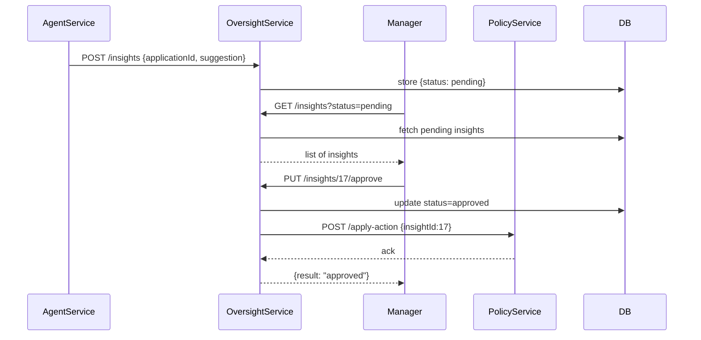

# Chapter 5: Human-in-the-Loop Oversight

Welcome back! In [Chapter 4: AI Agents Framework (HMS-A2A)](04_ai_agents_framework__hms_a2a__.md), we saw how autonomous agents generate insights and action proposals. Now it’s time to let real people review and approve those AI-driven suggestions before they become official. This is **Human-in-the-Loop Oversight**.

---

## 1. Why Human-in-the-Loop Oversight?

Imagine the Rehabilitation Services Administration (RSA) uses an AI agent to spot stalled grant applications. The agent suggests “send reminder email” for applications delayed over 7 days. But we need a program manager to check each case before emails go out—to ensure accuracy, context, and fairness.

Human-in-the-Loop Oversight:

- Embeds **checkpoints** where humans review AI recommendations.  
- Lets experts **adjust**, **approve**, or **reject** proposals.  
- Keeps a clear **audit trail** for accountability and trust.

---

## 2. Key Concepts

1. Checkpoint  
   A pause point where AI outputs wait for human review.

2. Review & Approve  
   UI or API where decision-makers see suggestions and click “Approve” or “Reject.”

3. Audit Trail  
   A stored history of who approved what and when.

4. Accountability  
   Ensures humans take responsibility for final decisions.

---

## 3. A Simple Review Flow

Let’s walk through a typical scenario:

1. **AgentService** posts insights about stalled grants.  
2. **OversightService** stores them as “pending review.”  
3. A **program manager** logs into the portal, sees the list.  
4. Manager clicks **Approve** or **Reject** on each suggestion.  
5. Approved suggestions go to **PolicyService** to enact changes; rejected ones are logged.

### 3.1 Sequence Diagram



---

## 4. Frontend Example: Reviewing Suggestions

Below is a minimal React snippet that shows pending AI insights and lets a manager approve them.

```jsx
// File: ReviewInsights.jsx
import React, {useEffect, useState} from 'react';
import api from './api'; // wraps fetch calls

export default function ReviewInsights() {
  const [insights, setInsights] = useState([]);

  useEffect(() => {
    api.get('/insights?status=pending').then(data => setInsights(data));
  }, []);

  function approve(id) {
    api.put(`/insights/${id}/approve`).then(() => {
      setInsights(insights.filter(i => i.id !== id));
    });
  }

  return (
    <ul>
      {insights.map(i => (
        <li key={i.id}>
          Grant #{i.applicationId}: {i.suggestion}
          <button onClick={() => approve(i.id)}>Approve</button>
        </li>
      ))}
    </ul>
  );
}
```

Explanation:  
- We fetch pending insights on load.  
- For each item, we render the suggestion and an **Approve** button.  
- Clicking **Approve** calls our Oversight API, then removes it from the list.

---

## 5. Under the Hood: OversightService

### 5.1 Step-by-Step

1. **AgentService** sends new insights to OversightService.  
2. OversightService saves them as `status: pending`.  
3. Manager queries `/insights?status=pending`.  
4. Manager approves via `PUT /insights/:id/approve`.  
5. OversightService updates the record and forwards the action to PolicyService.  
6. Complete audit logs live in the database.

### 5.2 Code: Routes (Node.js Express)

```js
// File: oversight-service/server.js
const express = require('express');
const app = express();
app.use(express.json());

let store = []; // In-memory store for demo

// 1. Record new insight
app.post('/insights', (req, res) => {
  const id = store.length + 1;
  store.push({ id, ...req.body, status: 'pending' });
  res.send({ id });
});

// 2. List insights by status
app.get('/insights', (req, res) => {
  const { status } = req.query;
  res.send(store.filter(item => item.status === status));
});

// 3. Approve an insight
app.put('/insights/:id/approve', (req, res) => {
  const insight = store.find(i => i.id == req.params.id);
  insight.status = 'approved';
  // Forward to PolicyService (simplified)
  // fetch('http://policy-service/apply-action', { ... })
  res.send({ result: 'approved' });
});

app.listen(6000, () => console.log('OversightService on 6000'));
```

Explanation:  
- **POST /insights**: Agents record suggestions.  
- **GET /insights**: Managers fetch pending items.  
- **PUT /insights/:id/approve**: Mark approved and forward to policy.

---

## 6. Audit Trail & Accountability

Every change in `store` includes who did it and when (in a real system, via database fields like `approvedBy` and timestamps). This creates an **audit trail** for compliance reviews and trust in your AI-driven processes.

---

## 7. Summary & Next Steps

In this chapter you learned how to:

- Embed **human checkpoints** for reviewing AI suggestions.  
- Build a simple **ReviewInsights** UI widget.  
- Implement an **OversightService** with endpoints to record, list, and approve insights.  
- Maintain an **audit trail** for full accountability.

Next up, we’ll dive into [Process & Policy Management](06_process___policy_management_.md) where approved actions become enforceable rules in HMS-UHC.

---

Generated by [AI Codebase Knowledge Builder](https://github.com/The-Pocket/Tutorial-Codebase-Knowledge)