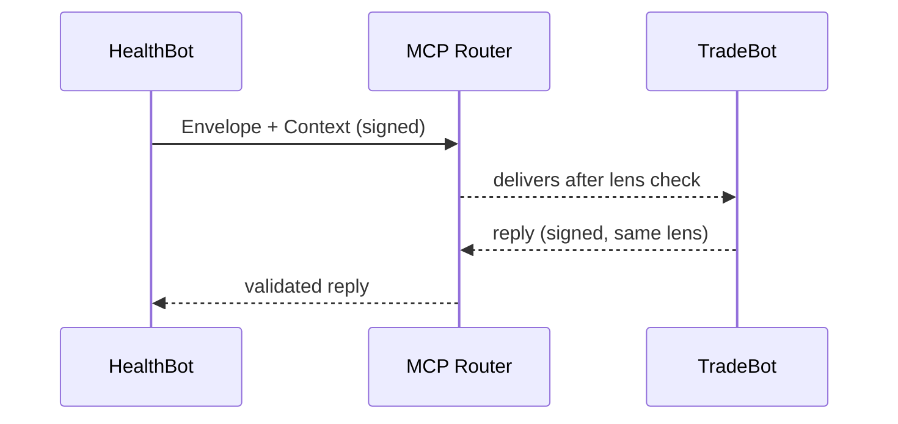

# Chapter 5: Model Context Protocol (HMS-MCP)

[← Back to Chapter 4: AI Agent Framework (HMS-AGT)](04_ai_agent_framework__hms_agt__.md)

---

## 1 Why Do Agents Need a Shared “Grammar”?

Picture two digital coworkers inside a federal program:

1. **HealthBot** – a GS-11 agent that reviews Medicaid drug claims.  
2. **TradeBot** – a GS-12 agent that tracks pharmaceutical import tariffs for the U.S. International Trade Administration.

One day HealthBot wants to double-check that a newly prescribed drug is **not** on the *high-tariff* list (which would make the claim ineligible for fast reimbursement).  
If HealthBot simply yells “Is drug X tariffed?” there is a good chance TradeBot will mis-interpret:

* Is “X” a National Drug Code (NDC) or a marketing name?  
* Does “tariffed” mean *any* tariff or only those above 10 %?

**Model Context Protocol (HMS-MCP)** is the **Bluebook for AI conversations**—a tiny but strict set of rules that says:

* what a message must look like,  
* which units and schemas tools should expect, and  
* how to cite evidence.

Following MCP means **zero semantic mix-ups—even across agencies**.

---

## 2 Beginner-Friendly Key Concepts

| MCP Term | Plain English | Analogy (Government) |
|----------|---------------|----------------------|
| **Envelope** | Tiny JSON wrapper with routing & auth info. | The barcode sticker on an inter-office memo. |
| **Context Block** | The actual question, plus any attachments. | The memo itself. |
| **Lens** | Declares how text should be read (FHIR, HS-Tariff, etc.). | “For Official Use Only” stamp. |
| **Citation** | Machine-readable pointer to evidence (URL, CFR section). | Footnotes in a GAO report. |
| **Signature** | HMAC that proves no one altered the message. | Chief of Staff’s ink stamp. |

---

## 3 The Use Case in 12 Lines of Code

Below HealthBot sends an MCP message to TradeBot.

```python
from hms_mcp import MCPMessage, send

msg = MCPMessage(
    to="agent:TradeBot",
    lens="HS_TARIFF_V2024",
    body={
        "query": "NDC:0002-8215",          # drug code
        "threshold_pct": 10
    },
    citations=[
        {"src": "21CFR§1308.12", "why": "Controlled Substance Check"}
    ]
)

reply = send(msg)        # handles envelope + signature
print(reply.body)        # → {"is_high_tariff": False, "rate": 5}
```

What happened?

1. `MCPMessage` auto-builds the **Envelope** (from/to, time, nonce).  
2. `send()` signs it, posts to the MCP Router, and validates the reply.  
3. TradeBot replies with the same lens, ensuring units match.

---

## 4 Message Anatomy at a Glance

```jsonc
{
  "envelope": {              // ❶ routing + security
    "from":   "HealthBot",
    "to":     "TradeBot",
    "nonce":  "1e2b3c",
    "sig":    "hmac-sha256…"
  },
  "context": {               // ❷ real meat
    "lens":  "HS_TARIFF_V2024",
    "body":  { "query": "NDC:0002-8215", "threshold_pct": 10 },
    "citations": [
      { "src": "21CFR§1308.12", "why": "Controlled Substance Check" }
    ]
  }
}
```

Keep this mental picture; every MCP message—small or huge—must follow it.

---

## 5 Step-by-Step Behind the Curtain



1. Router blocks any message missing a required field.  
2. Lens mismatch? Router returns `422 LENS_ERROR`.  
3. Invalid signature? `401 SIGNATURE_INVALID`.

---

## 6 A Tiny Peek at the Implementation

_File: `hms_mcp/core/message.py`_

```python
import hmac, json, time, secrets

class MCPMessage(dict):
    def __init__(self, to, lens, body, citations=None):
        env = {
            "from": "HealthBot", "to": to,
            "nonce": secrets.token_hex(6),
            "ts": int(time.time())
        }
        ctx = {"lens": lens, "body": body, "citations": citations or []}
        super().__init__(envelope=env, context=ctx)

    def sign(self, secret):
        raw = json.dumps(self["context"], sort_keys=True).encode()
        self["envelope"]["sig"] = hmac.new(secret, raw, "sha256").hexdigest()
```

Explanation:

1. Build envelope (`from`, `to`, `nonce`, `ts`).  
2. Insert context.  
3. `sign()` hashes only the context to avoid replay attacks.

(Yes—real code adds key rotation & size limits; omitted for clarity.)

---

## 7 Validating an Incoming Message

```python
from hms_mcp import validate

try:
    ctx = validate(incoming_msg)   # raises if bad
    process(ctx["body"])           # safe to use!
except MCPError as e:
    log.warning("MCP reject", e)
```

`validate()` checks:

* required envelope fields,  
* allowed lens list,  
* HMAC matches known key,  
* citations include “why”.

All in under 20 ms on a laptop.

---

## 8 Troubleshooting Cheat-Sheet

| Error Code | Meaning | Quick Fix |
|------------|---------|-----------|
| `401 SIGNATURE_INVALID` | Bad or missing HMAC. | Confirm both agents share the same secret. |
| `422 LENS_ERROR` | Unknown or mismatched lens. | Use `lens_registry.list()` to pick a supported lens. |
| `400 NO_CITATION` | Policy requires at least one source. | Add a citation array with `"why"`. |
| `429 CONTEXT_TOO_LARGE` | >100 KB body. | Upload big docs to HMS-DTA (see Chapter 12) and send a reference URL. |

---

## 9 Where MCP Fits in the Big Picture

• Agents created with [HMS-AGT](04_ai_agent_framework__hms_agt__.md) use MCP for every inter-agent call.  
• UI widgets from [HMS-MFE](03_micro_frontend_library__hms_mfe__.md) can inspect MCP replies to show inline footnotes.  
• The upcoming [Human-in-the-Loop Oversight Console](06_human_in_the_loop__hitl__oversight_console_.md) displays MCP citations so supervisors can audit “why the bot said that.”

---

## 10 Recap

In this chapter you:

1. Learned **why** a shared protocol prevents cross-agency confusion.  
2. Built and sent your first MCP message in 12 lines.  
3. Dissected the Envelope, Context Block, Lens, Citation, and Signature.  
4. Peeked at a minimal implementation and error handling.

Your bots can now **safely borrow each other’s expertise** while keeping an iron-clad audit trail.

Up next: give humans an easy way to oversee these conversations in real time—head to  
[Chapter 6: Human-in-the-Loop (HITL) Oversight Console](06_human_in_the_loop__hitl__oversight_console_.md).

---

Generated by [AI Codebase Knowledge Builder](https://github.com/The-Pocket/Tutorial-Codebase-Knowledge)