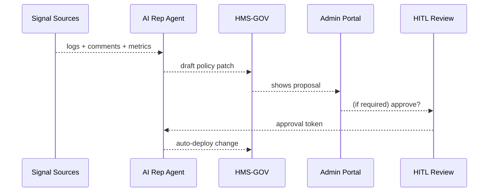

# Chapter 6: AI Representative Agent
*(your sleepless policy analyst in the cloud)*  

[← Back to Chapter 5: Admin / Gov Portal](05_admin___gov_portal_.md)

---

## 1. Why Do We Need an “AI Representative Agent”?

Picture Kareem, a small-business owner who just filed an OSHA workplace-safety permit through our portal.  
Minutes later he leaves this feedback:

> “Step 3 asks for the same inspection date twice—very confusing!”

• Before HMS-UHC, Kareem’s note vanished into a shared inbox nobody read.  
• Now, the **AI Representative Agent (AIRA)** sees the comment, checks error logs that show a spike in Step 3 aborts, drafts a one-line form change, and files a proposal for Lisa (the program manager from the last chapter) to approve.

Kareem’s fix is live the next morning—no night-shift humans required.

---

## 2. Key Concepts (in plain English)

| Term | What it really does |
|-----|---------------------|
| **Signal Listener** | Watches feeds: citizen comments, error logs, metrics. |
| **Insight Engine** | Clusters signals into a “problem statement.” |
| **Policy Draft Builder** | Writes a *proposed* change (text, JSON, or code patch). |
| **Deployment Bot** | Applies the change automatically **or** parks it for review. |
| **HITL Switch** | Toggles whether humans must approve (see [Human-in-the-Loop](07_human_in_the_loop__hitl__oversight_.md)). |

Remember: AIRA is not a mystical brain; it’s a **pipeline** of tiny, testable steps.

---

## 3. A 60-Second Walk-through (Live Demo)

Below is *all* the code a widget needs to ask AIRA for known issues with a specific form.

```jsx
// /widgets/form-insights/index.js   (16 lines)
export default function FormInsights({formId}) {
  const {data=[], refresh} = useFetch(`/api/aira/issues/${formId}`);

  return (
    <section>
      <h4>AI-Detected Issues</h4>
      {data.length === 0 && <p>No open issues 🎉</p>}
      {data.map(i=>(
        <div key={i.id}>
          <b>{i.title}</b> — {i.confidence}%
          <button onClick={()=>fetch(`/api/aira/resolve/${i.id}`)}>
            Mark Fixed
          </button>
        </div>
      ))}
      <button onClick={refresh}>Refresh</button>
    </section>
  );
}
```

What happens?  
1. Calls `/api/aira/issues/{formId}`.  
2. Shows AIRA’s latest findings.  
3. A click on **Mark Fixed** closes the issue and feeds the learning loop.

---

## 4. How Does AIRA Work? (High-Level View)



1. **Signal Sources** = log streams, feedback forms, etc.  
2. AIRA converts noise into an actionable *proposal*.  
3. If the **HITL switch** is on, humans approve before rollout.  

---

## 5. Peeking Inside the Code

### 5.1 Micro-service Skeleton (Node.js, 19 lines)

```js
// /services/aira/index.js
import express from "express";
import {listenSignals} from "./signals.js";
import {buildDraft}   from "./draft.js";
import {maybeDeploy}  from "./deploy.js";

const app = express();
app.use(express.json());

// ① incoming raw signal
app.post("/signal", async (req,res)=>{
  const insight = await listenSignals(req.body);
  if (insight) {
    const draft = await buildDraft(insight);   // ② create proposal
    await maybeDeploy(draft);                  // ③ auto or queue
  }
  res.json({ok:true});
});

app.listen(9000);
```

Explanation:  
1. Every log/error/comment hits `/signal`.  
2. `listenSignals` decides if it’s worth action.  
3. `maybeDeploy` checks the HITL setting before pushing to production.

---

### 5.2 Minimal `listenSignals` (12 lines)

```js
// /services/aira/signals.js
export async function listenSignals(payload){
  const {type, text} = payload;
  if (type!=="FORM_FEEDBACK") return null;

  if (/duplicate.+date/i.test(text)){
    return {problem:"Duplicate date field", formId:"OSHA_STEP3"};
  }
  return null;           // ignore minor comments
}
```

The function is **just pattern matching**—replace later with fancy ML.

---

### 5.3 Draft Builder (15 lines)

```js
// /services/aira/draft.js
export async function buildDraft(insight){
  return {
    title: `Remove duplicate date in ${insight.formId}`,
    patch: {
      op:"removeField",
      path:"/steps/3/fields/dateDuplicate"
    },
    confidence: 92
  };
}
```

• Produces a JSON patch + metadata  
• Confidence score helps humans decide quickly.

---

### 5.4 Deployment Decision (18 lines)

```js
// /services/aira/deploy.js
import {HITL_ON} from "../config.js";

export async function maybeDeploy(draft){
  if (HITL_ON){
    // ① send to proposal queue
    await db.proposals.insert({...draft, status:"PENDING"});
  } else {
    // ② auto-apply via HMS-GOV API
    await fetch("http://hms-gov/api/policy/patch",{
      method:"POST",
      body: JSON.stringify(draft.patch)
    });
    await db.audit.insert({draft, by:"AIRA", when:Date.now()});
  }
}
```

Short and sweet: either queue for humans or push instantly.

---

## 6. Calling AIRA from Other Layers

• **Admin / Gov Portal** – lists proposals (`/api/proposals/pending`).  
• **Governance Layer** – validates and stores any AI-generated patch.  
• **Compliance & Audit Trail** – logs every action `by:"AIRA"` for inspectors.  
• **HITL Oversight** – can flip the `HITL_ON` flag at runtime (see next chapter).

Cross-reference links:  
* Rules engine: [Governance Layer (HMS-GOV)](04_governance_layer__hms_gov__.md)  
* Human approvals: [Human-in-the-Loop (HITL) Oversight](07_human_in_the_loop__hitl__oversight_.md)

---

## 7. Common Pitfalls & Tips

1. **Too many low-value suggestions**  
   – Adjust the threshold inside `listenSignals` or pipe signals through a spam-filter Lambda.  
2. **Accidental auto-deploys**  
   – Keep `HITL_ON=true` in production until AIRA earns trust.  
3. **Model drift**  
   – Schedule a monthly accuracy review (dashboard provided in Admin Portal).  

---

## 8. Try It Yourself (Local Test)

```bash
# 1. start the agent
node services/aira/index.js

# 2. send a fake signal
curl -X POST localhost:9000/signal \
  -H "Content-Type: application/json" \
  -d '{"type":"FORM_FEEDBACK","text":"Step 3 asks for date twice"}'
```

Expected:  
• With `HITL_ON=true` → new row appears in the Proposal Inbox.  
• With `HITL_ON=false` → patch auto-applies; check the Audit log.

---

## 9. What You Learned

✔️ AIRA watches signals, drafts fixes, and (optionally) deploys them.  
✔️ The pipeline is composable: *Signal → Insight → Draft → Deploy*.  
✔️ Human approval is just a toggle, not a rewrite of the system.

Next we’ll dive deeper into that approval toggle and see how **Humans-in-the-Loop** keep the AI honest.

[→ Chapter 7: Human-in-the-Loop (HITL) Oversight](07_human_in_the_loop__hitl__oversight_.md)

---

Generated by [AI Codebase Knowledge Builder](https://github.com/The-Pocket/Tutorial-Codebase-Knowledge)