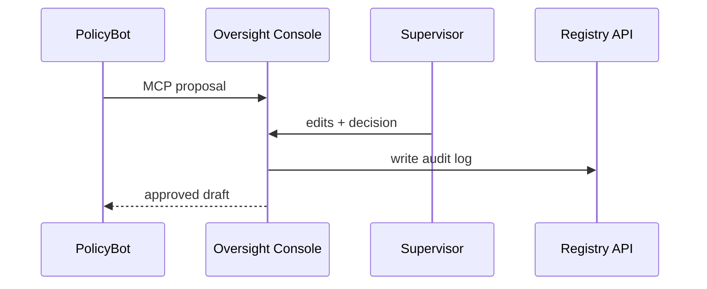

# Chapter 6: Human-in-the-Loop (HITL) Oversight Console
[← Back to Chapter 5: Model Context Protocol (HMS-MCP)](05_model_context_protocol__hms_mcp__.md)

---

## 1 Why Do We Need a “Red-Line” Desk for Robots?

Imagine the **Food Safety and Inspection Service (FSIS)** must publish a new rule on lab-grown chicken.  
A GS-11 *PolicyBot* (built in [HMS-AGT](04_ai_agent_framework__hms_agt__.md)) drafts 30 pages overnight:

*It looks good… but will Congress blame **you** if paragraph 13 violates the Poultry Products Inspection Act?*

The **HITL Oversight Console** turns every AI draft into a **red-line Word doc** on a supervisor’s desk:

1. **Queue** – see all pending AI proposals.  
2. **Red-Line** – tweak or strike text exactly like Track-Changes.  
3. **Approve / Veto** – one click sends it forward or back.  
4. **Audit Log** – who changed what, and why, is preserved forever.

Result: AI works fast, but humans stay in charge.

---

## 2 Key Concepts (Plain English)

| Term | In Everyday Words | Government Analogy |
|------|-------------------|--------------------|
| **Oversight Queue** | Inbox of all AI-generated drafts. | The in-tray on an SES director’s desk. |
| **Proposal Card** | One item in that inbox. Contains summary, risk score, and diff. | A memo jacket. |
| **Red-Line Editor** | UI (or API) to edit the draft. | Track-Changes in Microsoft Word. |
| **Decision Action** | `approve()`, `amend()`, or `reject()`. | “Sign”, “return for edits”, or “shred”. |
| **Audit Trail** | Immutable log of every keystroke. | The agency’s official records archive. |

---

## 3 First Walk-Through in 4 Steps

Below a supervisor reviews an AI-drafted grant letter.  
(We’ll use a sandbox token—no real data.)

### 3.1 Install & Authenticate
```bash
pip install hms-hitl
export HMS_HITL_TOKEN="demo-sandbox-token"
```

### 3.2 Open Your Inbox
```python
from hms_hitl import Console
cns = Console(token="demo-sandbox-token")

card = cns.queue.next()       # fetch oldest proposal
print(card.title)             # → "Lab-Grown Poultry Grant Letter"
```
Explanation:  
`queue.next()` pops the first **Proposal Card** ready for review.

### 3.3 Red-Line the Draft
```python
draft = card.open()
draft.replace("50,000", "75,000")     # raise grant cap
draft.comment("Adjusted for CPI.")
```
Beginners’ note: `.replace()` edits text; `.comment()` leaves a sticky note.

### 3.4 Approve & Ship
```python
card.approve(
    reason="CPI adjustment; otherwise compliant with 9 CFR 381."
)
```
• The AI receives the amended text.  
• The **Audit Trail** stores original + red-line + your username.  

That’s it—the grant letter goes out, and your name (not the robot’s) appears on the official signature block.

---

## 4 What Happens Behind the Scenes?



1. PolicyBot submits a **MCP message** labelled `lens: POLICY_DRAFT_V1`.  
2. HITL stores it; Queue shows “Pending”.  
3. Supervisor edits → clicks Approve.  
4. Console stamps an **HMAC signature** and returns the final text to the bot.  
5. Registry API writes an immutable record (block-hash style) for OIG audits.

---

## 5 Under-the-Hood Code Peek

_File: `hms_hitl/core/console.py` (simplified to 13 lines)_
```python
class Console:
    def __init__(self, token):
        self.token = token

    @property
    def queue(self):
        return _Queue(self.token)

class _Queue:
    def __init__(self, token):
        self.token = token

    def next(self):
        raw = _get("/api/hitl/queue/next", self.token)
        return ProposalCard(raw, self.token)

class ProposalCard:
    def __init__(self, data, token):
        self.data, self.token = data, token

    def open(self):
        return RedlineEditor(self.data["draft"])

    def approve(self, reason=""):
        _post("/api/hitl/decision", {
            "id": self.data["id"],
            "action": "APPROVE",
            "reason": reason
        }, self.token)
```
One-liner explanations:  
• `_get` / `_post` are thin wrappers that auto-sign MCP envelopes.  
• `ProposalCard.open()` returns a tiny text-mutation helper.  
• `approve()` fires the decision endpoint; server logs everything.

---

## 6 Troubleshooting Cheat-Sheet

| Symptom | Likely Cause | Quick Fix |
|---------|--------------|-----------|
| Inbox empty but bot says it sent draft | Agent used wrong `lens` | Check bot config (`lens="POLICY_DRAFT_V1"`). |
| `403 FORBIDDEN` on approve | You lack clearance | Ask admin to add role `reviewer` in HITL ACL. |
| Changes don’t stick | Forgot `.save()` in editor | Call `editor.save()` before `card.approve()`. |
| Audit log missing citation | Bot left out `citations[]` | Enforce MCP rule in bot (see Chapter 5). |

---

## 7 Where HITL Sits in the HMS Universe

• Proposals are authored by agents from [AI Agent Framework](04_ai_agent_framework__hms_agt__.md).  
• Messages travel via [Model Context Protocol](05_model_context_protocol__hms_mcp__.md).  
• Signed decisions feed downstream to the **AI Governance Values Pipeline**—next chapter!  

---

## 8 Recap & What’s Next

You have learned to:

1. View the Oversight Queue.  
2. Red-line an AI draft.  
3. Approve, amend, or reject with a single API call.  
4. Preserve a tamper-proof audit trail for inspectors-general.

Ready to see how those audit logs roll up into dashboards that track fairness, bias, and legal compliance?  
Jump ahead to [Chapter 7: AI Governance Values Pipeline](07_ai_governance_values_pipeline_.md).

---

Generated by [AI Codebase Knowledge Builder](https://github.com/The-Pocket/Tutorial-Codebase-Knowledge)