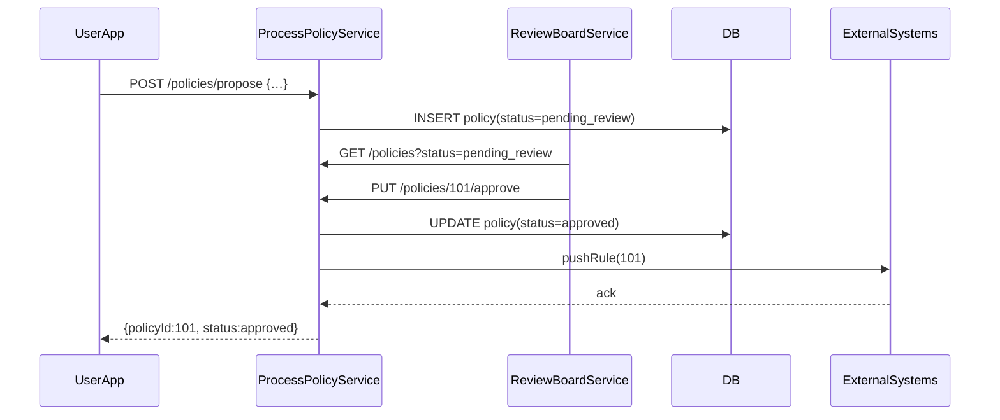

# Chapter 6: Process & Policy Management

In the previous chapter, we saw how humans review AI suggestions in [Chapter 5: Human-in-the-Loop Oversight](05_human_in_the_loop_oversight_.md). Now we’ll explore how **Process & Policy Management** lets agencies draft, review, approve, and enforce rules—just like a legislative drafting office for digital services.

---

## 1. Why Do We Need Process & Policy Management?

Imagine the Department of Energy runs a **Solar Rebate Program**. They need to:

1. Propose new rebate amounts or eligibility rules.
2. Collect feedback from experts and stakeholders.
3. Approve the final policy.
4. Push the rule change into billing systems, citizen portals, and external partners.

Without a central module, each step lives in a silo: spreadsheets, emails, manual code updates. Process & Policy Management centralizes workflows, rule definitions, and change mechanisms so every step is tracked, reviewed, and enforced.

---

## 2. Key Concepts

1. **Workflow Definition**  
   - Describes the steps: draft → review → approve → publish.

2. **Policy Rule Definition**  
   - A structured object: title, description, thresholds, dates.

3. **Review & Approval**  
   - Checkpoints where experts comment and vote on drafts.

4. **Enforcement Engine**  
   - Pushes approved rules to downstream systems (billing, portals).

5. **Synchronization**  
   - Ensures external systems (e.g., state utilities) get the updated rules.

---

## 3. Using Process & Policy Management

Let’s draft a new solar rebate increase—from \$500 to \$600 for low-income households.

### 3.1 Propose a Policy

```http
POST /policies/propose
Content-Type: application/json

{
  "title": "Increase Solar Rebate",
  "description": "Raise rebate to $600 for incomes <$50k",
  "rules": { "amount":600, "incomeCap":50000 }
}
```

Response:

```json
{
  "policyId": 101,
  "status": "pending_review"
}
```

*Explanation:* We sent a new policy draft. The system stored it as **pending_review** and returned `policyId=101`.

### 3.2 View a Pending Policy

```http
GET /policies/101
```

Response:

```json
{
  "policyId": 101,
  "title": "Increase Solar Rebate",
  "status": "pending_review",
  "rules": { "amount":600, "incomeCap":50000 }
}
```

*Explanation:* We fetched the draft to confirm details before review.

### 3.3 Approve & Enforce

```http
PUT /policies/101/approve
```

Response:

```json
{ "policyId":101, "status":"approved" }
```

*Explanation:* The policy is approved and the enforcement engine will push it to all connected systems.

---

## 4. What Happens Under the Hood?



1. **Draft**: UserApp calls **ProcessPolicyService** to store a draft.  
2. **Review**: ReviewBoardService lists pending drafts.  
3. **Approve**: Board approves via PolicySvc.  
4. **Enforce**: Approved rules are sent to ExternalSystems.  
5. **Notify**: UserApp sees final status.

---

## 5. Inside the Service: Minimal Code

### 5.1 process-policy-service/index.js

```js
const express = require('express');
const app = express();
app.use(express.json());

let policies = []; // in-memory store

// Propose a draft
app.post('/policies/propose', (req, res) => {
  const id = policies.length + 1;
  policies.push({ id, ...req.body, status: 'pending_review' });
  res.json({ policyId: id, status: 'pending_review' });
});

// Approve and enforce
app.put('/policies/:id/approve', (req, res) => {
  const p = policies.find(x => x.id == req.params.id);
  p.status = 'approved';
  enforceRule(p); // see next snippet
  res.json({ policyId: p.id, status: p.status });
});

app.listen(7000, () => console.log('ProcessPolicyService up'));
```

*Explanation:* We keep a simple array `policies`. One endpoint to propose, another to approve and call `enforceRule()`.

### 5.2 Enforcement Function

```js
function enforceRule(policy) {
  // Imagine this calls billing APIs, portal configs, etc.
  console.log(`Enforcing policy ${policy.id}:`, policy.rules);
  // fetch('https://external.gov/apply', …)
}
```

*Explanation:* After approval, `enforceRule` pushes the new rule to downstream systems.

---

## 6. Summary & Next Steps

You’ve learned how **Process & Policy Management** centralizes drafting, reviewing, approving, and enforcing policy changes—just like a legislative office. We saw:

- How to **propose**, **fetch**, and **approve** a policy via simple HTTP calls.
- A clear **sequence** from draft to enforcement.
- Minimal service code illustrating storage and push to external systems.

Next up: dive into the governance around AI itself in [Chapter 7: AI Governance Model](07_ai_governance_model_.md).

---

Generated by [AI Codebase Knowledge Builder](https://github.com/The-Pocket/Tutorial-Codebase-Knowledge)