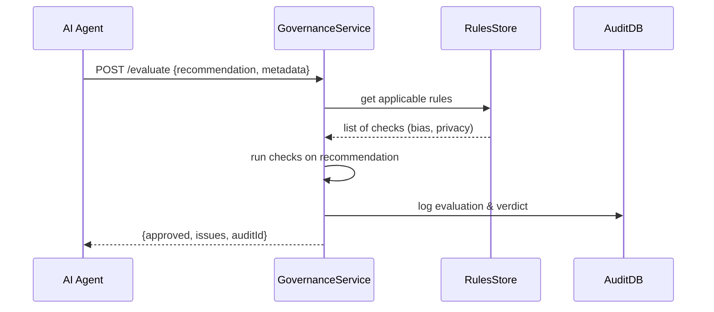

# Chapter 7: AI Governance Model

In [Chapter 6: Process & Policy Management](06_process___policy_management_.md), we saw how approved policies get drafted and enforced. Now we’ll add a crucial layer that **guards our AI**: the **AI Governance Model**. This ensures every AI-driven recommendation follows ethical rules—like having a virtual ethics committee checking every decision for fairness, safety, and privacy.

---

## 1. Why Do We Need an AI Governance Model?

Imagine the Department of Labor uses an AI agent to speed up unemployment-benefits processing. The agent suggests skipping certain identity checks for faster throughput. Without guardrails, it might accidentally favor one group over another or expose sensitive data. The **AI Governance Model** sits between the AI and the final action, answering questions like:

- “Does this recommendation treat all applicants fairly?”  
- “Is any private data being over-exposed?”  
- “Who is ultimately responsible for this decision?”

This model embeds **ethical guardrails** and **audit trails** into every AI suggestion.

---

## 2. Key Concepts

1. Ethical Guardrails  
   Rules that check AI outputs for bias, privacy, and safety.

2. Accountability Layer  
   Metadata on “who reviewed what, when” so decisions can be traced.

3. Governance Rules  
   A set of policies (e.g., “no recommendation may use race as a factor”).

4. Automated Review  
   A service that evaluates each AI proposal against governance rules.

5. Audit Trail  
   Logs every evaluation and final verdict for compliance.

---

## 3. Using the AI Governance Model

### 3.1 Example: Evaluating an AI Recommendation

Suppose your AI agent suggests this:

```json
{
  "recommendation": {
    "action": "accelerateProcessing",
    "applicantGroup": "all"
  },
  "metadata": { "agentId": "A2A-123", "timestamp":"2024-07-01T10:00Z" }
}
```

You send it to the Governance Service:

```js
// File: client.js
import api from './api';

const payload = { recommendation, metadata };
const result = await api.post('/governance/evaluate', payload);
console.log(result);
// Possible output:
// { approved: true, issues: [], auditId: 42 }
```

Explanation:  
- We call `POST /governance/evaluate` with the AI’s suggestion.  
- The service returns whether it’s **approved**, any **issues found**, and an **auditId** for tracking.

---

## 4. Under the Hood: What Happens Step-by-Step



1. **AI Agent** sends a recommendation with context.  
2. **GovernanceService** fetches its rule set.  
3. It runs each check (e.g., bias detector).  
4. Logs the result in **AuditDB**.  
5. Replies with **approved** or **rejected**, plus any **issues**.

---

## 5. Inside the GovernanceService

### 5.1 Endpoint Definition

```js
// File: governance-service/index.js
const express = require('express');
const { evaluate } = require('./rules');
const { logAudit } = require('./audit');
const app = express();
app.use(express.json());

app.post('/evaluate', (req, res) => {
  const {approved, issues} = evaluate(req.body);
  const auditId = logAudit(req.body, approved, issues);
  res.json({ approved, issues, auditId });
});

app.listen(8000, () => console.log('GovernanceService on 8000'));
```

Explanation:  
- `evaluate()` runs all governance checks.  
- `logAudit()` saves the full record and returns an `auditId`.  
- We respond with the decision and tracking ID.

### 5.2 Simple Rule Checks

```js
// File: governance-service/rules.js
const ruleSet = [
  rec => rec.recommendation.applicantGroup === 'all'
    ? { pass:true } : { pass:false, issue:'Invalid group' },
  rec => rec.metadata.agentId
    ? { pass:true } : { pass:false, issue:'Missing agentId' }
];

function evaluate(rec) {
  const issues = ruleSet
    .map(check => check(rec))
    .filter(r => !r.pass)
    .map(r => r.issue);
  return { approved: issues.length === 0, issues };
}

module.exports = { evaluate };
```

Explanation:  
- We define simple checks as functions in an array.  
- Each returns `{pass:true}` or `{pass:false, issue:'...'}`.  
- `evaluate()` collects any issue messages and decides approval.

### 5.3 Audit Logging (Simplified)

```js
// File: governance-service/audit.js
let audits = []; // in-memory store

function logAudit(rec, approved, issues) {
  const id = audits.length + 1;
  audits.push({ id, rec, approved, issues, time:Date.now() });
  return id;
}

module.exports = { logAudit };
```

Explanation:  
- We store each evaluation with a timestamp.  
- Returns an `auditId` so you can trace back exactly what was checked.

---

## 6. Summary & Next Steps

In this chapter you learned how to:  
- Embed **ethical guardrails** around every AI recommendation.  
- Define a **GovernanceService** that evaluates, logs, and tracks decisions.  
- Keep a clear **audit trail** for accountability and compliance.

Up next, we’ll expand governance to cover all services in [Chapter 8: Governance Layer](08_governance_layer_.md).

---

Generated by [AI Codebase Knowledge Builder](https://github.com/The-Pocket/Tutorial-Codebase-Knowledge)