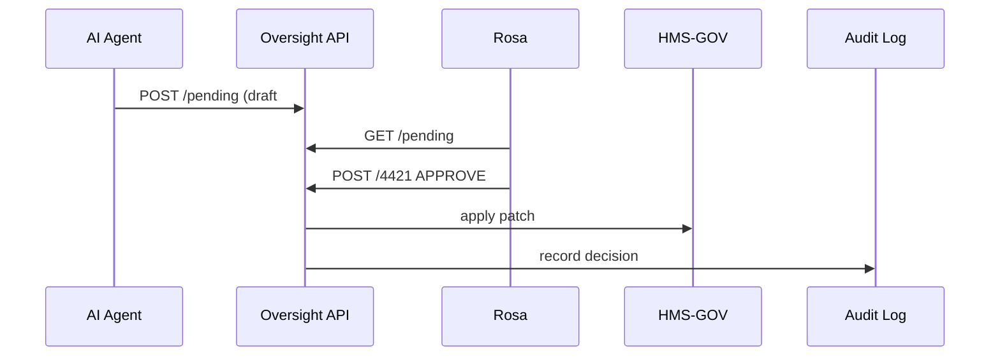

# Chapter 7: Human-in-the-Loop (HITL) Oversight  
*(the safety net that signs the AI’s checks)*  

[← Back to Chapter 6: AI Representative Agent](06_ai_representative_agent_.md)

---

## 1. Why Bother With Humans If We Have AI?  

Imagine **Rosa**, a benefits officer at the Social Security Administration.  
Yesterday the **AI Representative Agent (AIRA)** spotted a rule typo in a retirement-benefit form and drafted a patch to fix it. If that patch goes live unchecked, a single word change (“*must*” → “*may*”) could cost retirees money.

HITL Oversight guarantees:

1. A **human** reads every high-impact AI proposal.  
2. The decision—approve, modify, or reject—is **logged** forever.  
3. Citizens know an accountable person, not a black box, made the call.  

Think of HITL as the **building inspector** who signs off even when robots did the construction.

---

## 2. Key Concepts (Plain English)

| Term | What it really means |
|------|----------------------|
| **Oversight Board** | Group of authorized reviewers (e.g., Rosa & peers). |
| **Approval Queue** | List of AI or automated proposals waiting for a verdict. |
| **Override Switch** | Button to fast-track or block a proposal. |
| **Accountability Log** | Tamper-proof record of who decided what and why. |
| **Escalation Ladder** | Path to higher officials when reviewers disagree. |

Keep these five in mind; you’ll see them in code next.

---

## 3. Walking Through Rosa’s Day (End-to-End)

1. AIRA files proposal **#4421**: “Adjust eligibility age field label.”  
2. Proposal appears in the **Approval Queue**.  
3. Rosa opens it, tweaks wording, hits **Approve**.  
4. The patch reaches the [Governance Layer](04_governance_layer__hms_gov__.md) and is deployed.  
5. The action is stored in the [Compliance & Audit Trail](15_compliance___audit_trail_.md).

---

## 4. Tiny Front-End: “Approval Queue” Widget (18 lines)

```jsx
// /widgets/approval-queue/index.js
export default function ApprovalQueue() {
  const {data=[], refetch}=useFetch("/api/hitl/pending");

  const decide = async (id,action)=> {
    await fetch(`/api/hitl/${id}`,{
      method:"POST",
      body: JSON.stringify({action})
    });
    refetch();                    // refresh list
  };

  return (
    <section>
      <h3>Pending HITL Reviews</h3>
      {data.map(p=>(
        <div key={p.id}>
          <p>{p.title}</p>
          <button onClick={()=>decide(p.id,"APPROVE")}>Approve</button>
          <button onClick={()=>decide(p.id,"REJECT")}>Reject</button>
          <button onClick={()=>decide(p.id,"ESCALATE")}>Escalate</button>
        </div>
      ))}
    </section>
  );
}
```

What it does: fetches pending proposals, lets Rosa pick an action, then refreshes.

---

## 5. What Happens Behind the Curtain?



Five steps—no mystery.

---

## 6. Oversight API (Back-End) in 20 Lines

```js
// /api/hitl/[id].js
import {applyPatch} from "../../services/gov-bridge.js";
import {logDecision} from "../../services/audit.js";

export default async (req,res)=>{
  const {id} = req.query;
  const {action} = JSON.parse(req.body);   // APPROVE / REJECT / ESCALATE
  const prop = await db.proposals.find(id);

  if (action==="APPROVE") await applyPatch(prop.patch);
  if (action==="ESCALATE") await db.escalations.insert(prop);

  await db.proposals.update(id,{status:action});
  await logDecision({id,action,user:req.user.name});

  res.json({ok:true});
};
```

Explanation:  
• Approve → sends patch to HMS-GOV.  
• Reject → simply marks status.  
• Escalate → copies to a higher queue.  
• Every move is logged.

---

### 6.1 Minimal `applyPatch` (7 lines)

```js
export const applyPatch = patch =>
  fetch("http://hms-gov/api/policy/patch",{
    method:"POST",
    body: JSON.stringify(patch)
  });
```

Delegates the heavy lifting to the Governance Layer; keeps HITL code tiny.

---

## 7. Flipping the HITL Switch

AIRA decides whether to auto-deploy or queue for humans by reading one flag.

```js
// services/aira/config.js
export const HITL_ON = process.env.HITL_ON !== "false";
```

• Sandboxes keep `HITL_ON=false` for faster testing.  
• Production leaves it **true** so every patch meets human eyes.

---

## 8. Integrating With Other Layers

• **AI Representative Agent** – creates proposals; respects the `HITL_ON` flag.  
• **Admin / Gov Portal** – hosts the Approval Queue widget for reviewers.  
• **Compliance & Audit Trail** – stores `logDecision` entries.  
• **Access & Authorization Framework** – ensures only Oversight Board roles hit `/api/hitl/*`.

Need a refresher?  
• AI pipeline: [AI Representative Agent](06_ai_representative_agent_.md)  
• Policy engine: [Governance Layer](04_governance_layer__hms_gov__.md)

---

## 9. Common Pitfalls & Quick Fixes

1. **Proposal never shows up** – Check if AIRA mistakenly has `HITL_ON=false`.  
2. **Reviewer can’t approve** – Ensure the user has `ROLE_OVERSIGHT` in the [Access & Authorization Framework](11_access___authorization_framework_.md).  
3. **Audit log empty** – Verify `logDecision` writes to the same database where [Compliance & Audit Trail](15_compliance___audit_trail_.md) reads.

---

## 10. Try It Locally in Two Commands

```bash
npm run aira:demo      # starts AIRA & submits a dummy proposal
npm run portal:dev     # open http://localhost:3000/admin → approve it
```

Watch the patch apply and the audit entry appear—congrats, you just wielded HITL power!

---

## 11. What You Learned

✔️ Why human oversight is essential, even with smart AI.  
✔️ Five core HITL concepts: Oversight Board, Approval Queue, Override Switch, Accountability Log, Escalation Ladder.  
✔️ How <20-line widgets and APIs implement the entire loop.  
✔️ Where HITL plugs into Governance, AI, and Audit layers.

Ready to see how formal **policies and processes** feed into these decisions? Jump ahead to [Chapter 8: Policy / Process Module](08_policy___process_module_.md).

---

Generated by [AI Codebase Knowledge Builder](https://github.com/The-Pocket/Tutorial-Codebase-Knowledge)