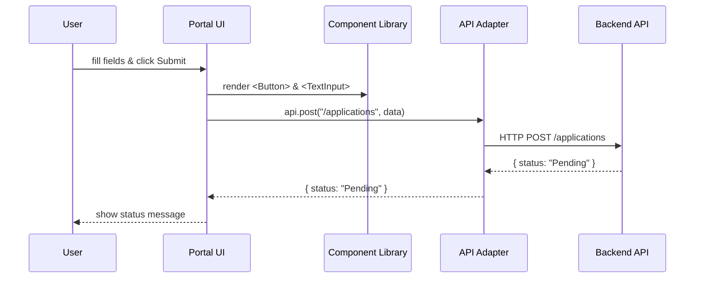
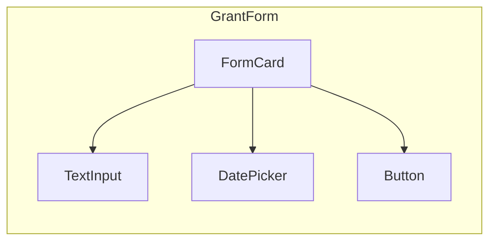

# Chapter 8: Frontend Component Library

Welcome back! In [Chapter 7: Interface Layer](07_interface_layer_.md) we built citizen and admin portals. Now, let’s create a **Frontend Component Library**—a shared toolkit of UI pieces (buttons, forms, cards) so every portal looks and behaves the same, just like standardized forms used across government agencies.

---

## Why a Component Library?

Imagine the Office of Justice Programs (OJP) and the Federal Crop Insurance Corporation (FCIC) both need date pickers, text inputs, and “Submit” buttons that look identical. A component library:

- Saves time—build once, reuse everywhere  
- Ensures consistency—uniform colors, fonts, spacing  
- Makes maintenance easier—fix a bug in Button, it updates everywhere  

It’s like having a standard federal form template you can drop into any agency’s website.

---

## Central Use Case: Building a “Grant Application” Form

Suppose we need a “Grant Application” form in both:

- **HMS-MFE** (citizen portal)  
- **HMS-GOV** (admin portal)  

Instead of writing your own `<input>` and `<button>` each time, you import:

```jsx
import { TextInput, DatePicker, Button, FormCard } from 'hms-ui-library';

function GrantForm() {
  return (
    <FormCard title="Apply for Grant">
      <TextInput label="Full Name" value={name} onChange={setName} />
      <DatePicker label="Date of Birth" value={dob} onChange={setDob} />
      <Button onClick={submit}>Submit Application</Button>
    </FormCard>
  );
}
```

Here, every field and button uses the same style, padding, and error handling.

---

## Key Concepts

1. **Design Tokens**  
   - Core values (colors, font sizes, spacing) in one place.  
   - E.g., `primaryColor = "#005EA2"` (gov-blue).  

2. **Base Components**  
   - `<Button>`, `<TextInput>`, `<Select>`, `<FormCard>`.  
   - Each handles accessibility, styles, and common props.  

3. **Theming**  
   - Switch between light/dark or agency-branded palettes.  
   - Use a ThemeProvider to wrap your app.  

4. **Composition**  
   - Build complex UIs by nesting simple components.  
   - E.g., `<FormCard>` wraps inputs and actions.  

5. **Storybook / Docs**  
   - Live catalog of components with examples.  
   - Helps developers see and test components before using them.

---

## How to Use the Library

1. **Install** (npm or yarn):

   ```bash
   npm install hms-ui-library
   ```

2. **Wrap your app** with the theme:

   ```jsx
   import { ThemeProvider } from 'hms-ui-library';
   import GrantForm from './GrantForm';

   function App() {
     return (
       <ThemeProvider>
         <GrantForm />
       </ThemeProvider>
     );
   }
   ```

3. **Import and use** components:

   ```jsx
   import { Button, TextInput } from 'hms-ui-library';

   <TextInput label="Email" value={email} onChange={setEmail} />
   <Button onClick={send}>Send</Button>
   ```

The components handle focus styles, error messages, and responsive layout automatically.

---

## What Happens When You Render a Form



1. **Portal UI** uses library components to render form elements.  
2. On submit, it calls the **API Adapter**, which talks to the **Backend API**.  
3. Responses bubble back to the user.

---

## Inside the Library: File Structure

```
hms-ui-library/
├─ src/
│  ├─ theme/
│  │   └─ tokens.js
│  ├─ components/
│  │   ├─ Button.js
│  │   ├─ TextInput.js
│  │   └─ FormCard.js
│  └─ index.js
└─ stories/
   └─ Button.stories.js
```

### 1. Design Tokens (`theme/tokens.js`)

```js
export const colors = {
  primary: '#005EA2',    // government-blue
  error: '#D4351C',      // red for errors
};
export const spacing = { sm: 8, md: 16, lg: 24 };
```

> Keep all core values here so components stay in sync.

### 2. Button Component (`components/Button.js`)

```jsx
import React from 'react';
import { colors, spacing } from '../theme/tokens';

export function Button({ children, onClick }) {
  return (
    <button
      style={{
        background: colors.primary,
        color: 'white',
        padding: spacing.md,
        border: 'none',
        borderRadius: 4,
      }}
      onClick={onClick}
    >
      {children}
    </button>
  );
}
```

> A simple, styled button that every portal reuses.

### 3. Form Card (`components/FormCard.js`)

```jsx
import React from 'react';

export function FormCard({ title, children }) {
  return (
    <div style={{ border: '1px solid #ccc', padding: 16, borderRadius: 4 }}>
      <h2>{title}</h2>
      {children}
    </div>
  );
}
```

> A container with a heading—great for grouping form fields.

---

## Visualizing Component Composition



- **FormCard** wraps the inputs and the submit button.  
- Each component uses the same design tokens.

---

## Conclusion

You’ve learned how a **Frontend Component Library** keeps your portals looking and behaving consistently—just like standardized government forms. You saw how to:

- Define **design tokens** for colors and spacing  
- Build and **compose** reusable components  
- Wrap your app in a **theming** provider  
- Publish a shared library for all teams

Next, we’ll connect with outside systems and synchronize data in [Chapter 9: External System Synchronization](09_external_system_synchronization_.md).

---

Generated by [AI Codebase Knowledge Builder](https://github.com/The-Pocket/Tutorial-Codebase-Knowledge)