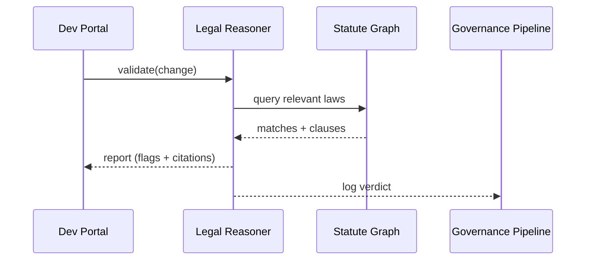

# Chapter 8: Legal & Compliance Reasoner (HMS-ESQ)

[← Back to Chapter 7: AI Governance Values Pipeline](07_ai_governance_values_pipeline_.md)

---

## 1 Why Should I Care?

Picture the **U.S. Department of Transportation (DOT)**.  
Tomorrow they want to switch the driver-license renewal form from PDF to an online wizard.

Sounds harmless, but before it goes live DOT’s lawyers must confirm the change does **NOT**:

1. Violate the REAL ID Act,  
2. Expose personal data against the Privacy Act of 1974, or  
3. Conflict with DOT Order 2100.6.

One missed clause could end up in a congressional hearing.  
**HMS-ESQ** is the always-on “digital counsel” that reviews every planned change and screams, *“Hold up—Section 102(b) forbids that!”*—complete with chapter-and-verse citations.

---

## 2 Key Concepts (Beginner Friendly)

| Term | Plain English | Government Analogy |
|------|---------------|--------------------|
| **Statute Graph** | A searchable map of laws, orders, and directives. | The U.S. Code printed on index cards and linked by topics. |
| **Change Proposal** | JSON/YAML description of what you’re about to deploy. | A Federal Register *notice of proposed rulemaking*. |
| **Conflict Flag** | “🚫 No-Go”, “⚠️ Warning”, or “✅ Clear”. | OMB clearance stamp in red, yellow, or green. |
| **Citation Bundle** | List of legal sources that justify each flag. | Footnotes in a GAO report. |
| **Mode** | `whisper` (adds warnings) or `block` (stops deployment). | Lawyer whispering in your ear vs. filing an injunction. |

Keep these five words in mind—everything ESQ does is built on them.

---

## 3 Your First Legal Check in 15 Lines

Goal: scan a new **API endpoint** that returns driver data.

### 3.1 Install & Authenticate

```bash
pip install hms-esq
export HMS_ESQ_TOKEN="demo-sandbox-token"
```

### 3.2 Validate the Change

```python
from hms_esq import ESQ

change = {
    "id":   "endpoint-v2",
    "title":"Driver Info API",
    "data": {"fields": ["name", "ssn", "address"]},
    "agency":"DOT"
}

report = ESQ().validate(change, mode="whisper")
print(report.pretty())
```

Sample output

```
Result : 🚫 BLOCK (2 conflicts)
1. Privacy Act §552a(b) – Disclosing SSN without consent
2. DOT Order 2100.6 §12 – Address info must be redacted

Suggested Fix:
• Mask SSN except last 4 digits
• Provide opt-out checkbox
```

What happened?  
• ESQ compared the proposal to the **Statute Graph**.  
• It raised two **Conflict Flags** and cited exact sections.

---

## 4 What Happens Under the Hood?



Takeaway: Your app never digs through CFR text—ESQ does and returns a one-page verdict.

---

## 5 Tiny Peek at the Implementation

_File: `hms_esq/core/reasoner.py` (simplified to 14 lines)_

```python
class ESQ:
    def __init__(self):
        self.graph = _load_graph()   # pre-built Neo4j or SQLite

    def validate(self, proposal, mode="whisper"):
        flags = []
        # 1. Crawl graph for every field & action in proposal
        for node in _extract_nodes(proposal):
            flags += self.graph.conflicts(node)

        report = _build_report(flags, proposal)
        if mode == "block" and any(f.level=="BLOCK" for f in flags):
            raise DeploymentError(report)
        return report
```

Quick notes:  
1. `_extract_nodes()` tokenizes the proposal (e.g., “SSN”).  
2. `graph.conflicts()` returns matching law sections.  
3. `report` holds **Conflict Flags** + suggested fixes.

---

## 6 Adding an Agency Directive in 10 Lines

Suppose DOT issues a new memo `DOT-2024-05` requiring all addresses to be truncated at ZIP + 4.

```python
from hms_esq import Statute

law = Statute(
    id="DOT-2024-05",
    text="Truncate home address to ZIP+4 when exposed externally.",
    scope={"agency":"DOT"},
    tags=["address","privacy"]
)

ESQ().register(law)
```

Now every future change exposing `address` will be checked against this directive automatically.

---

## 7 Integration Points

• **Values Pipeline**: ESQ ships a ready-made `ComplianceSensor` you can plug into the belt from [Chapter 7](07_ai_governance_values_pipeline_.md).  
• **HITL Console**: Flags marked `⚠️ Warning` are auto-queued for reviewers in [Chapter 6](06_human_in_the_loop__hitl__oversight_console_.md).  
• **Agents**: Bots in [Chapter 4](04_ai_agent_framework__hms_agt__.md) call `ESQ.validate()` before suggesting any policy change.

---

## 8 Troubleshooting Cheat-Sheet

| Symptom | Cause | Fix |
|---------|-------|-----|
| `No graph loaded` | Missing statutes DB | `export ESQ_GRAPH_PATH=/path/graph.db` |
| Every change blocked | Over-broad tag match | Add `scope={"agency":"DOT"}` when registering statutes. |
| Citations missing page numbers | Source PDF not parsed | Run `esq reindex --src /laws/*.pdf`. |
| Long validation time | Huge proposal file | Split into smaller modules or upgrade to Neo4j backend. |

---

## 9 Recap

You can now:

1. Describe a **Change Proposal** in JSON/YAML.  
2. Run `ESQ.validate()` to get instant legal feedback.  
3. Read **Conflict Flags** with exact citations and suggested fixes.  
4. Feed ESQ into your Governance Pipeline or HITL queue.

Legal guardrails are no longer a last-minute scramble—they’re baked into every deployment.

Ready to see how all these modules get wired in a production-ready stack?  
Jump to [Chapter 9: Three-Layer Micro-Service Stack (Governance / Management / Interface)](09_three_layer_micro_service_stack__governance___management___interface__.md).

---

---

Generated by [AI Codebase Knowledge Builder](https://github.com/The-Pocket/Tutorial-Codebase-Knowledge)