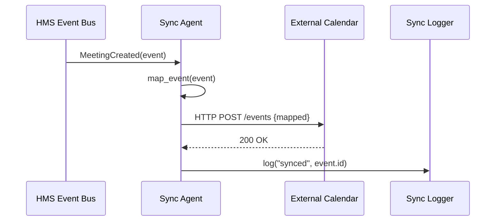
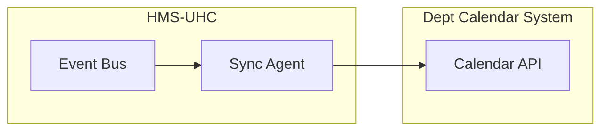

# Chapter 9: External System Synchronization

Welcome back! In [Chapter 8: Frontend Component Library](08_frontend_component_library_.md), you learned how to build consistent UIs. Now we’ll explore **External System Synchronization**—the real-time link that keeps outside scheduling or data services in sync with every update you make in HMS-UHC.

---

## Why External Synchronization Matters

Imagine the Department of Health schedules a cross-agency review meeting in HMS. The Education Department also uses its own calendar system. Without a live sync, both teams might accidentally double-book the same room or time slot.  

**External System Synchronization** ensures that whenever HMS creates, updates, or cancels a meeting, your partner agencies’ calendars stay up-to-date—preventing conflicts and confusion.

---

## Key Concepts

1. **Sync Agents**  
   - Small services that listen for HMS events (e.g., “MeetingCreated”).  
   - Transform and forward data to external APIs.

2. **Webhooks & APIs**  
   - HMS publishes events via webhooks or a message bus.  
   - Sync Agents call external REST endpoints to push updates.

3. **Data Mapping**  
   - Convert HMS event structures into the format the external system expects.  
   - Example: HMS’s `{ date: "2024-07-01" }` → External’s `{ startDate: "2024-07-01T09:00Z" }`.

4. **Error Handling & Retries**  
   - If the external API is down, the Sync Agent queues the event and retries later.  
   - Keeps logs for audit and troubleshooting.

5. **Real-Time vs. Batch**  
   - Real-time for critical updates (meetings, alerts).  
   - Batch sync for large data imports (e.g., overnight roster updates).

---

## Using External Synchronization

Here’s how you’d wire up a simple sync for meeting events in your HMS code:

```rust
// File: src/main.rs
fn main() -> Result<(), SyncError> {
    let mut agent = ExternalSyncAgent::new();
    agent.register_endpoint(
        "DeptCalendar",
        "https://calendar.dept.gov/api/events",
    );
    // Whenever a meeting is created in HMS:
    let meeting = Meeting { id: 42, title: "Budget Review", date: "2024-07-01" };
    agent.sync_meeting_created(&meeting)?;
    Ok(())
}
```

Explanation:  
- We instantiate an `ExternalSyncAgent`.  
- We tell it where to send department calendar updates.  
- On each new meeting, we call `sync_meeting_created`, and the agent pushes it out.

---

## What Happens Step-By-Step



1. HMS emits a `MeetingCreated` event.  
2. The Sync Agent maps the data fields.  
3. It calls the external calendar’s API.  
4. On success, it logs the sync for audit.

---

## Inside the Sync Agent

### File: src/sync/agent.rs

```rust
pub struct ExternalSyncAgent {
    endpoints: HashMap<String, String>,
}

impl ExternalSyncAgent {
    pub fn new() -> Self {
        ExternalSyncAgent { endpoints: HashMap::new() }
    }
    pub fn register_endpoint(&mut self, name: &str, url: &str) {
        self.endpoints.insert(name.to_string(), url.to_string());
    }
    pub fn sync_meeting_created(&self, m: &Meeting) -> Result<(), SyncError> {
        let url = &self.endpoints["DeptCalendar"];
        let payload = map_meeting(m);
        http_post(url, &payload)?;      // calls external API
        log_sync("created", m.id);      // records audit
        Ok(())
    }
}
```

- `register_endpoint` saves where to send data.  
- `sync_meeting_created` builds the payload, sends it, and logs the result.

### File: src/sync/mapping.rs

```rust
pub fn map_meeting(m: &Meeting) -> ExternalMeeting {
    ExternalMeeting {
        event_id: m.id,
        title: m.title.clone(),
        startDate: format!("{}T09:00Z", m.date),
    }
}
```

- Converts our HMS `Meeting` into the external system’s `ExternalMeeting` format.

---

## Visualizing the Architecture



- HMS publishes events.  
- The Sync Agent listens and forwards updates.  
- External system stays in lock-step.

---

## Conclusion

You’ve learned how **External System Synchronization** works:

- Setting up **Sync Agents** to listen for HMS events  
- Mapping HMS data into external formats  
- Calling partner APIs with retries and logging  

This keeps cross-agency calendars and services aligned in real-time, avoiding scheduling conflicts.  

Next up, we’ll introduce an intelligent layer that can act on citizen requests automatically: [Chapter 10: AI Representative Agent](10_ai_representative_agent_.md).

---

Generated by [AI Codebase Knowledge Builder](https://github.com/The-Pocket/Tutorial-Codebase-Knowledge)