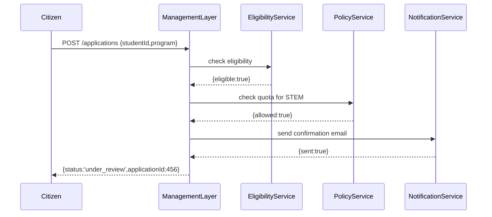

# Chapter 9: Management Layer

Welcome back! In [Chapter 8: Governance Layer](08_governance_layer_.md), we saw how policies get enforced at every gateway. Now we’ll build on that foundation with the **Management Layer**—the “public works department” of HMS-UHC that plans, runs, and monitors your day-to-day business processes.

## 1. Why Do We Need a Management Layer?

Imagine a federal postsecondary office that runs a new STEM scholarship program.  Each application must go through multiple steps:

  - Verify the student’s eligibility  
  - Check that the scholarship fund has room  
  - Reserve a spot  
  - Notify the student of next steps  

Without a central orchestrator, these calls happen in separate scripts or manual spreadsheets—and it’s easy to lose track. The **Management Layer** automates and coordinates every step:

  - It applies **business logic** (eligibility rules, quotas)  
  - It manages **workflow** (step-by-step sequencing)  
  - It handles **resource allocation** (reserve seats, funds)  
  - It monitors progress and reports on each application’s status  

## 2. Key Concepts

1. **Orchestration**  
   A central component that calls downstream services in the right order.

2. **Workflow Definition**  
   A simple description of steps, e.g., “eligibility → quota check → reservation → notification.”

3. **Business Logic Enforcement**  
   Code that applies policies (quotas, deadlines, eligibility) before moving on.

4. **Resource Manager**  
   Tracks and reserves scarce resources (scholarship slots, grant dollars).

5. **Monitoring & Logging**  
   Records each step’s outcome for audit and performance dashboards.

## 3. Using the Management Layer

Here’s how a client (like a portal or script) asks the Management Layer to start a scholarship application:

```js
// File: application-client.js
import fetch from 'node-fetch';

async function submitScholarship(app) {
  const res = await fetch('http://mgmt-layer:8000/applications', {
    method: 'POST',
    headers:{'Content-Type':'application/json'},
    body: JSON.stringify(app)
  });
  return res.json();
}

submitScholarship({ studentId:123, program:'STEM' })
  .then(console.log);
// Possible output:
// { status: 'under_review', applicationId: 456 }
```

Explanation:  
- We `POST` our student’s data to `/applications`.  
- The Management Layer runs the workflow and returns a status & `applicationId`.

## 4. Under the Hood: Workflow Sequence

Here’s a simple sequence of what happens inside the Management Layer:



1. **Receive request**  
2. **EligibilityService** confirms student can apply  
3. **PolicyService** checks fund quotas  
4. **NotificationService** sends an email  
5. **Respond** with an application ID and status

## 5. Inside the Management Layer: Minimal Code

### 5.1 Entrypoint (server.js)

```js
// File: management-layer/server.js
const express = require('express');
const { processApp } = require('./workflow');
const app = express();
app.use(express.json());

app.post('/applications', async (req, res) => {
  const result = await processApp(req.body);
  res.json(result);
});

app.listen(8000, () => console.log('Management Layer up on 8000'));
```

_Explanation:_  
- We expose `/applications` and delegate to a `workflow` module.

### 5.2 Workflow Logic (workflow.js)

```js
// File: management-layer/workflow.js
const fetch = require('node-fetch');

async function processApp(app) {
  // 1. Eligibility check
  const elig = await fetch('http://eligibility-service/check', {
    method:'POST', body: JSON.stringify(app), headers:{'Content-Type':'application/json'}
  }).then(r=>r.json());
  if (!elig.eligible) return { status:'rejected', reason:'Not eligible' };

  // 2. Quota check
  const quota = await fetch('http://policy-service/quotas?program='+app.program)
    .then(r=>r.json());
  if (!quota.allowed) return { status:'rejected', reason:'Quota full' };

  // 3. Notify student
  await fetch('http://notification-service/send', {
    method:'POST', body: JSON.stringify({ id:elig.applicationId }), headers:{'Content-Type':'application/json'}
  });

  return { status:'under_review', applicationId: elig.applicationId };
}

module.exports = { processApp };
```

_Explanation:_  
- We call three services in order  
- We stop early on failure, or confirm and return a status  

## 6. Summary & Next Steps

In this chapter you learned how the **Management Layer**:

  - Coordinates multiple services to run a business workflow  
  - Enforces eligibility rules and policy quotas  
  - Manages resource reservations and sends notifications  
  - Logs each step for transparency and monitoring  

Next, we’ll dive into the plumbing that runs all these services—our [Core Infrastructure (HMS-SYS)](10_core_infrastructure__hms_sys__.md).

---

Generated by [AI Codebase Knowledge Builder](https://github.com/The-Pocket/Tutorial-Codebase-Knowledge)