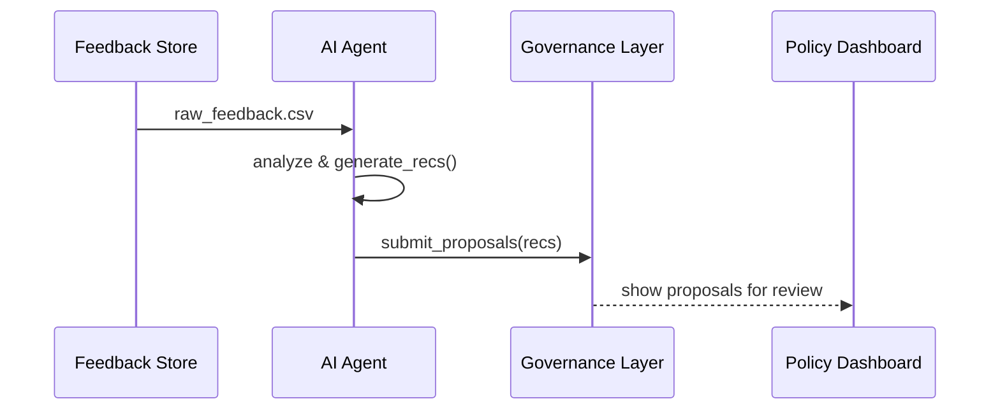
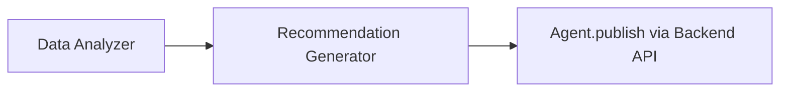

# Chapter 10: AI Representative Agent

Welcome back! In [Chapter 9: External System Synchronization](09_external_system_synchronization_.md), we saw how HMS-UHC keeps outside systems like calendars up-to-date. Now we’ll add a **smart advisor**—an **AI Representative Agent** that reviews citizen feedback and proposes process or policy changes automatically.

---

## Why an AI Representative Agent?

Government agencies collect tons of feedback:  
- Online surveys about public transit  
- Forms suggesting improvements to grant applications  
- Emails reporting confusing instructions  

Manually summarizing and acting on all that takes weeks. The **AI Representative Agent** acts like a virtual policy aide:

- It scans real feedback data  
- Spots common pain points (e.g., “form too long”)  
- Recommends specific process or policy tweaks  

Imagine the Office of English Language Acquisition receives thousands of school‐district comments about grant deadlines. The agent can say, “60% of districts asked for a 2-week extension—consider updating the deadline policy.”

---

## Key Concepts

1. **Data Analyzer**  
   - Reads raw feedback, counts themes (e.g., “deadline”, “instructions”).  

2. **Recommendation Generator**  
   - Turns themes and counts into concrete suggestions.  

3. **Proposal Publisher**  
   - Sends those suggestions back into our system—via the [Backend API](05_backend_api_.md) or a policy dashboard.

4. **Autonomy & Scheduling**  
   - Runs on a schedule (e.g., nightly) or on-demand.  
   - Can alert humans for review before finalizing.

---

## Using the AI Agent: A Simple Example

Here’s how an agency script might run the agent:

```rust
// File: run_agent.rs
fn main() {
    let feedback_csv = "data/citizen_feedback.csv";
    let agent = AiRepresentativeAgent::new();
    let suggestions = agent.analyze_and_recommend(feedback_csv);
    println!("Suggestions:\n{}", suggestions);
}
```

When you run this, you might see:

```
Suggestions:
1. Extend application deadline by 2 weeks (62% requested).
2. Simplify section 3: reduce required fields from 10 to 6.
3. Add a help tooltip for “ZIP Code” field.
```

This simple call does all the heavy lifting: it loads feedback, analyzes it, and prints human-readable recommendations.

---

## Step-by-Step Flow



1. **Feedback Store** holds citizen comments.  
2. **AI Agent** analyzes data and generates recommendations.  
3. **AI Agent** sends proposals to the **Governance Layer**.  
4. **Policy Dashboard** presents proposals to human reviewers.

---

## Under the Hood: Core Components

### 1. Agent Entry Point (`src/agent.rs`)

```rust
pub struct AiRepresentativeAgent;

impl AiRepresentativeAgent {
    pub fn new() -> Self { AiRepresentativeAgent }
    pub fn analyze_and_recommend(&self, path: &str) -> String {
        let data = DataAnalyzer::load(path);
        let themes = DataAnalyzer::find_themes(&data);
        RecommendationGenerator::make(&themes)
    }
    pub fn submit_proposals(&self, recs: &str) {
        // calls Backend API to post proposals
    }
}
```

- `analyze_and_recommend` ties together the analyzer and recommender.  
- `submit_proposals` could call an API like `POST /policies/proposals`.

### 2. Data Analyzer (`src/analyzer.rs`)

```rust
pub struct DataAnalyzer;
impl DataAnalyzer {
    pub fn load(path: &str) -> Vec<String> {
        // read CSV lines, return list of comments
    }
    pub fn find_themes(data: &[String]) -> Vec<(String, u32)> {
        // count keywords, e.g., ("deadline", 124)
    }
}
```

- Loads feedback and returns counts of common keywords or phrases.

### 3. Recommendation Generator (`src/recommender.rs`)

```rust
pub struct RecommendationGenerator;
impl RecommendationGenerator {
    pub fn make(themes: &[(String, u32)]) -> String {
        let mut recs = String::new();
        for (theme, count) in themes.iter().take(3) {
            recs += &format!(
                "- Address “{}” ({} mentions).\n", theme, count
            );
        }
        recs
    }
}
```

- Picks the top themes and formats them into bullet points.

---

## Visualizing the Internal Flow



- **Data Analyzer** scans and counts feedback themes.  
- **Recommendation Generator** crafts recommendation text.  
- **Agent** pushes proposals into the policy system.

---

## Conclusion

You’ve learned how to build an **AI Representative Agent** that:

- Collects and analyzes citizen feedback  
- Generates clear, data-driven policy recommendations  
- Submits proposals into the governance workflow  

This gives agencies a powerful, automated “smart advisor.” Next, we’ll see how to bring humans back into the loop for final sign-off in [Chapter 11: Human-in-the-Loop (HITL) Mechanism](11_human_in_the_loop__hitl__mechanism_.md).

---

Generated by [AI Codebase Knowledge Builder](https://github.com/The-Pocket/Tutorial-Codebase-Knowledge)