# Chapter 10: External System Sync Connector  
*(keeping legacy tech in step with new-school HMS magic)*  

[← Back to Chapter 9: Management Layer (HMS-SVC, HMS-ACH, HMS-A2A)](09_management_layer__hms_svc__hms_ach__hms_a2a__.md)

---

## 1. Why Do We Need a “Sync Connector”?

Meet Denise, the records officer at the **National Archives and Records Administration (NARA)**.  
Her life is a juggling act:

1. HMS-UHC just processed **2 000 new Freedom-of-Information requests**.  
2. A 1990s-era mainframe (NARA’s “FOIA-X”) must store every request for long-term retention.  
3. A separate data warehouse powers monthly Congressional reports.  

If any one of these stores falls out of sync, Denise faces angry requesters *and* a compliance headache.  
The **External System Sync Connector (ESSC)** is the translator that:

* Listens to fresh events inside HMS (step completions, status changes, payments).  
* Maps each event into the exact payload FOIA-X understands (fixed-width files!).  
* Ships the update instantly—no midnight CSV dumps, no manual re-keying.  

Think of ESSC as **“Google Translate for government databases.”**

---

## 2. Key Concepts—One-by-One

| Term | Plain-English Meaning |
|------|----------------------|
| **Source Event** | A fact inside HMS (“request WF-9812 closed”). |
| **Mapping Rule** | Instruction on how to turn that fact into FOIA-X format. |
| **Transport Adapter** | Tiny plug that knows *how* to talk to the external system (SFTP, SOAP, REST). |
| **Idempotent Updater** | Guarantees the same event sent twice won’t create duplicates. |
| **Health Monitor** | Heartbeat that tells Denise if syncs are falling behind. |

Keep these five handy; together they form the ESSC toolkit.

---

## 3. 60-Second Demo: Sync One FOIA Ticket

Below is everything a developer needs to copy new FOIA tickets from HMS into FOIA-X.

### 3.1 Declare the Mapping Rule (YAML, 14 lines)

```yaml
# /sync-rules/foia_new.yaml
id: FOIA_NEW
sourceEvent: FOIA.TICKET_CREATED
targetSystem: FOIA-X
transform:
  - field: ticket_id
    from: data.id
  - field: requester_name
    from: data.citizen.fullName
  - field: filed_date
    from: meta.timestamp
```

What it says:  
“When HMS emits `FOIA.TICKET_CREATED`, build a record with three columns.”

### 3.2 Register the Rule (CLI, 1 line)

```bash
npx hms-sync register ./sync-rules/foia_new.yaml
```

ESSC now knows *what* to send.

### 3.3 Provide a Transport Adapter (Node, 18 lines)

```js
// /adapters/foia-x.js
import axios from "axios";
export async function send(record){
  await axios.post("https://foiax.gov/api/v1/records", record, {
    headers:{ "X-API-KEY": process.env.FOIA_X_KEY }
  });
}
```

Tiny: converts a JS object into a REST call.

### 3.4 Wire Rule to Adapter (JSON, 6 lines)

```json
{
  "targetSystem": "FOIA-X",
  "adapter": "./adapters/foia-x.js",
  "retry": 3
}
```

That’s it—every new FOIA ticket now arrives in FOIA-X seconds after it’s created in HMS.

---

## 4. What Happens Under the Hood?

```mermaid
sequenceDiagram
    participant HMS as HMS Event Bus
    participant ESSC as Sync Connector
    participant MAP as Mapping Engine
    participant ADP as Transport Adapter
    participant EXT as FOIA-X

    HMS-->>ESSC: FOIA.TICKET_CREATED
    ESSC-->>MAP: apply rule FOIA_NEW
    MAP-->>ADP: {ticket_id: "WF-9812", …}
    ADP-->>EXT: POST /records
    EXT-->>ADP: 200 OK
```



1. HMS broadcasts an event (see [Management Layer](09_management_layer__hms_svc__hms_ach__hms_a2a__.md)).  
2. ESSC finds a rule whose `sourceEvent` matches.  
3. Mapping Engine builds the payload.  
4. Adapter transmits it.  
5. Success (or retry + alert on failure).

---

## 5. Internal Implementation Peek  

### 5.1 The 15-Line Event Listener

```js
// services/essc/listener.js
import {onEvent}   from "./bus.js";
import {mapEvent}  from "./mapper.js";
import {adapters}  from "./registry.js";

onEvent(async evt=>{
  const rule = await db.rules.find({sourceEvent: evt.type});
  if (!rule) return;

  const record = mapEvent(evt, rule.transform);    // ①
  const send   = adapters[rule.targetSystem];      // ②

  try {
    await send(record);                            // ③
  } catch(e){
    await retryOrAlert(evt, rule, e);              // ④
  }
});
```

Explanation:  
1. Apply YAML transform to the event.  
2. Load matching adapter.  
3. Ship the payload.  
4. If anything breaks, use retry count then ping Health Monitor.

### 5.2 Ultra-Simple Mapper (10 lines)

```js
// services/essc/mapper.js
export function mapEvent(evt, transforms){
  const out = {};
  for (const t of transforms){
    out[t.field] = t.from.split('.')
                         .reduce((o,k)=>o?.[k], {...evt});
  }
  return out;
}
```

• Walks dot-paths like `data.citizen.fullName`.  
• No external libraries needed.

---

## 6. Monitoring the Pipeline

ESSC emits its own *heartbeat* every minute:

```json
{
  "service": "ESSC",
  "status": "OK",
  "pendingQueue": 0,
  "lastError": null
}
```

The [Metrics & Monitoring Dashboard](14_metrics___monitoring_dashboard_.md) paints this green, yellow, or red so Denise can sleep at night.

---

## 7. Security & Compliance Notes

1. **Least Privilege** – Adapters use individual API keys scoped to a single external system. Keys are stored in the [Access & Authorization Framework](11_access___authorization_framework_.md).  
2. **Audit Trail** – Every payload (hash only, never PII) plus success/failure is written to the [Compliance & Audit Trail](15_compliance___audit_trail_.md).  
3. **PII Scrubbing** – Mapping rules may mark fields as `mask:true`; ESSC redacts them before logging.

---

## 8. Common Pitfalls & Quick Fixes

| Symptom | Quick Fix |
|---------|-----------|
| Duplicate records in FOIA-X | Confirm the adapter sends an `Idempotency-Key` header or that FOIA-X supports upsert IDs. |
| Rule saved but never triggers | Check `sourceEvent` spelling and that the Management Layer actually emits that event. |
| Adapter timeouts | Increase `retry` count or switch transport to SFTP batch mode at night. |
| Health Monitor red 🚨 | Look at `/logs/essc` for stack trace; most issues are invalid credentials. |

---

## 9. Try It Locally in 3 Commands

```bash
git clone hms-uhc-demo && cd hms-uhc-demo
npm run essc:dev      # starts Sync Connector & mock FOIA-X
npm run emit:foia     # creates a fake FOIA ticket event
```

Watch the console:

```
[ESSC] mapped event -> { ticket_id: 'WF-0001', ... }
[FOIA-X] 200 OK
```

Congrats—your first live sync!

---

## 10. What You Learned

✔️ The External System Sync Connector listens to HMS events and mirrors them into legacy or partner systems.  
✔️ Five building blocks: Source Event, Mapping Rule, Transport Adapter, Idempotent Updater, Health Monitor.  
✔️ You registered a rule, wrote an 18-line adapter, and watched data flow within minutes.  
✔️ ESSC keeps compliance and observability hooks alive for auditors and managers.

Next we’ll secure all these connectors—and every other layer—using fine-grained roles, tokens, and scopes in the [Access & Authorization Framework](11_access___authorization_framework_.md).

---

---

Generated by [AI Codebase Knowledge Builder](https://github.com/The-Pocket/Tutorial-Codebase-Knowledge)