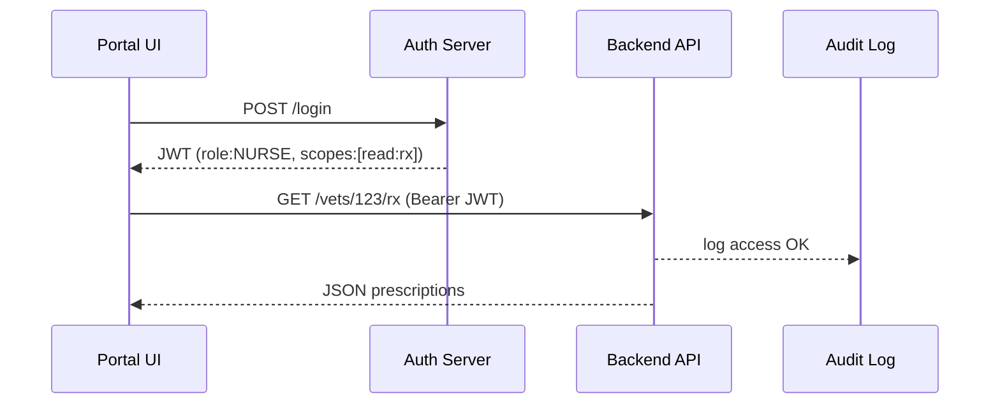

# Chapter 11: Access & Authorization Framework
*(the TSA checkpoint for every byte of government data)*  

[← Back to Chapter 10: External System Sync Connector](10_external_system_sync_connector_.md)

---

## 1. Why Bother With One More “Security” Layer?

Meet **Emma**, a registered nurse at a Veterans Affairs (VA) clinic.  
She opens the HMS portal to:

1. View **Sergeant Ruiz’s** mental-health history.  
2. Submit a **pharmacy refill** request.  
3. Peek at her own **training-credit balance**.

Every click must answer two questions:

1. **Who** is asking? (log-in / identity)  
2. **May** they see or do this? (authorization)

If Emma accidentally sees another veteran’s PTSD notes, HMS violates HIPAA, and taxpayers foot the lawsuit.  
The **Access & Authorization Framework (AAF)** is our digital *TSA checkpoint*: checking ID, stamping boarding passes (tokens), and logging every gate entry.

---

## 2. Five Key Concepts (Plain English)

| Concept | What it really means | Analogy |
|---------|---------------------|---------|
| Identity | “I am Emma, VA-Nurse #42” | Driver’s license |
| Role | A job label that unlocks powers (`NURSE`, `VETERAN`, `PUBLIC`) | Uniform badge |
| Scope | Fine-grained permission (`read:rx`, `edit:labs`) | Boarding pass sections |
| Token | Signed payload the browser shows on every request (JWT) | Boarding pass |
| Least-Privilege | Only the minimum scopes are granted | TSA “need-to-fly” rule |

Remember: *Identity* answers **who**, *Role + Scope* answer **may I?**

---

## 3. Quick Start: Getting & Using a Token

### 3.1 Front-End: Log In & Store Token (16 lines)

```js
// /widgets/login/index.js
export async function login(username, pwd){
  const res = await fetch("/auth/login",{
    method:"POST",
    body: JSON.stringify({username,pwd})
  });
  const {token} = await res.json();   // JWT string
  localStorage.setItem("hms_token", token);
}
```

What happens?  
1. Sends credentials to the Auth Server.  
2. Receives a JSON Web Token (JWT).  
3. Saves it for later API calls.

### 3.2 Front-End: Call an API With the Token (10 lines)

```js
export async function fetchRx(vetId){
  const token = localStorage.getItem("hms_token");
  const res = await fetch(`/api/v1/veterans/${vetId}/rx`,{
    headers:{ Authorization:`Bearer ${token}` }
  });
  return res.json();
}
```

If Emma lacks `read:rx` scope the server answers **403 Forbidden**—no data leak.

---

## 4. Server-Side Check in One Line

Inside any Node/Express micro-service:

```js
app.get("/veterans/:id/rx", auth("read:rx"), handler);
```

`auth(scope)` is middleware that:

1. Verifies the token’s signature & expiry.  
2. Confirms the requested **scope** is in `token.scopes`.  
3. Logs the decision for auditors.

> Less code, more safety.

---

## 5. Walkthrough: What Happens When Emma Opens a Chart



Five steps, <500 ms, zero HIPAA worries.

---

## 6. Under the Hood (Mini Code Tour)

### 6.1 Issuing a Token (18 lines)

```js
// /services/auth/issue.js
import jwt from "jsonwebtoken";
export function issue(user){
  const payload = {
    sub: user.id,
    role: user.role,           // e.g. "NURSE"
    scopes: roleToScopes[user.role],
    iat: Date.now()/1000,
    exp: Date.now()/1000 + 3600   // 1 h
  };
  return jwt.sign(payload, process.env.JWT_SECRET);
}
```

`roleToScopes` is a constant map like:

```js
NURSE   -> ["read:rx","edit:rx"]
VETERAN -> ["read:rx"]
PUBLIC  -> []
```

### 6.2 Verifying & Authorizing (17 lines)

```js
// /middlewares/auth.js
import jwt from "jsonwebtoken";
export const auth = needScope => (req,res,next)=>{
  try{
    const token = req.headers.authorization?.split(" ")[1];
    const data  = jwt.verify(token, process.env.JWT_SECRET);
    if(!data.scopes.includes(needScope))
        return res.sendStatus(403);  // no ticket
    req.user = data;                // attach identity
    next();
  }catch(e){
    res.sendStatus(401);            // bad or expired token
  }
};
```

Short, readable, testable.

### 6.3 Logging Every Decision (8 lines)

```js
// always called inside auth()
db.accessLogs.insert({
  user:req.user.sub,
  scope:needScope,
  path:req.path,
  ts:Date.now()
});
```

These rows feed both the [Metrics & Monitoring Dashboard](14_metrics___monitoring_dashboard_.md) and the [Compliance & Audit Trail](15_compliance___audit_trail_.md).

---

## 7. How It Connects to Other Layers

| Layer | Interaction |
|-------|-------------|
| [Backend API Gateway](12_backend_api_gateway__hms_api__.md) | First gate that checks tokens before routing. |
| [Governance Layer](04_governance_layer__hms_gov__.md) | Publishes policy saying “NURSE gets these scopes.” |
| [Management Layer](09_management_layer__hms_svc__hms_ach__hms_a2a__.md) | Internal micro-services reuse the same middleware. |
| [External System Sync Connector](10_external_system_sync_connector_.md) | Uses **service tokens** with only `sync:*` scopes. |
| [Compliance & Audit Trail](15_compliance___audit_trail_.md) | Stores every access log row. |

---

## 8. Common Pitfalls & Quick Fixes

| Problem | Fix |
|---------|-----|
| “Token expired” errors | Increase `exp` or implement silent refresh every 50 min. |
| Too many scopes in one token | Revisit least-privilege—split roles or use **delegated tokens**. |
| Micro-service calling another without token | Use a **service account** issued by AAF, never the user’s token. |
| Audit table filling disk | Rotate to cold storage monthly; counts stay in Metrics dashboard. |

---

## 9. Try It Locally (≈60 s)

```bash
# 1. launch demo auth & api
npm run auth:dev   # http://localhost:8080
npm run api:dev    # http://localhost:9000

# 2. log in as nurse
curl -X POST localhost:8080/login -d '{"u":"emma","p":"demo"}' 

# 3. paste token below & fetch meds
curl -H "Authorization: Bearer <TOKEN>" \
     localhost:9000/veterans/123/rx
```

Expected: JSON list of prescriptions. Replace the token with garbage and you’ll get **401 Unauthorized**.

---

## 10. What You Learned

✔️ Why *identity* and *authorization* are separate but related.  
✔️ Five beginner-friendly terms: Identity, Role, Scope, Token, Least-Privilege.  
✔️ How to grab a JWT, send it, and verify it in <20 lines of code.  
✔️ Internal flow: issue → verify → log → audit.  
✔️ Where AAF plugs into API Gateway, Governance, Metrics, and Audit layers.

Ready to see where **all** API traffic enters HMS and meets this framework?  
March forward to [Chapter 12: Backend API Gateway (HMS-API)](12_backend_api_gateway__hms_api__.md).

---

---

Generated by [AI Codebase Knowledge Builder](https://github.com/The-Pocket/Tutorial-Codebase-Knowledge)