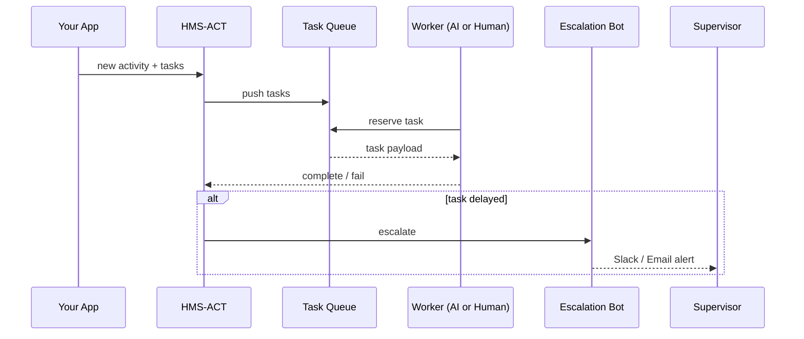

# Chapter 11: Activity Orchestrator & Task Queues (HMS-ACT / HMS-OMS)

[← Back to Chapter 10: Backend Service Gateway (HMS-SVC / HMS-API)](10_backend_service_gateway__hms_svc___hms_api__.md)

---

## 1 Why Do We Need a “311-Style Dispatcher” for Digital Government?

Imagine a citizen, **Jordan**, calls the county helpline and says:

> “I lost my COVID-19 vaccine card and need a replacement by Friday for a trip.”

Behind that simple request hide at least **four** moving parts:

1. Verify identity against DMV records.  
2. Check vaccine status in the state Immunization Registry (HL7 / FHIR).  
3. Generate a secure PDF card.  
4. Overnight-mail the printout if Jordan clicks “Physical Copy.”

Jordan doesn’t care how many databases, printers, or AI bots are involved—he just wants his card.  
That is exactly what **HMS-ACT (Activity Orchestrator)** and **HMS-OMS (Operations & Messaging Scheduler)** do:

* Turn the request into an **ordered set of tasks**.  
* Pick the **best worker** (human clerk or AI agent) for each task.  
* **Track progress** against a Service-Level Agreement (SLA).  
* **Escalate** if anything stalls.  
* Feed real-time metrics to supervisors.

Think of it as the **311 dispatcher** for every digital service in your agency.

---

## 2 Key Concepts (Beginner Friendly)

| Term | Plain English | Government Analogy |
|------|---------------|--------------------|
| **Activity** | One end-to-end request from a citizen or system. | A 311 call ticket. |
| **Task** | A single unit of work inside an activity. | “Send truck to fix pothole.” |
| **Queue** | Ordered list of pending tasks. | Clipboard on a dispatcher’s desk. |
| **Worker** | Code, AI agent, or human who executes a task. | A city crew or clerk. |
| **SLA Timer** | How long the worker has before escalation. | “Pothole must be patched in 48 hrs.” |
| **Escalation Rule** | What happens if the timer expires. | Supervisor gets an alert. |

Keep these six words in mind—everything else is just wiring.

---

## 3 Your First “Replace Vaccine Card” Workflow in 18 Lines

Below we will:

1. Create an activity.  
2. Register three tasks.  
3. Let the orchestrator assign workers.  
4. Watch the queue in action.

### 3.1 Install & Authenticate

```bash
pip install hms-act
export HMS_ACT_TOKEN="demo-sandbox-token"
```

### 3.2 Define and Submit the Activity

```python
from hms_act import Orchestrator, Task

orc = Orchestrator(token="demo-sandbox-token")

# 1) Describe the end-to-end activity
activity_id = orc.activities.create(
    citizen_id="sandbox-jordan-77",
    intent="replace_vaccine_card",
    sla="48h"
)

# 2) Register ordered tasks
orc.tasks.enqueue(activity_id, [
    Task("verify_identity",   sla="2h"),
    Task("fetch_vaccine_log", sla="4h"),
    Task("generate_pdf",      sla="1h",  needs=["fetch_vaccine_log"]),
    Task("ship_physical",     sla="24h", optional=True)
])

print("Activity queued:", activity_id)
```

Explanation (bullet-quick):
* `.activities.create()` opens a new “ticket” with a 48-hour promise.  
* `Task(name, sla, needs=…)` declares dependencies; `optional=True` means skip if citizen declines shipping.  
* `enqueue()` pushes all tasks into HMS-OMS, which figures out the exact run order.

---

### 3.3 Peek at the Live Queue

```python
queue = orc.queue.list(activity_id)
for t in queue:
    print(t.name, t.status)
```

Sample output:

```
verify_identity   PENDING
fetch_vaccine_log WAITING(for:verify_identity)
generate_pdf      WAITING
ship_physical     OPTIONAL
```

---

### 3.4 Simulate a Worker Completing a Task

```python
orc.tasks.complete(activity_id, "verify_identity", worker_id="bot-dmv-3")
```

The queue automatically unlocks the next task:

```
fetch_vaccine_log   PENDING
```

If `fetch_vaccine_log` exceeds its 4-hour SLA, HMS-ACT will:

* reassign it to a backup worker (`bot-health-7`), then  
* ping the **HITL Oversight Console** (see [Chapter 6](06_human_in_the_loop__hitl__oversight_console_.md)).

---

## 4 What Actually Happens Behind the Scenes?



Key takeaway: **Your code never polls**—workers **pull** tasks, and escalations are automatic.

---

## 5 Tiny Code Tour (Under 20 Lines)

_File: `hms_act/core/queue.py`_

```python
class Queue:
    def enqueue(self, activity_id, tasks):
        for t in tasks:
            db.insert("tasks", {
                "activity": activity_id,
                "name": t.name,
                "status": "WAITING" if t.needs else "PENDING",
                "sla_sec": _parse_sla(t.sla)
            })

    def reserve(self, worker):
        row = db.first(
            "SELECT * FROM tasks "
            "WHERE status='PENDING' "
            "ORDER BY created_at"
        )
        if not row:
            return None
        db.update("tasks", row.id, {"status": "IN_PROGRESS", "worker": worker})
        return row
```

Beginner notes:

1. Tasks start as `WAITING` if they depend on another task.  
2. `reserve()` is a **non-blocking** call a worker makes to grab the next job.  
3. When a task finishes, a trigger in `db.update()` unlocks dependents.

---

## 6 Adding a Human Clerk as a Worker (8 Lines)

```python
from hms_act import Worker

clerk = Worker(
    name="Alice (County Clerk)",
    skills=["ship_physical"],
    channel="email:alice@county.gov"
)

orc.workers.register(clerk)
```

Now any `ship_physical` task will be auto-emailed to Alice with a link to mark it complete. If she doesn’t click within 24 hours, the escalation bot re-routes the task to a commercial courier.

---

## 7 SLA-Driven Escalation Rules (10 Lines)

```python
orc.escalations.set_rule(
    when="sla_breach",
    then="reassign",
    to="backup_worker_pool",
    notify=["sms:+1-202-555-0123", "slack:#ops-alerts"]
)
```

This one liner:

* Monitors every task’s `due_at` timestamp.  
* On breach, moves the task to a “backup” group.  
* Sends SMS + Slack alerts to on-call staff.

No custom code needed—just config.

---

## 8 Common Troubleshooting

| Symptom | Likely Cause | Quick Fix |
|---------|--------------|-----------|
| Tasks stuck in **WAITING** | Dependency never completed | Call `orc.tasks.status(activity, task)` to see parent name. |
| Worker gets no tasks | Skill mismatch | `orc.workers.update(skills=[…])` to include needed skill. |
| Flood of escalation alerts | SLA too tight | Increase `sla` or add grace period in escalation rule. |
| Duplicate task execution | Two workers reserved same job | Ensure Redis or Postgres row-level lock enabled. |

---

## 9 How HMS-ACT Connects to Other Chapters

* API calls arrive via the [Backend Service Gateway](10_backend_service_gateway__hms_svc___hms_api__.md) and are **queued** here instead of blocking the caller.  
* Workers can be AI agents created in [AI Agent Framework (HMS-AGT)](04_ai_agent_framework__hms_agt__.md) or human clerks visible in [HITL Oversight Console](06_human_in_the_loop__hitl__oversight_console_.md).  
* Escalation metrics flow to the [Observability & Operations Center](15_observability___operations_center__hms_ops__.md).  
* Completed task artefacts (PDFs, CSVs…) are stored in the [Central Data Repository (HMS-DTA)](12_central_data_repository__hms_dta__.md).

---

## 10 Recap & Next Steps

You now know how to:

1. Turn a user intent into an **activity** with ordered **tasks**.  
2. Let the orchestrator pick the right **worker** for each task.  
3. Enforce SLAs and automatic **escalations**.  
4. Integrate smoothly with the rest of the HMS stack.

Ready to learn where all the data produced by these tasks actually lives?  
March on to [Chapter 12: Central Data Repository (HMS-DTA)](12_central_data_repository__hms_dta__.md).

---

---

Generated by [AI Codebase Knowledge Builder](https://github.com/The-Pocket/Tutorial-Codebase-Knowledge)