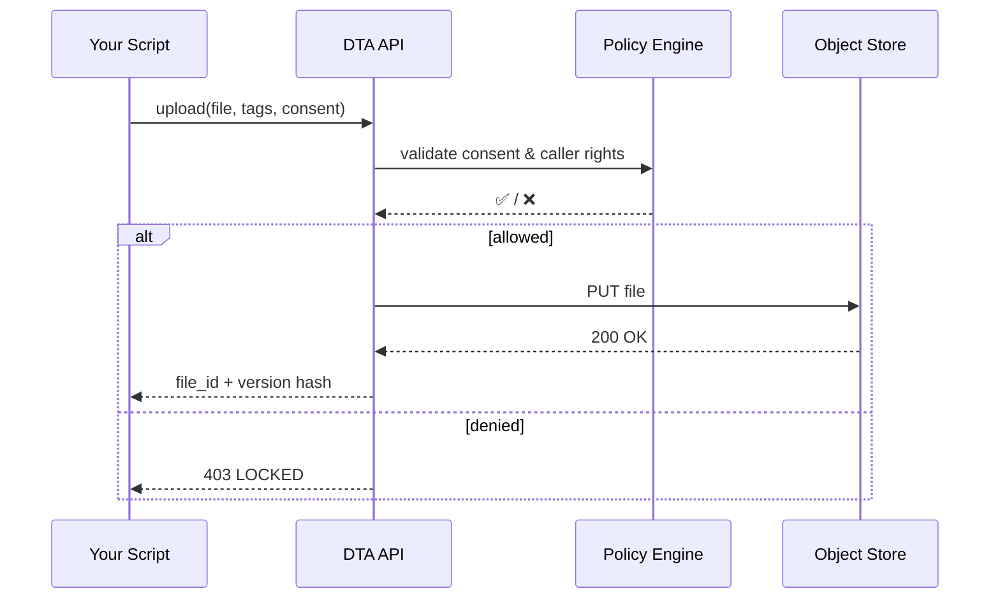

# Chapter 12: Central Data Repository (HMS-DTA)

[← Back to Chapter 11: Activity Orchestrator & Task Queues](11_activity_orchestrator___task_queues__hms_act___hms_oms__.md)

---

## 1 Why Do We Need a “National Archives for Bytes”?

Picture the **Centers for Disease Control and Prevention (CDC)** running a new *Long-COVID Study*.

1. Volunteers submit health surveys (PII = HIPAA‐sensitive).  
2. Lab partners upload raw RNA files (massive, 10 GB each).  
3. Data scientists publish cleaned CSVs.  
4. An AI team trains a model to predict recovery time.  
5. Journalists file a **FOIA** request for “all non-identifiable study data”.

Without a single, policy-aware home for every file, chaos erupts:

* Versions get mixed up (“Which CSV fed the AI?”).  
* Lawyers panic about privacy leaks.  
* Auditors can’t trace who changed what.

**Central Data Repository (HMS-DTA)** is the solution—think of it as a **digital Library of Congress** where:

* Every upload is versioned & tagged.  
* Consent labels (HIPAA, FERPA, FOIA exemptions…) are baked into file metadata.  
* Fine-grained locks decide who can see or export each slice.

---

## 2 Key Concepts (Beginner Friendly)

| Term | In Plain English | Government Analogy |
|------|------------------|--------------------|
| **Dataset** | A folder-like collection of related files. | One “record group” at NARA. |
| **Version** | Immutable snapshot of a dataset. | A stamped “revision” of a federal form. |
| **Tag** | Free-text label (e.g., `cleaned`, `model_input`). | Sticky note on a box in the archives. |
| **Consent Label** | Machine-readable policy flag (`HIPAA_PHI`, `FOIA_B4`). | The colored stripe on a classified dossier. |
| **Lock** | Rule that blocks unauthorised reads/writes. | A vault door—opened only with the right clearance. |

---

## 3 A 5-Minute Walk-Through

We’ll create a dataset, upload raw files, publish a cleaned version, and share a FOIA-safe view.

> All commands use the sandbox token from earlier chapters; no real PHI is exposed.

### 3.1 Install & Authenticate

```bash
pip install hms-dta
export HMS_DTA_TOKEN="demo-sandbox-token"
```

### 3.2 Create the Dataset

```python
from hms_dta import Repo

r = Repo(token="demo-sandbox-token")

dataset_id = r.datasets.create(
    name="LongCovidStudy2024",
    description="CDC longitudinal survey",
    consent="HIPAA_PHI"         # default label
)
print(dataset_id)               # e.g., ds-101
```

Explanation  
1. We open a `Repo` client.  
2. We create a dataset with a **consent label** that marks every file *HIPAA-protected* unless overridden.

---

### 3.3 Upload a Raw File

```python
r.files.upload(
    dataset_id,
    path="survey_raw_jan.csv",
    tags=["raw", "survey"],
    consent="HIPAA_PHI"
)
```

*Tags* make searching easy later; the `consent` label inherits default HIPAA protections.

---

### 3.4 Publish a Cleaned Version

```python
clean_id = r.datasets.version(dataset_id,
    include_tags=["raw"],
    transform="scripts/clean.py",   # repository-stored script
    new_tags=["cleaned", "v1"]
)
print(clean_id)    # e.g., ver-202
```

What happens inside:

* The transform script runs inside a secure sandbox.  
* Output files inherit **new** tags (`cleaned`, `v1`).  
* A *version hash* locks the snapshot forever.

---

### 3.5 Share a FOIA-Safe View

```python
view_url = r.views.create(
    dataset_id,
    version=clean_id,
    remove_consents=["HIPAA_PHI"],  # strip PHI columns
    add_consents   =["FOIA_RELEASE"]
)
print(view_url)    # pre-signed URL for download
```

Journalists receive only the de-identified CSV because the **FOIA_B4 exemption** lines are now cleared.

---

## 4 What Happens Under the Hood?



Key takeaway: **Policy Engine** guards every read/write; storage never sees tokens or roles.

---

## 5 Peek at the Codebase (14 Lines)

_File: `dta/core/repository.py`_

```python
class Repo:
    def __init__(self, token):
        self.token = token

    def create_acl(self, consent):
        # map consent label → JSON policy
        return POLICIES[consent]

    def upload_file(self, ds, path, tags, consent):
        acl = self.create_acl(consent)
        if not check_rights(self.token, acl):
            raise PermissionError("LOCKED")
        url = presign_put(ds, path)          # short-lived S3 link
        _stream_upload(url, open(path, 'rb'))
        return {"ok": True}
```

Beginner notes:

1. **`POLICIES`** is a lookup table that mirrors FOIA & HIPAA clauses.  
2. `check_rights()` asks the **Legal Reasoner** from [Chapter 8](08_legal___compliance_reasoner__hms_esq__.md).  
3. Actual bytes go straight to S3 (or MinIO) via a presigned link—**API never touches the file content**.

---

## 6 Attaching DTA to Other HMS Modules

| Module | How It Interacts with DTA |
|--------|---------------------------|
| Activity Orchestrator (HMS-ACT) | Stores task artefacts (PDFs, JSON) as versioned files. |
| AI Agent Framework (HMS-AGT) | Pulls **training sets** tagged `model_input`. |
| Governance Values Pipeline | Adds a **PrivacySensor** that blocks releases lacking `FOIA_RELEASE`. |
| Backend Service Gateway | Streams large downloads via pre-signed URLs, not through micro-services. |

---

## 7 Common Troubleshooting

| Symptom | Cause | Quick Fix |
|---------|-------|-----------|
| `403 LOCKED` on download | Caller lacks required consent | Use `Repo.views.create()` to generate a filtered view. |
| Too many versions | Transform script re-runs nightly | Add `--dedupe` flag or remove cron. |
| Uploads time out | Large files on slow link | Use `r.files.multipart_upload()` helper. |
| “Unknown consent label” | Custom policy not registered | `Repo.consents.register(name, json_policy)` |

---

## 8 Recap & Next Steps

You just learned to:

1. Create a **Dataset** with built-in privacy labels.  
2. Upload raw data, publish cleaned **Versions**, and hand out FOIA-safe views.  
3. See how locks mirror FOIA & HIPAA clauses.  
4. Peek under the hood to understand **policy-first storage**.

All bytes are now safely archived—ready for sync to outside partners.  
Let’s wire up that bridge in [Chapter 13: External System Sync Bridge](13_external_system_sync_bridge_.md).

---

---

Generated by [AI Codebase Knowledge Builder](https://github.com/The-Pocket/Tutorial-Codebase-Knowledge)