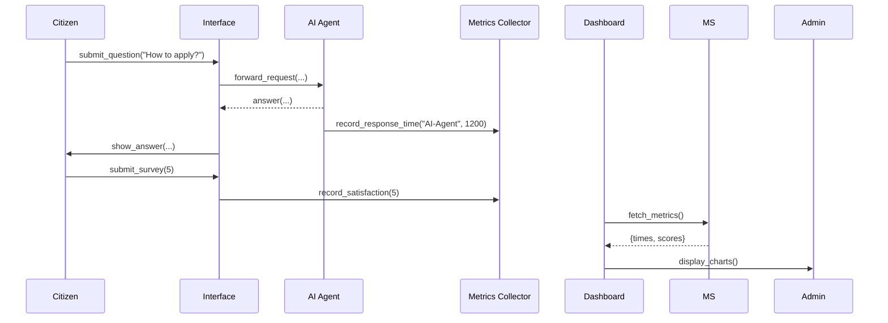
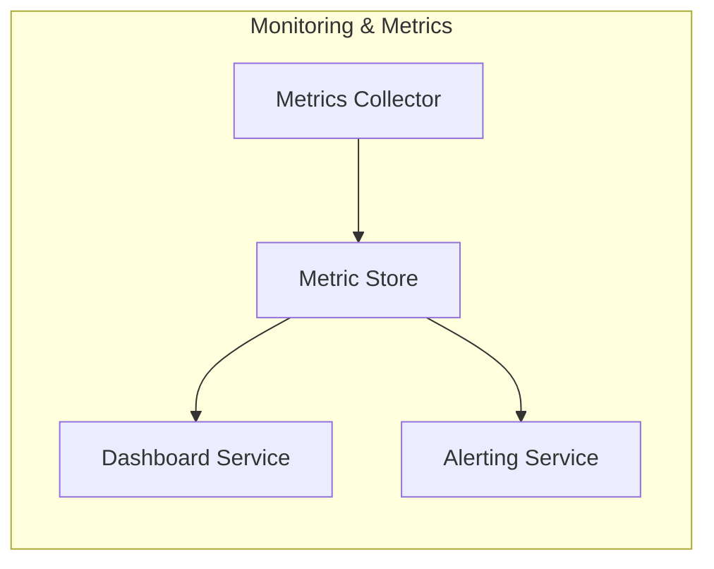

# Chapter 12: Monitoring and Metrics Framework

In [Chapter 11: Human-in-the-Loop Mechanism](11_human_in_the_loop__hitl__mechanism_.md), we saw how humans review AI proposals before they become policy. Now it’s time to make sure our whole system stays healthy, fast, and citizen-friendly by tracking key numbers—response times, complaint counts, resolution rates—just like a public affairs office does.

---

## Why Monitoring and Metrics?

Imagine a public affairs office that answers citizen questions. They care about:

- Average response time (“How quickly do we reply?”)  
- Number of complaints per week  
- Resolution rate (“What percentage of issues got solved?”)  
- Citizen satisfaction scores from follow-up surveys  

Without real-time dashboards and alerts, problems hide until it’s too late. The **Monitoring and Metrics Framework** gives us visibility so we can spot slowdowns, failed steps, or unhappy citizens—and fix them quickly.

---

## Key Concepts

1. **Metrics Collector**  
   Gathers events (response times, errors, satisfaction ratings) from each service.

2. **Metric Store**  
   A simple database or in-memory log that holds time-series data for analysis.

3. **Dashboard**  
   Visual charts showing trends (e.g., line charts for response time over days).

4. **Alerting Rules**  
   Thresholds (e.g., “Alert if average response > 2s” or “> 5 complaints in 10 min”).

5. **Reporting API**  
   Endpoints clients or external tools can call to fetch current metrics.

---

## Solving Our Use Case

Use Case: Track AI Agent response time and citizen satisfaction.

1. When the AI Agent answers a question, we record how long it took.  
2. After tickets resolve, we record a satisfaction score (1–5 stars).  
3. Our Dashboard queries the stored metrics and draws charts.  
4. If average response time exceeds 2 seconds, we fire an alert.

Here’s a minimal Rust example of recording metrics:

```rust
// File: src/metrics/collector.rs
pub struct MetricsCollector;

impl MetricsCollector {
    pub fn record_response_time(&self, service: &str, ms: u64) {
        // Push to MetricStore (omitting error handling)
        MetricStore::global().save(Metric::ResponseTime {
            service: service.into(),
            value_ms: ms,
            timestamp: now(),
        });
    }

    pub fn record_satisfaction(&self, score: u8) {
        MetricStore::global().save(Metric::Satisfaction {
            value: score,
            timestamp: now(),
        });
    }
}
```

This collector calls into a shared `MetricStore` (we’ll define next). Every time an AI request finishes or a survey comes in, we log a new metric.

---

## What Happens Step-by-Step



1. **Interface** sends user request to **AI Agent**.  
2. **AI Agent** responds and calls **Metrics Collector** to log response time.  
3. Citizen rates satisfaction; we log that too.  
4. **Dashboard** polls stored metrics and renders charts for admins.

---

## Inside the Monitoring & Metrics Framework



- **Metrics Collector**: your code calls recorder methods.  
- **Metric Store**: holds all records in memory, file, or TSDB.  
- **Dashboard Service**: HTTP API serving charts.  
- **Alerting Service**: watches store and sends notifications when rules fire.

---

### Metric Store (src/metrics/store.rs)

```rust
pub struct MetricStore {
    records: Vec<Metric>,
}

impl MetricStore {
    pub fn global() -> &'static mut Self {
        static mut STORE: MetricStore = MetricStore { records: Vec::new() };
        unsafe { &mut STORE }
    }

    pub fn save(&mut self, m: Metric) {
        self.records.push(m);
    }

    pub fn query(&self) -> &[Metric] {
        &self.records
    }
}
```

> A very simple global store. In production you might swap this for a time-series DB.

### Dashboard Service (src/dashboard/server.rs)

```rust
fn main() {
    let store = MetricStore::global();
    // Expose an HTTP GET /metrics endpoint
    // that returns store.query() as JSON
}
```

> The Dashboard reads all metrics and draws charts using your favorite frontend.

---

## Conclusion

You’ve learned how the **Monitoring and Metrics Framework**:

- Collects key performance and satisfaction metrics  
- Stores them for later analysis  
- Provides dashboards to visualize trends  
- Fires alerts when thresholds are crossed  

With these tools, you can keep your citizen services fast, reliable, and responsive.  

This concludes our HMS-UHC tutorial. Thank you for following along!

---

Generated by [AI Codebase Knowledge Builder](https://github.com/The-Pocket/Tutorial-Codebase-Knowledge)