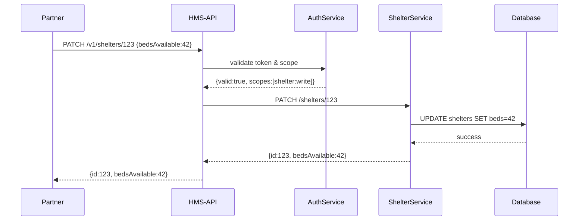

# Chapter 13: Backend API Layer (HMS-API / HMS-MKT)

In [Chapter 12: Backend Services (HMS-SVC)](12_backend_services__hms_svc__.md), we built small services that run core business logic. Now let’s open the doors for external partners—like scheduling platforms or analytics tools—to interact with those services in a secure, versioned way. That’s the **Backend API Layer**.

---

## 1. Why a Backend API Layer?

Imagine the National Emergency Management Agency wants to share real-time shelter occupancy and resource data with five state systems and a public dashboard. Each partner needs to:

- **Read** the latest shelter status  
- **Update** available beds when new evacuees arrive  
- **Fetch** policy changes (e.g., curfew declarations)  

If every partner called each microservice directly, you’d end up with ten different integration points—and security nightmares. The **Backend API Layer** (`HMS-API` for internal, `HMS-MKT` for external/marketplace) acts like a secure digital post office:

- It centralizes **endpoints** (REST or GraphQL).  
- It enforces **authentication**, **rate limits**, and **versioning**.  
- It routes calls to the right microservice and hides internal details.  

This makes partner integration consistent, safe, and easy to manage.

---

## 2. Key Concepts

1. **API Gateway**  
   A single entry point that receives HTTP or GraphQL requests and routes them.

2. **Versioned Endpoints**  
   Paths like `/v1/shelters` or `/v2/policies` so old and new clients can coexist.

3. **Security & AuthN/Z**  
   OAuth tokens, API keys, or JWTs to verify who is calling and what they’re allowed to do.

4. **Throttling & Monitoring**  
   Limit how many requests a partner can make per minute and track usage.

5. **Schema & Docs**  
   OpenAPI/Swagger docs or GraphQL schemas so partners know how to integrate.

---

## 3. Using the Backend API Layer

Here’s how a partner might use our REST-style API to update shelter occupancy.

```js
// File: client.js
import fetch from 'node-fetch';

async function updateShelter(shelterId, bedsAvailable) {
  const res = await fetch(
    'https://api.hms.gov/v1/shelters/' + shelterId,
    {
      method: 'PATCH',
      headers: {
        'Content-Type': 'application/json',
        'Authorization': 'Bearer YOUR_TOKEN'
      },
      body: JSON.stringify({ bedsAvailable })
    }
  );
  const data = await res.json();
  console.log('Updated:', data);
}

updateShelter('SHELTER-123', 42);
```

What happens:

1. We call `PATCH /v1/shelters/SHELTER-123`.  
2. The API Layer checks our token, verifies scope.  
3. It forwards to the **Shelter Service** in `HMS-SVC`.  
4. Returns the updated record.

---

## 4. What Happens Under the Hood?



1. **Partner Request** arrives at `HMS-API`.  
2. **AuthService** checks the bearer token.  
3. If valid, the **API Gateway** routes to the correct backend service.  
4. The service writes to its database and returns the result.  
5. The API Layer relays that back to the partner.

---

## 5. Inside the API Layer: Minimal Code

Below is a super-simple Express.js snippet for our **HMS-API** gateway.

```js
// File: hms-api/server.js
const express = require('express');
const fetch   = require('node-fetch');
const app     = express();
app.use(express.json());

// Middleware: check token (simplified)
app.use((req, res, next) => {
  if (req.headers.authorization === 'Bearer secret') return next();
  res.status(401).json({ error:'Unauthorized' });
});

// Versioned route for shelters
app.patch('/v1/shelters/:id', async (req, res) => {
  const serviceUrl = 'http://shelter-service/shelters/' + req.params.id;
  const upstream   = await fetch(serviceUrl, {
    method:'PATCH',
    headers:{ 'Content-Type':'application/json' },
    body: JSON.stringify(req.body)
  });
  const data = await upstream.json();
  res.json(data);
});

app.listen(8080, () => console.log('HMS-API on port 8080'));
```

Explanation:

- We listen on port **8080**.  
- A simple middleware checks our fake token.  
- The `/v1/shelters/:id` route forwards the body to `shelter-service`.

---

## 6. Summary & Next Steps

In this chapter you learned how the **Backend API Layer (HMS-API / HMS-MKT)**:

- Provides a **single, versioned gateway** for all partner integrations.  
- Enforces **authentication**, **rate limits**, and **audit logging**.  
- Routes requests to the right backend microservice, hiding internal complexity.

Next, we’ll look at keeping external systems in sync with HMS-UHC in [Chapter 14: External System Synchronization](14_external_system_synchronization_.md).

---

Generated by [AI Codebase Knowledge Builder](https://github.com/The-Pocket/Tutorial-Codebase-Knowledge)