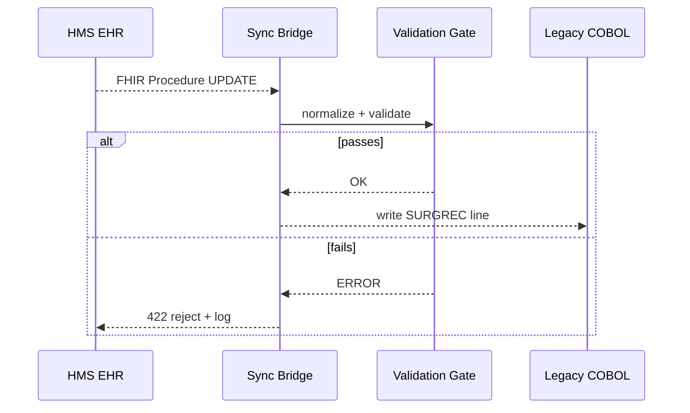

# Chapter 13: External System Sync Bridge  
[← Back to Chapter 12: Central Data Repository (HMS-DTA)](12_central_data_repository__hms_dta__.md)

---

## 1 Why Do We Need a “Border Checkpoint” for Data?

Imagine **Bethesda Community Hospital** just deployed an AI from the HMS stack that shuffles the next-day operating-room schedule to cut average wait-time by 20 %.  
Great—but only if:

1. **The in-house EHR** shows the new schedule **instantly**, so nurses do not call patients twice.  
2. **The payroll system** moves anesthesiologists’ shifts to the correct cost-center.  
3. **The legacy COBOL billing box** still produces the right CPT line items at midnight.

One missing sync and Congress hears about “AI chaos in the OR.”  
**External System Sync Bridge** (ESB) acts like a **customs checkpoint at the data border**:

* validates every record,  
* translates field names,  
* mirrors the change *both* ways in near real-time.

No more manual re-keying, no Excel ping-pong, no night-shift surprises.

---

## 2 Key Concepts (Plain English)

| Term | What It Really Means | Government Analogy |
|------|---------------------|--------------------|
| **Bridge** | Always-on service that watches two systems and keeps them in sync. | A staffed border crossing on I-95. |
| **Connector** | Plug-in driver that talks FHIR, CSV, SOAP, COBOL files … | A multilingual customs officer. |
| **Mapping Table** | Rules that match fields (e.g., `SURG_TIME` → `procedure.start`). | A translation phrase book. |
| **Validation Gate** | Checks every record against schema and policy. | Customs X-ray machine. |
| **Mirror Action** | The final insert/update in the opposite system. | Truck released to the other side. |

Remember these five; everything else is scaffolding.

---

## 3 Five-Minute “Hello Bridge” Demo

Goal: When HMS updates an **OR schedule slot**, the same row appears in the hospital’s **legacy COBOL table**.

### 3.1 Install & Authenticate
```bash
pip install hms-bridge
export HMS_BRIDGE_TOKEN="demo-sandbox-token"
```

### 3.2 Wire Up Both Sides
```python
from hms_bridge import Bridge, FHIRConnector, CobolConnector

b = Bridge(name="OR_Schedule_Bridge")

b.add_connector("hms_ehr",  FHIRConnector(url="https://ehr.local/fhir"))
b.add_connector("cobol_db", CobolConnector(file="/mnt/cobol/sched.dat"))

b.set_mapping(
    source="hms_ehr",
    target="cobol_db",
    table ={
        "resourceType":         "SURGREC",
        "id":                   "REC_ID",
        "procedure.start":      "SURG_TIME",
        "procedure.location":   "OR_ROOM",
        "performer[0].staffId": "ANESTH_ID"
    }
)
b.start()        # begins the continuous sync loop
```
What this tiny script does:  
1. Adds two **Connectors**—FHIR on one side, COBOL file on the other.  
2. Declares a **Mapping Table** of 4 fields.  
3. Calls `start()`, which spins a background thread that listens for FHIR `Procedure` updates and writes `SURGREC` lines into `sched.dat`.

---

### 3.3 Watch It Work (Optional)
```python
print(b.stats())
```
Typical output:
```
Bridge OR_Schedule_Bridge
• 12 records synced (11 OK, 1 failed validation)
• Avg latency: 1.4 s
• Last error: "OR_ROOM value empty"
```

---

## 4 What Happens Internally?


Take-away: **Validation happens before** anything crosses the border, preventing bad data from contaminating the other side.

---

## 5 A Peek at the Code (≤ 15 Lines)

_File: `bridge/core/bridge.py`_
```python
class Bridge:
    def __init__(self, name):
        self.name, self.conns, self.map = name, {}, {}
    def add_connector(self, key, conn):
        self.conns[key] = conn
    def set_mapping(self, source, target, table):
        self.map[(source, target)] = table
    def start(self):
        src, tgt = self.conns.keys()
        while True:
            rec = self.conns[src].next_change()
            if not _validate(rec, self.map[(src, tgt)]):
                _log("reject", rec["id"]); continue
            row = _transform(rec, self.map[(src, tgt)])
            self.conns[tgt].write(row)
```

Quick tour:  
1. `next_change()` is a generator from the Connector that yields new or updated records.  
2. `_validate()` checks mandatory fields + calls [Legal & Compliance Reasoner](08_legal___compliance_reasoner__hms_esq__.md) for any PHI constraints.  
3. `_transform()` renames fields per the mapping.  
4. `write()` pushes into the target system.  
5. Whole loop ♥ under 14 lines—beginners welcome!

---

## 6 How It Talks to Other HMS Modules

* Uses **Dataset IDs** from [Central Data Repository](12_central_data_repository__hms_dta__.md) to version audit copies of each sync batch.  
* Runs behind the **Backend Service Gateway** ([Chapter 10](10_backend_service_gateway__hms_svc___hms_api__.md)) so outsiders never hit internal ports.  
* Escalation on repeated validation failure is queued to **Activity Orchestrator** ([Chapter 11](11_activity_orchestrator___task_queues__hms_act___hms_oms__.md)).  
* All bridge metrics stream to **Observability Center** ([Chapter 15](15_observability___operations_center__hms_ops__.md)).

---

## 7 Troubleshooting Cheat-Sheet

| Symptom | Likely Cause | Quick Fix |
|---------|--------------|-----------|
| “Connector not found” | Typo in `add_connector` key | Call `b.connectors()` to list names. |
| High latency (>10 s) | Target system slow | Enable `batch_size=100` in `CobolConnector()`. |
| Validation errors on PHI | Mapping omits HIPAA flag | Add `"consent":"HIPAA_PHI"` in mapping or field metadata. |
| Duplicate records | Source sends both UPDATE & CREATE | Set `dedupe=True` in Bridge constructor. |

---

## 8 Recap & Next Stop

You:

1. Saw why federated data needs a **customs checkpoint**.  
2. Created a two-way bridge in under 20 lines.  
3. Learned how validation, mapping, and mirroring fit together.  
4. Peeked at the minimal internal loop.  

Your hospital, payroll, and COBOL boxes now speak the same language—instantly.

Next we scale across **multiple agencies** (Medicare, VA, IRS…) with formal data-sharing agreements.  
Grab your passport and head to [Chapter 14: Inter-Agency Data Exchange (HMS-A2A)](14_inter_agency_data_exchange__hms_a2a__.md).

---

---

Generated by [AI Codebase Knowledge Builder](https://github.com/The-Pocket/Tutorial-Codebase-Knowledge)