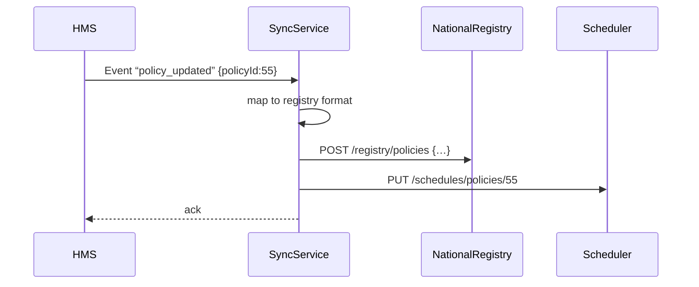

# Chapter 14: External System Synchronization

Welcome back! In [Chapter 13: Backend API Layer (HMS-API / HMS-MKT)](13_backend_api_layer__hms_api___hms_mkt__.md) we opened secure, versioned gateways for partners. Now we’ll close the loop by keeping **all** systems—HMS and external platforms—up to date in real time. This is **External System Synchronization**.

---

## 1. Why Do We Need External System Synchronization?

Imagine the Office of Manufactured Housing Programs issues new permit-approval policies. Once updated in HMS, every scheduling tool, state registry, and regional portal must reflect that change **immediately**. If one system lags behind, an inspector might use an outdated rule, causing service delays or mismatches.

**External System Synchronization** solves this by:

- Detecting changes in HMS (like a new policy version).
- Transforming and forwarding updates to all linked platforms.
- Ensuring consistency, preventing errors, and keeping citizens happy.

---

## 2. Key Concepts

1. Real-time Data Exchange  
   Keep data flowing as soon as changes occur—no more manual imports.

2. Change Detection  
   Track what changed (new policy, updated schedule) so only deltas go out.

3. Data Mapping & Transformation  
   Convert HMS data formats into external system formats (field renaming, code lookups).

4. Synchronization Patterns  
   - **Push**: HMS sends updates via webhooks or messages.  
   - **Pull**: External systems poll HMS APIs at intervals.  
   - **Message Bus**: A broker distributes events to subscribers.

5. Error Handling & Retry  
   Queue failed messages and retry automatically to handle outages.

---

## 3. How It Works: Permit-Approval Update Example

### 3.1 High-Level Flow



1. **HMS** emits a `policy_updated` event.  
2. **SyncService** picks it up, transforms data.  
3. It calls the **National Registry** and the **Scheduling** system APIs.  
4. All platforms now use the latest rule.

---

## 4. Using External System Synchronization

Below is a minimal Node.js example of a **SyncService** that listens for webhooks from HMS and forwards them.

```js
// File: sync-service/server.js
const express = require('express');
const mapData = require('./mapper');
const fetch   = require('node-fetch');
const app     = express();
app.use(express.json());

// Receive HMS update webhook
app.post('/webhook/policy-updated', (req, res) => {
  const externalPayload = mapData(req.body);
  // Send to National Registry
  fetch('https://registry.gov/policies', {
    method:'POST',
    headers:{'Content-Type':'application/json'},
    body: JSON.stringify(externalPayload)
  });
  res.send({status:'forwarded'});
});

app.listen(9100, () =>
  console.log('SyncService listening on 9100'));
```

This code:

1. Exposes `/webhook/policy-updated` for HMS to call.  
2. Uses a `mapper` module to translate fields.  
3. Forwards the transformed payload to an external API.

---

## 5. Under the Hood: Change Mapping

### 5.1 Data Mapper (`mapper.js`)

```js
// File: sync-service/mapper.js
module.exports = function mapData(hmsEvent) {
  // Convert HMS policy object to registry schema
  return {
    id:       hmsEvent.policyId,
    title:    hmsEvent.name,
    effectiveDate: hmsEvent.effective_on,
    rules:    hmsEvent.rulesJson
  };
};
```

Explanation:  
- Takes the HMS event payload and returns a new object with renamed keys.

---

## 6. Pull-Based Synchronization Alternative

If an external system cannot accept webhooks, it can **poll**:

```js
// File: polling-client.js
import fetch from 'node-fetch';

async function syncPolicies() {
  const { updates } = await fetch(
    'http://hms-api/v1/policies/changes?since=2024-07-01'
  ).then(res=>res.json());

  // process each update
  updates.forEach(u => console.log('Sync policy', u.policyId));
}

setInterval(syncPolicies, 5*60*1000); // every 5 min
```

Explanation:  
- Calls an HMS API for changes since a timestamp.  
- Processes each updated policy on a schedule.

---

## 7. Summary

In this chapter, you learned how **External System Synchronization**:

- Detects changes in HMS and keeps all linked systems current.  
- Uses **push** (webhooks) or **pull** (polling) patterns.  
- Transforms data via a **mapper** before sending.  
- Ensures consistent, real-time updates across a city-wide network of agencies.

You’ve reached the end of the tutorial. Thanks for following along, and happy syncing!

---

Generated by [AI Codebase Knowledge Builder](https://github.com/The-Pocket/Tutorial-Codebase-Knowledge)