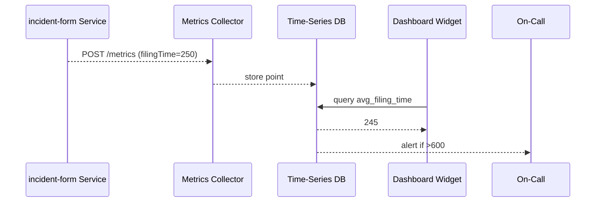

# Chapter 14: Metrics & Monitoring Dashboard  
*(mission-control for every policy, micro-service, and AI agent)*  

[← Back to Chapter&nbsp;13: Microservice Orchestration & Observability](13_microservice_orchestration___observability_.md)

---

## 1. Why Bother With Yet Another “Dashboard”?

Meet **Officer Diaz** at the U.S. Capitol Police.  
Last night a new **incident-report form** went live through HMS-UHC. By sunrise the Chief asks two questions:

1. Did the form **speed up** report filing compared to the old PDF?  
2. Did it **break** anything for overnight patrols?  

Without real-time metrics Diaz would sift through logs and guesses.  
With the **Metrics & Monitoring Dashboard (MMD)** she opens one screen and instantly sees:

* Average filing time dropped from **14 min → 5 min** (green ✔️)  
* Error rate stayed below **0.2 %** (green ✔️)  
* Officer satisfaction (“thumbs-up” rating) climbed to **92 %** (green ✔️)  

One glance → data-driven confidence. MMD is the *truth meter* for every policy and process you launch.

---

## 2. Five Key Concepts (Plain English)

| Term | What it really means | Analogy |
|------|---------------------|---------|
| KPI | A number that proves success (e.g., “avg filing time”). | Speedometer |
| Probe | Code line that sends a KPI value. | Fitbit sensor |
| Time-Series DB | Database that stores “value vs. time” (Prometheus). | Heart-rate chart |
| Widget | Tiny graph or gauge on the dashboard. | Car dashboard dial |
| Alert | Rule that pages humans when a KPI crosses a limit. | Smoke alarm |

Keep these five in mind—together they form the dashboard.

---

## 3. A 90-Second Tour of the Dashboard

Below are three **micro-frontend widgets** you can drop into the Admin Portal (see [Admin / Gov Portal](05_admin___gov_portal_.md)).

### 3.1 “Avg Filing Time” Gauge (15 lines)

```jsx
// /widgets/gauge-filing-time/index.js
export default function FilingTimeGauge() {
  const {data=[]}=useFetch("/api/metrics?query=avg_filing_time");
  const secs = Math.round(data[0]?.value ?? 0);

  return (
    <section>
      <h4>Avg Filing Time (sec)</h4>
      <h1 style={{color: secs<600?"green":"red"}}>{secs}</h1>
    </section>
  );
}
```

*Fetches one Prometheus query and paints green if < 10 min.*

---

### 3.2 “Error Heat-Map” (18 lines)

```jsx
// /widgets/heatmap-errors/index.js
export default function ErrorHeatMap() {
  const {data=[]} = useFetch("/api/metrics?query=errors_by_hour");

  return (
    <table>
      <tbody>
        {data.map(row=>(
          <tr key={row.hour}>
            <td>{row.hour}:00</td>
            <td style={{background:`rgba(255,0,0,${row.count/50})`}}>
              {row.count}
            </td>
          </tr>
        ))}
      </tbody>
    </table>
  );
}
```

*Darker red cells = more errors during that hour.*

---

### 3.3 “Thumbs-Up Score” Sparkline (14 lines)

```jsx
// /widgets/spark-satisfaction/index.js
export default function SatisfactionSpark() {
  const {data=[]} = useFetch("/api/metrics?query=sat_score_last24h");

  return (
    <svg width="200" height="40">
      {data.map((p,i)=>(
        <circle key={i} cx={i*8} cy={40-p.value} r="2" fill="blue"/>
      ))}
    </svg>
  );
}
```

*Plots 24 dots—one per hour—showing how happy officers feel.*

---

## 4. Emitting Your First Metric (Service-Side)

Inside any Node/Express micro-service (e.g., `incident-form`):

```js
// /services/incident-form/probes.js   (12 lines)
import prom from "prom-client";
export const filingTime = new prom.Histogram({
  name: "avg_filing_time",
  help: "Seconds to finish incident form",
  buckets: [60,120,300,600,1200]   // 1 min → 20 min
});

export function record(timeSec){
  filingTime.observe(timeSec);
}
```

Explanation  
1. Create a **Histogram** metric.  
2. Call `record(250)` whenever a form completes.  
3. A built-in endpoint `/metrics` now exposes data for Prometheus to scrape every 15 s.

---

## 5. Setting an Alert in 2 Lines

```yaml
# alerts/filing_time.yaml
- alert: FilingTooSlow
  expr: avg(avg_filing_time) > 600  # >10 min
  for: 5m
```

Prometheus → Alertmanager → Slack/email when the rule fires.  
*(See [Human-in-the-Loop Oversight](07_human_in_the_loop__hitl__oversight_.md) if you want humans to approve auto-remediation.)*

---

## 6. What Happens Behind the Curtain?



*Five players, all automated—no midnight SSH sessions.*

---

## 7. Under-the-Hood Code Peek

### 7.1 Collector Config (8 lines)

```yaml
scrape_configs:
- job_name: incident-form
  metrics_path: /metrics
  static_configs:
  - targets: ['incident-form:4000']
```

*Kubernetes appends this to the global Prometheus config.*

### 7.2 Super-Tiny Query Endpoint (18 lines)

```js
// /api/metrics.js
import fetch from "node-fetch";
export default async function handler(req,res){
  const query = req.query.query;
  const url = `http://prometheus:9090/api/v1/query?query=${query}`;
  const out = await fetch(url).then(r=>r.json());
  res.json(out.data.result.map(r=>({
    value: Number(r.value[1]),
    hour:  new Date(Number(r.value[0])*1000).getHours()
  })));
}
```

*Allows any widget to hit `/api/metrics?query=...` without knowing Prometheus internals.*

---

## 8. How MMD Connects to Other Layers

| Layer | Interaction |
|-------|-------------|
| [Microservice Orchestration & Observability](13_microservice_orchestration___observability_.md) | Exposes metrics endpoints & trace IDs. |
| [Backend API Gateway](12_backend_api_gateway__hms_api__.md) | Gateway latency/error metrics appear as their own KPIs. |
| [Admin / Gov Portal](05_admin___gov_portal_.md) | Hosts the dashboard widgets for managers. |
| [Access & Authorization Framework](11_access___authorization_framework_.md) | Restricts sensitive metrics (e.g., PII counts) to privileged roles. |

---

## 9. Common Pitfalls & Quick Fixes

| Symptom | Quick Fix |
|---------|-----------|
| “Gauge always 0” | Confirm the service actually calls `record()` and `/metrics` endpoint is scraped. |
| Huge cardinality (memory blow-up) | Avoid labels with user IDs; bucket by coarse groups instead. |
| Alert fatigue (too many pings) | Add a `for: 10m` clause or raise threshold. |
| Widgets 500-error | Proxy them through [Backend API Gateway](12_backend_api_gateway__hms_api__.md) to bypass CORS. |

---

## 10. Try It Locally (3 Commands, 2 Minutes)

```bash
# 1. start demo service + prometheus + dashboard
docker compose up -d incident-form prometheus grafana

# 2. simulate 20 form submissions
node scripts/send-sample-metrics.js

# 3. open Grafana
open http://localhost:3000  (login: admin / admin)
```

Add Prometheus as data-source → import dashboard **ID 11074** → watch numbers dance.

---

## 11. What You Learned

✔️ KPIs > gut feelings—how a single probe call feeds a live gauge.  
✔️ How to build 3 micro-frontend widgets with < 20 lines each.  
✔️ Alert rules that page humans before citizens see errors.  
✔️ MMD is the conversation hub between **services**, **people**, and **policies**.

In the final chapter we’ll see how every metric, decision, and user action you just visualized is **immutably recorded for auditors**.

[→ Chapter 15: Compliance & Audit Trail](15_compliance___audit_trail_.md)

---

Generated by [AI Codebase Knowledge Builder](https://github.com/The-Pocket/Tutorial-Codebase-Knowledge)