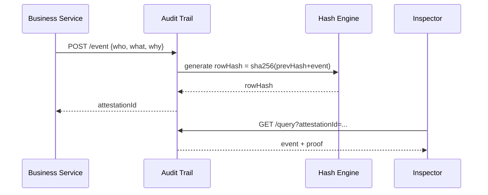

# Chapter 15: Compliance & Audit Trail  
*(“Show me the receipts!” — every Inspector General, ever)*  

[← Back to Chapter&nbsp;14: Metrics & Monitoring Dashboard](14_metrics___monitoring_dashboard_.md)

---

## 1. Why Does HMS Need an Audit Trail?

Imagine the **Council of the Inspectors General on Integrity and Efficiency (CIGIE)** receives a whistle-blower tip:

> “Someone edited 300 rural-clinic travel subsidies last Friday at 11 p.m. and no one can explain why.”

If HMS-UHC can’t answer *who changed what, when, and why*, the whole program risks:

* FISMA non-compliance  
* Congressional hearings  
* Citizens losing trust  

The **Compliance & Audit Trail (CAT)** layer ends those nightmares.  
Every significant action—whether made by a human, a micro-service, or the [AI Representative Agent](06_ai_representative_agent_.md)—lands in an **immutable ledger** that meets federal standards (NIST 800-53, FISMA, FedRAMP).

One query → instant receipts → crisis averted.

---

## 2. Five Key Concepts (Plain English)

| Concept | What it really is | Analogy |
|---------|------------------|---------|
| **Ledger** | Append-only table that nobody can edit retroactively. | A bound paper notebook—no tearing pages |
| **Audit Event** | One row in the ledger (`who`, `what`, `when`, `why`, `hash`). | Cash-register receipt |
| **Hash Chain** | Each row stores the hash of the previous row. | Tamper-evident wax seal |
| **Attestation Token** | Signed proof returned to the caller (“your action is now recorded”). | USPS tracking number |
| **Inspector Query** | Read-only search endpoint for auditors. | Library card catalog |

Keep these handy—CAT is just these five ingredients mixed carefully.

---

## 3. Quick Walk-Through: Recording & Retrieving a Change

### 3.1 Front-End: Call Any HMS API *With* Attestation (14 lines)

```js
// /widgets/subsidy-editor/save.js
export async function saveChange(payload){
  const token = localStorage.getItem("hms_token");        // from Chapter 11
  const res   = await fetch("/api/subsidy/update",{
    method:"POST",
    headers:{ Authorization:`Bearer ${token}` },
    body: JSON.stringify(payload)
  });
  const {attestationId} = await res.json();
  alert("Saved! Audit ID: " + attestationId);             // show the receipt
}
```

What happens?  
1. Normal business call (`/subsidy/update`).  
2. The service writes business data **and** pushes an **Audit Event**.  
3. CAT returns `attestationId`, a unique receipt users can jot down.

### 3.2 Inspector General Query (10 lines)

```js
// /scripts/find-change.js
import fetch from "node-fetch";

(async ()=>{
  const res = await fetch("http://cat/api/query?attestationId=abc123");
  console.log(await res.json());    // -> full event details
})();
```

Instant receipts—no need to chase logs.

---

## 4. What Happens Behind the Curtain?



1. **Business Service** posts an event.  
2. CAT seals it with a **hash chain**.  
3. Returns **attestationId** to caller.  
4. **Inspector** can read but never alter the ledger.

Only 4 actors → easy to reason about.

---

## 5. Under-the-Hood Code (All Blocks < 20 Lines)

### 5.1 Event Writer (Node/Express, 18 lines)

```js
// /services/cat/write.js
import crypto from "crypto";
export async function record(event){
  const prev = await db.ledger.findOne({}, {sort:{_id:-1}});
  const prevHash = prev?.rowHash || "";
  const rowHash  = crypto.createHash("sha256")
                         .update(prevHash + JSON.stringify(event))
                         .digest("hex");

  const doc = {...event, rowHash, ts:Date.now()};
  const {insertedId} = await db.ledger.insert(doc);

  return {attestationId: insertedId.toString()};
}
```

Explanation  
• Reads `prevHash`, creates a new `rowHash`.  
• Stores full event + hash.  
• Returns `attestationId` to caller.

### 5.2 Middleware to Auto-Audit Any Route (12 lines)

```js
// /middlewares/audit.js
import {record} from "../services/cat/write.js";
export const audit = action => async (req,res,next)=>{
  res.on("finish", async ()=>{
    if (res.statusCode < 400){          // only on success
      await record({
        who:  req.user.sub,
        what: action,
        why:  req.body?.reason || "N/A"
      });
    }
  });
  next();
};
```

Add to any business route:

```js
app.post("/subsidy/update",
  auth("edit:subsidy"),                 // from Chapter 11
  audit("SUBSIDY_UPDATE"),
  saveHandler);
```

Zero extra code per route after this!

### 5.3 Read-Only Query Endpoint (15 lines)

```js
// /services/cat/query.js
export async function find(req,res){
  const {attestationId} = req.query;
  const row = await db.ledger.findOne({_id: db.id(attestationId)});
  if(!row) return res.sendStatus(404);

  res.json({
    ...row,
    valid: verifyChain(row)             // quick hash check
  });
}

function verifyChain(row){
  // recompute current hash from prev row
  const prev = db.ledger.findOne({_id: {$lt: row._id}}, {sort:{_id:-1}});
  const calc = crypto.createHash("sha256")
                     .update((prev?.rowHash||"")+JSON.stringify(row))
                     .digest("hex");
  return calc === row.rowHash;
}
```

Auditors see the full event **plus** a real-time verification flag.

---

## 6. How CAT Integrates with Other Layers

| Layer | What flows into CAT? |
|-------|----------------------|
| [Management Layer](09_management_layer__hms_svc__hms_ach__hms_a2a__.md) | Each workflow step posts an event (`WORKFLOW_STEP_DONE`). |
| [Access & Authorization Framework](11_access___authorization_framework_.md) | `who` field comes directly from verified JWTs. |
| [Backend API Gateway](12_backend_api_gateway__hms_api__.md) | 401/403 events are logged for intrusion analysis. |
| [Metrics & Monitoring Dashboard](14_metrics___monitoring_dashboard_.md) | High-level counts from CAT (e.g., “events/min”) power compliance charts. |
| [Human-in-the-Loop Oversight](07_human_in_the_loop__hitl__oversight_.md) | Every approve/reject decision is an Audit Event. |

CAT is the common memory everyone shares.

---

## 7. Compliance Check-List (Make Your Lawyers Happy)

1. **Write-once storage** (e.g., WORM S3 or Append-only Postgres table)  
2. **Time sync** via NTP on all hosts (NIST SP 800-52)  
3. **Encryption-at-rest** with FIPS-validated modules  
4. **Role-based read access** (`ROLE_AUDITOR` only)  
5. **30-day hash scan** job that re-verifies the entire chain  

Add these five points to your Authority-to-Operate (ATO) documents and sleep easier.

---

## 8. Common Pitfalls & Quick Fixes

| Problem | Fix |
|---------|-----|
| Clock drift breaks hash chain | Enable `chrony` on every node, monitor drift < 100 ms. |
| Ledger table gets huge | Archive older rows to cold WORM storage; keep 90 days hot. |
| Services forget to call `audit()` | Use ESLint rule: “every Express route must include audit middleware.” |
| Auditors complain about PII in logs | Redact or hash sensitive fields *before* calling `record()`. |

---

## 9. Try It Locally (2 Commands, 30 Seconds)

```bash
# 1. start mock CAT service
npm run cat:dev   # API at http://localhost:9100

# 2. simulate a subsidy change
curl -X POST localhost:9100/demo/save -d '{"amount":42}'
# → {"attestationId":"64a..."}
```

Now query:

```bash
curl localhost:9100/api/query?attestationId=64a...
```

You’ll see the full JSON event plus `"valid":true`.

---

## 10. What You Learned

✔️ Why an **immutable audit trail** is non-negotiable for federal software.  
✔️ Five beginner-friendly concepts: Ledger, Audit Event, Hash Chain, Attestation Token, Inspector Query.  
✔️ How to record and retrieve events with < 20 lines of code.  
✔️ How CAT threads through every other HMS layer, powering trust and legal defensibility.  

You now have the complete story—from a citizen’s click on the [Interface Layer](01_interface_layer__hms_mfe__sector_portals__.md) all the way to tamper-proof records in CAT.  
Deploy with confidence: the lights are on, the logs are sealed, and the auditors are smiling.

*(End of tutorial series. Happy building!)*

---

Generated by [AI Codebase Knowledge Builder](https://github.com/The-Pocket/Tutorial-Codebase-Knowledge)