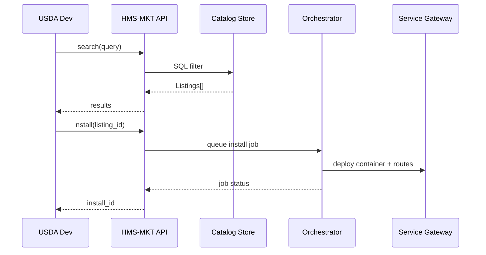

# Chapter 17: Marketplace & Discovery Hub (HMS-MKT)

[← Back to Chapter 16: Policy Deployment Pipeline (HMS-CDF)](16_policy_deployment_pipeline__hms_cdf__.md)

---

## 1 Why Another “.gov Storefront”?

Picture the **Department of Agriculture (USDA)** frantically searching for:

* a **“Geospatial Crop Classifier”** ML model,  
* an **API** that already checks farm‐loan eligibility against public debt,  
* a tested **wizard** for small-farmer grant applications.

Each almost certainly exists—in some sibling agency’s repo, on someone’s hard-drive, or buried in an old SharePoint.  
Re-coding takes months; re-procurement takes *years*.

**Marketplace & Discovery Hub (HMS-MKT)** solves the “lost-treasure” problem.  
Think **GSA Schedule, but for code and AI skills**:

1. Agencies **list** reusable micro-services, datasets, and components.  
2. Others **shop** with filters (“WCAG-compliant”, “FedRAMP High”).  
3. With one click they **install** the asset into their own HMS stack.  
4. Ratings & audit badges build trust—reuse becomes the default, not the exception.

---

## 2 Key Concepts (Plain English)

| Term | What It Means | Government Analogy |
|------|---------------|--------------------|
| **Listing** | One reusable asset (service, dataset, UI widget, AI skill). | A vendor line-item on the GSA e-Library. |
| **Catalog** | Searchable store of all listings. | A thick GSA Schedule catalog. |
| **Badge** | Auto-generated compliance label (WCAG, HIPAA, FedRAMP…). | “Energy-Star” sticker on a government fridge. |
| **Click-to-Install** | One API call that wires the asset into your stack. | “Add to cart” + FAS Procurement auto-PO. |
| **Rating** | 1–5 star feedback from other agencies. | Past-performance CPARS score. |
| **Procurement Vault** | Immutable record of license & approvals. | Contract file in FPDS-NG. |

Keep these six words in mind—everything else is wiring.

---

## 3 Walk-Through: Reusing a “Geospatial Crop Classifier” in 3 Acts

### 3.1 Browse & Compare (≤15 lines)

```python
from hms_mkt import Catalog

cat = Catalog()                      # public read-only
results = cat.search(
    keywords=["crop", "classifier"],
    badges=["FedRAMP_HIGH", "WCAG_AA"]
)

print(results[0].title)              # → "Geospatial Crop Classifier v2"
print(results[0].rating)             # → 4.7
```

Explanation  
1. We open a read-only `Catalog` client.  
2. `search()` filters by keywords + required compliance `badges`.  
3. Each `Listing` object exposes `title`, `rating`, `publisher`, etc.

---

### 3.2 One-Click Install (≤12 lines)

```python
listing = results[0]

install_id = listing.install(
    target_env="usda-dev",              # your HMS stack alias
    token="demo-sandbox-token"
)
print("Install job:", install_id)
```

What happens?

* HMS-MKT validates that USDA has a **FedRAMP-High** workspace.  
* It queues a background job in [Activity Orchestrator](11_activity_orchestrator___task_queues__hms_act___hms_oms__.md) to:  
  1. Pull the Docker image,  
  2. Register routes in the [Service Gateway](10_backend_service_gateway__hms_svc___hms_api__.md),  
  3. Import sample datasets into [Central Data Repository](12_central_data_repository__hms_dta__.md).

You get a real-time status link—no manual DevOps.

---

### 3.3 Leave a Rating & Lock the Paperwork (≤12 lines)

```python
listing.rate(stars=5, comment="Saved 3 sprints—thanks NASA!")

vault = listing.procurement_vault(
    environment="usda-dev",
    format="pdf"
)
print("PO archived at:", vault)
```

* `rate()` stores feedback visible to all agencies.  
* `procurement_vault()` returns a PDF bundle (license, FedRAMP letter, installation hash) filed automatically in FPDS-NG or your e-Filing system.

---

## 4 What’s Going on Behind the Curtain?



Key takeaway: **Only HMS-MKT** talks to the inner guts; your script just calls two methods.

---

## 5 Inside the Codebase (Mini Tour)

### 5.1 `mkt/core/catalog.py` (≤14 lines)

```python
class Catalog:
    def search(self, keywords, badges=None):
        q = "SELECT * FROM listings WHERE"
        q += " AND ".join([f"title ILIKE '%{k}%'" for k in keywords])
        if badges:
            q += " AND " + " AND ".join([f"'{b}' = ANY(badges)" for b in badges])
        rows = db.fetch(q)
        return [Listing(r) for r in rows]
```

Beginner notes:  
* Builds a tiny SQL string (real code uses parameterized queries).  
* Returns `Listing` objects—lightweight wrappers around row dicts.

### 5.2 `mkt/core/listing.py` (≤16 lines)

```python
class Listing:
    def __init__(self, row): self.row = row

    def install(self, target_env, token):
        payload = {
            "listing_id": self.row["id"],
            "env": target_env
        }
        resp = httpx.post("/api/install", json=payload,
                          headers={"Auth": token}).json()
        return resp["job_id"]

    def rate(self, stars, comment=""):
        db.insert("ratings", {
            "listing": self.row["id"],
            "stars": stars,
            "comment": comment
        })
```

* `install()` is just a thin wrapper that calls the HMS-MKT API.  
* `rate()` writes to a simple `ratings` table; an hourly cron recalculates averages.

---

## 6 Publishing Your Own Listing (≤18 lines)

```python
from hms_mkt import Publisher, Badge

pub = Publisher(token="agency-token")

listing_id = pub.create_listing(
    title="Farm-Loan Eligibility API",
    description="Checks debtor status via Treasury offset.",
    docker_image="ghcr.io/usda/elig-api:1.0.3",
    badges=[Badge.WCAG_AA, Badge.FEDRAMP_HIGH],
    price_tier="free-gov-reuse"
)
print("Listing ID:", listing_id)
```

HMS-MKT runs an **onboarding scan** behind the scenes:

* Pulls the Docker image; checks for vulnerabilities.  
* Cross-references policy labels from [Legal Reasoner](08_legal___compliance_reasoner__hms_esq__.md).  
* Assigns initial trust score.

If anything fails, you get a red-flag report just like the sensors in [AI Governance Pipeline](07_ai_governance_values_pipeline_.md).

---

## 7 Troubleshooting Cheat-Sheet

| Symptom | Cause | Quick Fix |
|---------|-------|-----------|
| `INSTALL_DENIED: badge mismatch` | Your env not FedRAMP High | Pick a listing with lower badge or upgrade your stack. |
| “Rating not saved” | Anonymous user | Pass a valid `token` with `rate()`. |
| Listing stuck in **Scanning** | Large image | Use multi-stage build; push slim image. |
| Procurement vault empty | Install job not finished | `listing.install_status(job_id)` to check progress. |

---

## 8 How HMS-MKT Fits into the HMS Universe

| Module | Interaction |
|--------|-------------|
| **Backend Service Gateway** | Click-to-Install registers new routes automatically. |
| **Activity Orchestrator** | Executes long installs & scans as background tasks. |
| **Central Data Repository** | Stores artefacts (scan reports, sample datasets) under each listing. |
| **AI Governance Pipeline** | Provides trust badges (`BIAS_CHECK_PASSED`, `PRIVACY_OK`). |
| **Policy Deployment Pipeline** | Bills published in [Chapter 16](16_policy_deployment_pipeline__hms_cdf__.md) can themselves appear as “Policy Modules” here. |

---

## 9 Recap & Next Stop

In this chapter you:

1. Learned why HMS-MKT turns code reuse into “shopping not coding.”  
2. Searched the **Catalog**, clicked **Install**, and left a **Rating**.  
3. Looked under the hood at tiny SQL & HTTP helpers.  
4. Published your own listing with automated compliance scans.

With a thriving marketplace, agencies can swap proven solutions in hours—freeing time for innovation, not duplication.

Ready to **test-drive** these reusable assets in a safe sandbox before rolling them live?  
Jump ahead to [Chapter 18: Simulation & Training Sandbox (HMS-ESR / HMS-EDU)](18_simulation___training_sandbox__hms_esr___hms_edu__.md).

---

Happy shopping—and happier reusing!

---

Generated by [AI Codebase Knowledge Builder](https://github.com/The-Pocket/Tutorial-Codebase-Knowledge)