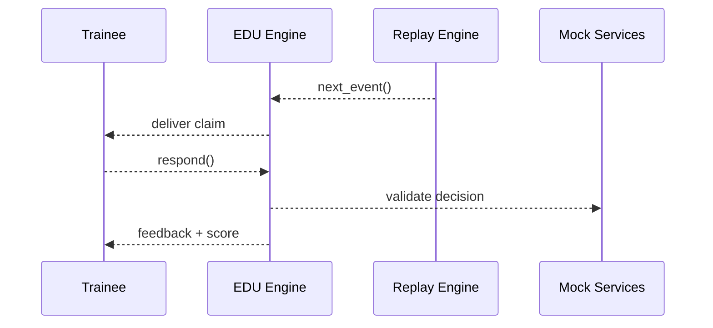

# Chapter 18: Simulation & Training Sandbox (HMS-ESR / HMS-EDU)

[← Back to Chapter 17: Marketplace & Discovery Hub](17_marketplace___discovery_hub__hms_mkt__.md)

---

## 1 Why Do We Need a “Government Flight-Sim” for Policy Systems?

Picture the **Department of Labor (DOL)** on a Friday afternoon.  
A hurricane is predicted to hit the Gulf Coast and **unemployment claims may spike 500 % by Monday**.  
Brand-new claims examiners and freshly-deployed AI bots have never faced that load.  
If they mess up—even in a test environment—citizens will wait weeks for benefits.

**Simulation & Training Sandbox (HMS-ESR / HMS-EDU)** provides a safe **flight-sim**:

1. **ESR (Execution Scenario Replay)**  
   • Re-creates realistic user traffic (citizens, employers, bots).  
2. **EDU (Interactive Coursework)**  
   • Grades every human or AI on speed, accuracy, and compliance.  
3. **Zero risk** to real databases, budgets, or reputations.

Result: Staff earn digital “wings” before they touch production.

---

## 2 Key Concepts (Plain English)

| Term | What It Means | Government Analogy |
|------|---------------|--------------------|
| **Scenario** | A scripted real-world event (e.g., “Hurricane Ida Claim Surge”). | Disaster-response tabletop exercise. |
| **Agent** | Human trainee **or** AI bot being evaluated. | New TSA officer in classroom training. |
| **Replay Engine (ESR)** | Re-creates user clicks, API calls, and errors at exact timestamps. | Flight simulator hydraulics shaking the cockpit. |
| **Course Module (EDU)** | Lesson + automatic rubric (“<2 % error rate”). | Multiple-choice test plus practical exam. |
| **Badge / Wings** | Blockchain-signed certificate of competence. | Pilot license signed by FAA. |

---

## 3 Boot-Up Your First Training Flight in 15 Lines

We will:

1. Spin up a **scenario** (“Surge in Unemployment Claims”).  
2. Attach a **trainee** (you).  
3. Watch the **grade** appear.

```bash
pip install hms-edu
export HMS_EDU_TOKEN="demo-sandbox-token"
```

```python
from hms_edu import Simulator, Trainee

# 1) Pick a scenario published in the Marketplace (Chapter 17)
sim = Simulator(scenario_id="usc_dol_claim_surge_2023")

# 2) Register yourself as a trainee
me = Trainee(name="Alex Doe", role="Claims Examiner (GS-7)")

session_id = sim.enroll(me)
print("Session:", session_id)
```

Explanation  
• `scenario_id` points to a **Listing** you might have installed via the [Marketplace](17_marketplace___discovery_hub__hms_mkt__.md).  
• `Simulator.enroll()` clones a *sandbox copy* of every micro-service the scenario touches.

---

### 3.1 Handle One Claim (You vs. Bot)

The simulator feeds you mock claims exactly like production traffic.

```python
claim = sim.next_event(session_id)
print(claim)                   # minimal JSON

decision = {
    "approve": True,
    "weekly_amount": 275,
    "notes": "Meets all criteria."
}

sim.respond(session_id, claim["id"], decision)
```

Every call is **recorded**; no real benefit dollars move.

---

### 3.2 View Your Scorecard

```python
score = sim.grade(session_id)
print(score)
```

Example output

```
Accuracy : 98.7 %
Latency  : 42 s avg
Compliance flags: 0
Badge earned : "Claim Surge Bronze Wings" 🏅
```

You just “landed” the flight—congrats!

---

## 4 What’s Happening Under the Hood?



1. **ESR** streams the next prerecorded user action.  
2. **EDU** feeds it to the trainee, times the response, and asks mock services for validation.  
3. Score updates in real time—no risk to production.

---

## 5 Tiny Code Peek (13 Lines)

_File: `hms_edu/core/simulator.py`_

```python
class Simulator:
    def __init__(self, scenario_id):
        self.esr  = ESR.load(scenario_id)
        self.edu  = EDU.load_rules(scenario_id)

    def enroll(self, trainee):
        sid = _uuid()
        DB["sessions"][sid] = {"t": trainee, "idx": 0, "score": {}}
        return sid

    def next_event(self, sid):
        idx = DB["sessions"][sid]["idx"]
        event = self.esr.events[idx]
        return event

    def respond(self, sid, event_id, decision):
        rules = self.edu
        passed = rules.check(decision)
        DB["sessions"][sid]["score"].update(rules.metrics(decision))
```

Beginner notes  
• `ESR.load()` returns a list of timestamped events.  
• `rules.check()` is a tiny function auto-generated from the **Course Module** YAML.  
• No network calls = lightning-fast feedback.

---

## 6 Creating Your Own Scenario in 12 Lines

```python
from hms_esr import Scenario, Event

events = [
    Event.at("00:00").citizen("submit_claim.json"),
    Event.at("00:05").citizen("upload_w2.pdf"),
    Event.at("00:30").system("IRS_verification_call")
]

Scenario(
    id="demo_micro_surge",
    title="3-Claim Mini Surge",
    events=events
).publish()
```

• Publish pushes to the **Marketplace** so any agency can reuse it.  
• A matching **EDU YAML** defines grading rubrics (`error_tolerance: 5%`, `sla_sec: 60`, …).

---

## 7 Link-Ups to Earlier HMS Modules

| Module | How It Plays in the Sandbox |
|--------|-----------------------------|
| **AI Agent Framework** ([Chapter 4](04_ai_agent_framework__hms_agt__.md)) | Drop an AI bot into a session to earn its own badge. |
| **Human-in-the-Loop Console** ([Chapter 6](06_human_in_the_loop__hitl__oversight_console_.md)) | Supervisors watch sessions live and intervene. |
| **Governance Values Pipeline** ([Chapter 7](07_ai_governance_values_pipeline_.md)) | Flags policy violations inside training (better than production!). |
| **Marketplace** ([Chapter 17](17_marketplace___discovery_hub__hms_mkt__.md)) | Scenarios & courses are published as reusable listings. |

---

## 8 Troubleshooting Cheat-Sheet

| Symptom | Likely Cause | Quick Fix |
|---------|--------------|-----------|
| `NO_EVENT` returned | Finished scenario | Call `sim.grade()` or start a new session. |
| Score stuck at 0 % | Rules file missing | Check that `.edu.yml` exists alongside the scenario. |
| Real API hit by mistake | Wrong service URL in scenario | Use `sim.audit(session_id)` to list every outbound call. |
| Badge not issued | Minimum score not met | Adjust rubric or retry scenario. |

---

## 9 Recap

You have:

1. Understood why agencies need a **risk-free flight simulator** for policies.  
2. Enrolled in a surge scenario, processed claims, and earned wings.  
3. Peeked inside the ESR & EDU engines.  
4. Learned to publish your own scenarios for others to reuse.

The HMS adventure ends here—but your training journey has just begun.  
Clone a scenario, invite colleagues, and keep your agency’s digital pilots sharp!

---

**End of the HMS-UHC Tutorial Series – thanks for flying!**

---

Generated by [AI Codebase Knowledge Builder](https://github.com/The-Pocket/Tutorial-Codebase-Knowledge)