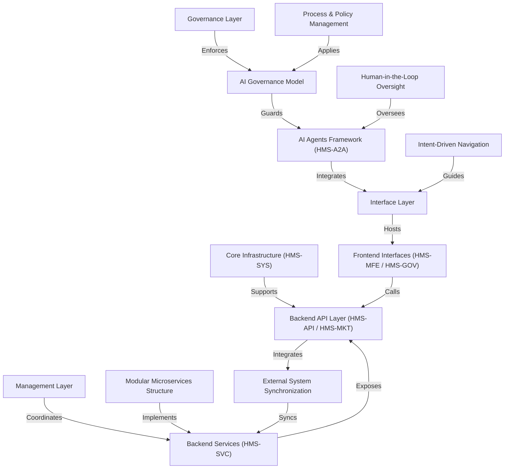

# Tutorial: HMS-UHC

**HMS** is an *expert-led, AI-powered* workflow automation platform that helps governments coordinate **citizen services**, **policy management**, and **agency operations**. It uses layered abstractions—like the **Governance Layer** to enforce rules and the **Interface Layer** to provide user portals—and a **Modular Microservices Structure** to scale individual services independently. With built-in **AI Agents**, **intent-driven navigation**, and *human-in-the-loop oversight*, the system streamlines complex processes such as eligibility determination, legislative workflows, and external system synchronization.

**Source Repository:** [None](None)

## Chapters

1. [Interface Layer
](01_interface_layer_.md)
2. [Frontend Interfaces (HMS-MFE / HMS-GOV)
](02_frontend_interfaces__hms_mfe___hms_gov__.md)
3. [Intent-Driven Navigation
](03_intent_driven_navigation_.md)
4. [AI Agents Framework (HMS-A2A)
](04_ai_agents_framework__hms_a2a__.md)
5. [Human-in-the-Loop Oversight
](05_human_in_the_loop_oversight_.md)
6. [Process & Policy Management
](06_process___policy_management_.md)
7. [AI Governance Model
](07_ai_governance_model_.md)
8. [Governance Layer
](08_governance_layer_.md)
9. [Management Layer
](09_management_layer_.md)
10. [Core Infrastructure (HMS-SYS)
](10_core_infrastructure__hms_sys__.md)
11. [Modular Microservices Structure
](11_modular_microservices_structure_.md)
12. [Backend Services (HMS-SVC)
](12_backend_services__hms_svc__.md)
13. [Backend API Layer (HMS-API / HMS-MKT)
](13_backend_api_layer__hms_api___hms_mkt__.md)
14. [External System Synchronization
](14_external_system_synchronization_.md)

---

Generated by [AI Codebase Knowledge Builder](https://github.com/The-Pocket/Tutorial-Codebase-Knowledge)