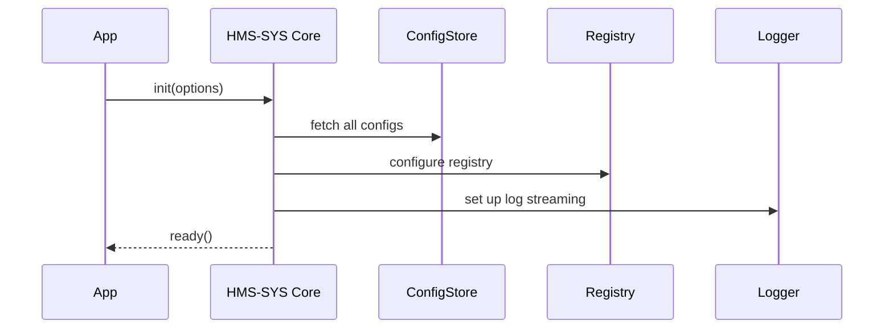

# Chapter 1: Core Infrastructure (HMS-SYS)

Welcome to HMS-UTL! In this chapter, we’ll explore **Core Infrastructure (HMS-SYS)**—the reliable backbone for all your services, like a power grid and highway network for digital systems.

## Why Core Infrastructure?

Imagine U.S. Customs and Border Protection (CBP) builds a citizen portal. They need:
- Secure ways for services to find each other  
- A single place to store configuration  
- Uniform logging for audits  
- Built-in security to protect sensitive data  
- Monitoring and failover hooks  

Without a shared backbone, every team rebuilds the same plumbing. HMS-SYS solves this by offering:
- Service discovery  
- Configuration management  
- Logging  
- Security foundations  
- Monitoring hooks  

**Use case:** A federal health-care platform where patient data services, appointment scheduling, and AI diagnostics need to interoperate securely.

## Key Concepts

1. **Service Discovery**  
   Like a digital phone book. Services register under a name and address. Clients ask “Where is user-service?” and HMS-SYS replies.

2. **Configuration Management**  
   A central control panel for settings (endpoints, credentials). No hard-coding!

3. **Logging**  
   Security cameras for your code. Capture events (info, warnings, errors) and ship them to a log server.

4. **Security Foundation**  
   Locks and keys. Handle TLS, authentication tokens, and access controls out of the box.

5. **Monitoring Hooks**  
   Sensors that trigger alerts or failover when services lag or crash.

## Quick Start Example

Here’s a minimal JavaScript example showing how a service uses HMS-SYS:

```javascript
// index.js
const hmsSys = require('hms-sys');

// 1. Initialize core infra
hmsSys.init({
  env: 'production',
  configServer: 'https://config.fed.gov',
});

// 2. Load a config value
const dbConfig = hmsSys.config.get('database');
// -> { host: 'db.fed.gov', user: 'svc_user', ... }

// 3. Register this service
hmsSys.discovery.register('healthcare-appointment', 'http://localhost:3000');

// 4. Discover another service
const recordSvcUrl = hmsSys.discovery.get('patient-records');
// -> 'http://records.fed.gov'

// 5. Log an event
hmsSys.logger.info('Appointment service started');
```

Explanation:
1. `init(...)` fetches configs, sets up discovery, logging, and security.  
2. `config.get(...)` reads settings from a central store.  
3. `discovery.register(...)` makes your service discoverable.  
4. `discovery.get(...)` finds a peer service’s address.  
5. `logger.info(...)` sends a log entry.

## Under the Hood Walkthrough

When you call `hmsSys.init()`, HMS-SYS:
1. Fetches configuration from the config server  
2. Sets up the service registry  
3. Hooks into a logging pipeline  
4. Establishes security (TLS, tokens, ACLs)  
5. Exposes helpers (`config`, `discovery`, `logger`)

Here’s a simple sequence:



## Peeking into Core Files

### core.js

```javascript
// File: hms_sys/core.js
const config = require('./config');
const discovery = require('./discovery');
const logger = require('./logger');
const security = require('./security');

function init(options) {
  config.load(options.configServer, options.env);
  discovery.setup();
  logger.setup(options.env);
  security.init();
}

module.exports = { init, config, discovery, logger };
```

> This code pulls in all modules and runs their setup routines.

### discovery.js

```javascript
// File: hms_sys/discovery.js
const registryClient = {};

function setup() {
  // connect to a real registry (e.g., Consul) or use in-memory
}

function register(name, url) {
  registryClient[name] = url;
}

function get(name) {
  if (!registryClient[name]) throw new Error('Service not found');
  return registryClient[name];
}

module.exports = { setup, register, get };
```

> A minimal registry stored in memory—easily replaced with a production tool.

## Summary

You’ve seen how HMS-SYS lays the foundation for every service by providing discovery, configuration management, logging, security, and monitoring hooks. Now you can focus on business logic instead of boilerplate plumbing.

Up next: dive into service design and communication in  
[Microservices Architecture](02_microservices_architecture_.md).

---

Generated by [AI Codebase Knowledge Builder](https://github.com/The-Pocket/Tutorial-Codebase-Knowledge)