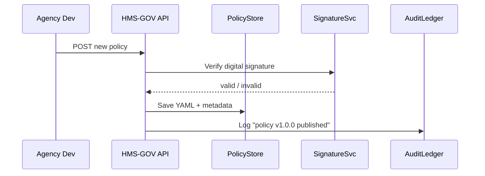

# Chapter 1: Governance Layer (HMS-GOV)

*Welcome to HMS-UTL! In this opening chapter we meet the “city hall” of the whole platform.*

---

## 1. Why Does HMS-GOV Exist?

Imagine the Consumer Product Safety Commission (CPSC) wants to change its **remote-work hiring policy** to attract talent faster.  
Before any microservice can implement this new rule, the platform must answer three questions:

1. Is the new policy written in an approved format?  
2. Has it been signed by an authorized official?  
3. Can every downstream service prove (later, in an audit) that it followed the exact policy text?

HMS-GOV is built to answer **yes** to all three—automatically.

---

## 2. Core Ideas in Plain English

| Concept | Think of it as… | Why it matters |
|---------|-----------------|----------------|
| Policy Document | A city ordinance | Describes *what* must be done (e.g., “Remote work allowed up to 2 days/week”). |
| Version Tag | Ordinance revision number | Allows the platform to know whether a policy is new, old, or retired. |
| Digital Signature | Mayor’s official seal | Proves the policy came from a trusted authority. |
| Compliance Check API | City clerk’s desk | Every service stops here first to ask, “Is this action legal?” |
| Audit Log | Public record archive | Lets auditors replay history and see *exactly* which version was used. |

---

## 3. Quick-Start: Publishing Your First Policy

We will walk through a **toy example** where CPSC publishes the new remote-work policy.

### 3.1 Minimal Policy File (`remote_work_v1.yaml`)

```yaml
id: cpsc-remote-work
version: 1.0.0
agency: CPSC
title: Remote Work Hiring Policy
body: |
  CPSC employees may work remotely up to 2 days per week.
effective_date: 2024-10-01
signed_by: "Jane Doe, Chief Human Capital Officer"
signature: "<base64-signature>"
```

*Beginners’ note*: The `signature` field is just a long string generated by a private key; we shorten it here.

### 3.2 Upload with a Single cURL Command

```bash
curl -X POST https://hms-gov.api/policies \
  -H "Content-Type: application/yaml" \
  --data-binary @remote_work_v1.yaml
```

**What happens?**

1. HMS-GOV validates the YAML structure and the digital signature.  
2. It stores the policy in its versioned repository.  
3. A new audit-log entry is created (you will explore this deeper in [Policy Versioning & Audit Ledger](02_policy_versioning___audit_ledger_.md)).

---

## 4. Consuming a Policy

A downstream hiring microservice now wants to know whether an applicant can be scheduled for two remote days.

```python
import requests

resp = requests.get(
    "https://hms-gov.api/validate",
    params={
      "policy_id": "cpsc-remote-work",
      "version": "latest",
      "action": "schedule_remote_days",
      "days_requested": 2
    }
)
print(resp.json())
```

Probable output (simplified):

```json
{
  "allowed": true,
  "policy_version": "1.0.0",
  "reason": "Within remote work limit"
}
```

Explanation:  
The microservice asks HMS-GOV; HMS-GOV looks up the policy ⇾ sees that 2 days is within limits ⇾ returns *allowed*.

---

## 5. A Peek Under the Hood

### 5.1 High-Level Flow



That’s it—five moving parts keep city-hall operations simple.

### 5.2 Tiny Implementation Snippet

_File: `hms_gov/publish.py` (excerpt)_

```python
def publish_policy(yaml_bytes: bytes, user):
    data = yaml.safe_load(yaml_bytes)           # 1. Parse YAML
    verify_signature(data, user)                # 2. Trust check
    version_tag = save_to_store(data)           # 3. Persist
    log_audit(user, data["id"], version_tag)    # 4. Record history
    return version_tag
```

Line-by-line:

1. Parse the incoming YAML.  
2. Call an internal `verify_signature` helper.  
3. Persist to `PolicyStore` (could be S3, Git, or a database).  
4. Write one line into the append-only Audit Ledger.

You will learn the nitty-gritty of Steps 3-4 in the next chapter.

---

## 6. Common Questions

**Q: Do I need to understand cryptography to use HMS-GOV?**  
A: No. You only have to paste the signature provided by your security office; the platform does the heavy lifting.

**Q: What if I upload a policy with the same ID but higher version?**  
A: HMS-GOV automatically marks the previous version as “superseded” and logs the change.

**Q: Can citizens see these policies?**  
A: Public-facing summaries can be exposed via the [User Portal (HMS-MFE Public Interface)](03_user_portal__hms_mfe_public_interface__.md).

---

## 7. What You Learned

• HMS-GOV acts like city hall—storing, signing, and validating every rule.  
• Publishing a policy is as simple as uploading a YAML file.  
• Downstream services call a single endpoint to stay compliant.  
• Under the hood, a signature service, a store, and an audit ledger keep things trustworthy.

Ready to dive deeper into how policies are versioned and traced? Continue to [Policy Versioning & Audit Ledger](02_policy_versioning___audit_ledger_.md).

---

Generated by [AI Codebase Knowledge Builder](https://github.com/The-Pocket/Tutorial-Codebase-Knowledge)