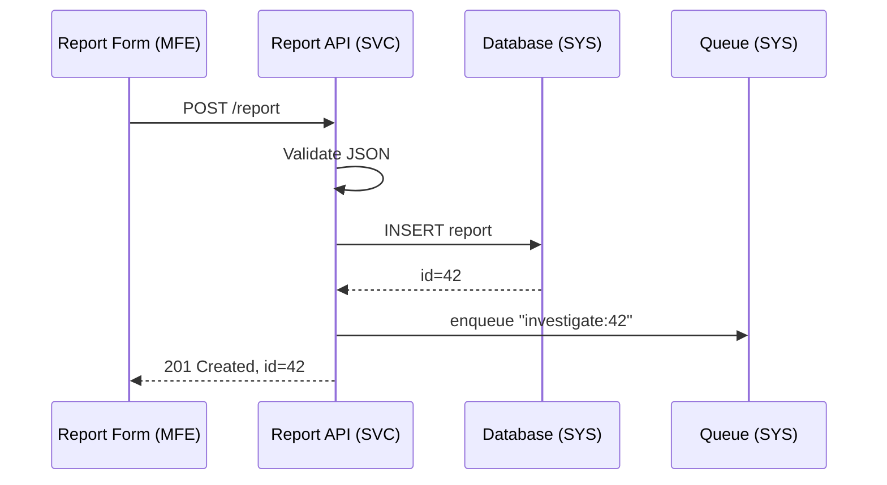

# Chapter 1: Multi-Layered System Architecture


Welcome to HMS-UTL!  
Before we write a single line of code, let’s get a mental picture of **where** that code will live. Imagine the entire Health & Municipal Services (HMS) platform as a **three-story government complex**:

```
┌────────────────────────────────┐
│ 3️⃣  Public-Facing Offices     │ ← HMS-MFE / HMS-GOV
├────────────────────────────────┤
│ 2️⃣  Service Desks            │ ← HMS-SVC
├────────────────────────────────┤
│ 1️⃣  Core Plumbing & Power    │ ← HMS-SYS
└────────────────────────────────┘
```

Knowing this “building layout” helps everyone—from junior developers to senior policy staff—route problems to the right floor and upgrade rooms without closing the whole complex.

---

## 1. Why Do We Need Layers?

### A real-world use case: Filing an Industrial Accident Report

The U.S. Chemical Safety Board (CSB) must accept electronic reports whenever a factory incident occurs.  
Our goals:

1. A citizen or factory manager can fill out a web form.  
2. The data is validated and stored securely.  
3. CSB staff can review the report and kick off investigations.  
4. New policy questions (e.g., “Was PFAS involved?”) can be added later **without downtime**.

Without layers, touching any part of this flow risks breaking the others. With layers, we can:

* Add a **PFAS** checkbox on the top floor (UI)  
* Store extra data mid-floor (services)  
* Patch encryption in the basement (system)  

—all independently.

---

## 2. Meet the Three Core Layers

| Floor | HMS Code | Plain-English Role | Gov Analogy |
|-------|----------|--------------------|-------------|
| 1️⃣ Basement | **HMS-SYS** | Low-level runtime, databases, queues | Plumbing, electrical, permits |
| 2️⃣ Middle | **HMS-SVC** | Domain & business services, APIs | Service desks, record rooms |
| 3️⃣ Top | **HMS-MFE / HMS-GOV** | Web & mobile front-ends, citizen portals | Public counters, info kiosks |

### 2.1 Basement – HMS-SYS
* Handles **databases**, message buses, and authentication.
* Think “pipes & power.” You rarely see them, but nothing works without them.

### 2.2 Middle Floor – HMS-SVC
* Exposes REST/GraphQL endpoints.
* Executes core logic: “Save report,” “Validate attachments,” “Assign investigator.”
* Only talks **up** (to UI) and **down** (to SYS).

### 2.3 Top Floor – HMS-MFE / HMS-GOV
* Micro-frontends: React/Angular/Vue components embedded in agency portals.
* Calls HMS-SVC via https to fetch or submit data.
* Must stay friendly for screen-reader users and mobile devices.

---

## 3. A 10-Second Code Tour

Below is a hyper-simplified flow for our accident report use case.

### 3.1 Front-End Snippet (Top Floor)

```typescript
// /mfe/reportForm.tsx
// Show a basic report form and POST data to HMS-SVC
function submitReport(data) {
  fetch("/svc/api/v1/report", {
    method: "POST",
    headers: { "Content-Type": "application/json" },
    body: JSON.stringify(data)
  })
  .then(r => r.json())
  .then(showConfirmation)
  .catch(alert);
}
```

Beginners’ note: We post JSON to the **middle floor**. No DB code here—only UI.

### 3.2 Service Layer Endpoint (Middle Floor)

```python
# /svc/report.py
@app.post("/api/v1/report")
def create_report(report: ReportIn):
    validate(report)         # business rules
    id = db.save(report)      # talk to basement
    notify("csb_queue", id)   # send message
    return {"id": id}
```

Explanation:  
1) Validate input  
2) Save to DB (basement)  
3) Notify investigators via queue.

### 3.3 System-Layer Stub (Basement)

```go
// /sys/db.go
func Save(report Report) (string, error) {
    // insert into Postgres, return UUID
}
```

Implementation details stay hidden from upper floors.

---

## 4. What Happens Under the Hood?

Let’s trace one report submission.



Key takeaway: **Each arrow crosses only one floor**—never jump from UI straight to DB.

---

## 5. Why This Matters for Agility

Scenario: Congress mandates PFAS tracking tomorrow.

* UI change → add checkbox (Top)  
* Service change → store new field (Middle)  
* System change? None (Basement schema already flexible)

Teams can deploy each piece separately. No “all-hands” outage night.

---

## 6. Talking to Other Chapters

You will soon meet:

* The [Policy Lifecycle Engine (HMS-CDF)](02_policy_lifecycle_engine__hms_cdf__.md) that lives mostly on the middle floor but writes new “rules” to the basement.
* The [Micro-Frontend Interface Library (HMS-MFE)](12_micro_frontend_interface_library__hms_mfe__.md) that makes building top-floor kiosks trivial.

Keep this three-floor map in mind—future chapters will plug into it.

---

## 7. Hands-On: Your First Commit

1. Clone the repo  
2. Navigate to `hms-sys/README.md`, run the DB docker compose.  
3. Navigate to `hms-svc/`, start the FastAPI server.  
4. Navigate to `hms-mfe/`, run `npm run dev`.  
5. Open `http://localhost:3000/report` and submit a test.

If everything is wired correctly, you’ll see `{ id: "some-uuid" }` and a console log saying the queue received a message.

---

## 8. Recap

You learned:

✔ Why HMS uses a **multi-layered architecture**  
✔ The role of HMS-SYS, HMS-SVC, HMS-MFE/HMS-GOV  
✔ How a single accident report flows through all three floors  
✔ How layers enable painless policy updates

Next we’ll dive deeper into the **policy rules engine** that lives mainly on the middle floor.

➡️ Continue to [Policy Lifecycle Engine (HMS-CDF)](02_policy_lifecycle_engine__hms_cdf__.md)

---

Generated by [AI Codebase Knowledge Builder](https://github.com/The-Pocket/Tutorial-Codebase-Knowledge)