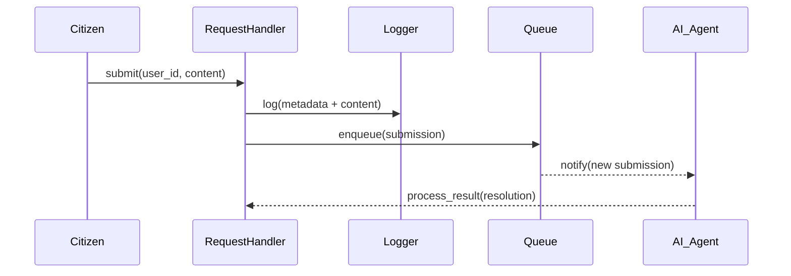

# Chapter 1: User Request & Complaint Handling

Welcome to the first chapter of HMS-UTL! In this chapter, we’ll learn how citizens or end users can file requests and complaints—just like visiting a government front desk to submit a grievance form—and how our system captures, logs, and routes each submission for follow-up.

---

## 1. Why We Need “User Request & Complaint Handling”

Imagine you’re at the passport office. The renewal process takes too long, so you fill out a feedback form at the service desk. The clerk:

1. Takes your form  
2. Stamps it with date & time  
3. Records your citizen ID  
4. Passes it to the right team (AI or human) for investigation  

Our abstraction does exactly that—automatically. It ensures every submission is:

- Captured with metadata (timestamps, user IDs)  
- Safely logged  
- Queued for analysis by an AI Agent or a Human Decision Maker  

This prevents lost feedback and guarantees a clear audit trail for public-sector accountability.

---

## 2. Key Concepts

1. **Submission**  
   The moment a user hits “Submit,” we gather their feedback text plus metadata.
2. **Logger**  
   Persists each submission to a database or file for audit and tracking.
3. **Queue**  
   Holds submissions in FIFO order until processed by AI or human staff.
4. **Router**  
   Decides whether an AI Agent handles the request first or routes directly to a Human Decision Maker.

---

## 3. Using the Abstraction: A Quick Example

Below is a minimal Python snippet illustrating how a gov-app might use our RequestHandler.

```python
# file: request_handler_example.py
from hms_utl.request_handler import RequestHandler

handler = RequestHandler()
# A citizen (user_id=123) files a complaint about "slow license renewal"
submission_id = handler.submit(
    user_id=123,
    content="My driver's license renewal is delayed by 3 weeks!"
)
print(f"Your submission ID is {submission_id}")
```

What happens next?

- The system logs your input with timestamp and user ID.  
- It enqueues the message in the “complaints” queue.  
- A notification might go out to the AI Agent or human reviewer.  

---

## 4. Under the Hood: Step-by-Step Walkthrough

Here’s a simple sequence when `submit()` is called:



1. **Citizen** calls `RequestHandler.submit()`.  
2. **RequestHandler** logs data.  
3. It puts the record in the **Queue**.  
4. The **AI_Agent** gets notified and begins analysis.

---

## 5. Internal Implementation Highlights

### 5.1. request_handler.py

```python
# file: hms_utl/request_handler.py
import time
import uuid
from hms_utl.logger import Logger
from hms_utl.queue import SubmissionQueue

class RequestHandler:
    def __init__(self):
        self.logger = Logger()
        self.queue = SubmissionQueue()

    def submit(self, user_id, content):
        # 1. Build metadata
        submission = {
            "id": str(uuid.uuid4()),
            "user_id": user_id,
            "content": content,
            "timestamp": time.time()
        }
        # 2. Persist
        self.logger.log(submission)
        # 3. Enqueue for analysis
        self.queue.add(submission)
        return submission["id"]
```

**Explanation:**  
- We generate a unique ID and timestamp.  
- We call `Logger.log()` to save it.  
- We call `SubmissionQueue.add()` to enqueue it.

### 5.2. logger.py

```python
# file: hms_utl/logger.py
class Logger:
    def log(self, data):
        # Imagine writing to a secure government database
        print(f"Logged submission {data['id']} at {data['timestamp']}")
```

### 5.3. queue.py

```python
# file: hms_utl/queue.py
class SubmissionQueue:
    def __init__(self):
        self._items = []

    def add(self, submission):
        self._items.append(submission)
        print(f"Enqueued {submission['id']} for processing")
```

---

## 6. Analogy Recap

Think of `RequestHandler` as a **front-desk clerk**:

- Takes in feedback (your content)  
- Stamps it (timestamp & ID)  
- Logs it in the ledger (Logger)  
- Places it into the inbox (Queue)  

The AI or a human staffer then pulls from that inbox and works on your case.

---

## Conclusion

You’ve learned how HMS-UTL captures and queues citizen feedback in a robust, auditable way. Next, we’ll explore how an AI Agent proposes concrete process improvements based on these submissions.

Continue to [Chapter 2: AI Process Proposal Engine](02_ai_process_proposal_engine_.md).

---

Generated by [AI Codebase Knowledge Builder](https://github.com/The-Pocket/Tutorial-Codebase-Knowledge)