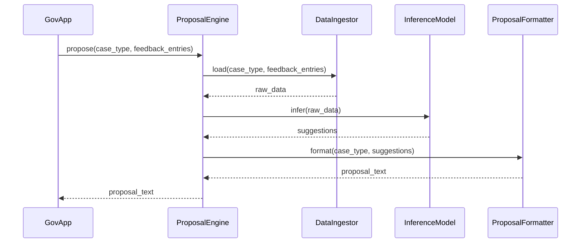

# Chapter 2: AI Process Proposal Engine

Welcome back! In [Chapter 1: User Request & Complaint Handling](01_user_request___complaint_handling_.md) we saw how citizen feedback is captured, logged, and queued. Now, let’s explore how our system’s “virtual consultant” turns that raw feedback into concrete workflow or policy proposals.

## 1. Why We Need an AI Process Proposal Engine

Imagine a state health agency that receives dozens of complaints about long wait times for patient appointments. Manually sifting through those comments to redesign the process can take weeks. Our **AI Process Proposal Engine** automates this by:

1. Ingesting past feedback and case metrics  
2. Running a smart model to spot bottlenecks  
3. Formatting clear, step-by-step recommendations

It’s like having a data-savvy consultant drafting a new rulebook—ready for review or even automatic rollout.

## 2. Key Concepts

1. **Data Ingestion**  
   Gathers all relevant inputs—feedback entries, usage logs, performance metrics—into one structured dataset.

2. **Model Inference**  
   Applies machine learning or rule-based logic to that dataset, extracting patterns and crafting improvement suggestions.

3. **Proposal Formatting**  
   Takes the raw suggestions and turns them into human-readable workflows or policy updates.

These three pieces work together inside the `ProposalEngine`.

## 3. Using the Proposal Engine

Below is a minimal example showing how an application might ask for a new appointment workflow for patient bookings:

```python
# file: example_proposal.py
from hms_utl.proposal_engine import ProposalEngine

engine = ProposalEngine()
proposal = engine.propose(
    case_type="patient_appointments",
    feedback_entries=[
        {"id": "fb1", "content": "Wait times over 3 weeks"},
        {"id": "fb2", "content": "Online form is confusing"}
    ]
)
print(proposal)
```

Beginner-friendly explanation:
- We import `ProposalEngine`.  
- Call `propose()` with a `case_type` and a small list of feedback.  
- The engine returns a text proposal, something like:

```
Proposal for patient_appointments:
1. Add online pre-screen form
2. Send automated SMS reminders
```

## 4. Under the Hood: Step-by-Step Flow

Here’s what happens when `propose()` runs:



1. **GovApp** calls `ProposalEngine.propose()`.  
2. Engine asks **DataIngestor** to load and structure all inputs.  
3. It then passes that data to **InferenceModel** for suggestion-generation.  
4. Finally, **ProposalFormatter** turns suggestions into a neat text proposal.

## 5. Internal Implementation Highlights

### 5.1 proposal_engine.py

```python
# file: hms_utl/proposal_engine.py
from .data_ingestor import DataIngestor
from .inference_model import InferenceModel
from .formatter import ProposalFormatter

class ProposalEngine:
    def __init__(self):
        self.loader = DataIngestor()
        self.model = InferenceModel()
        self.formatter = ProposalFormatter()

    def propose(self, case_type, feedback_entries):
        raw_data = self.loader.load(case_type, feedback_entries)
        suggestions = self.model.infer(raw_data)
        return self.formatter.format(case_type, suggestions)
```

Explanation:  
- We wire up three components.  
- `propose()` runs them in order: load → infer → format.

### 5.2 data_ingestor.py

```python
# file: hms_utl/data_ingestor.py
class DataIngestor:
    def load(self, case_type, entries):
        # Combine feedback entries and any logs or metrics
        combined = {"type": case_type, "entries": entries}
        print("Data loaded for", case_type)
        return combined
```

Analogy: DataIngestor is like a researcher collecting all the files before analysis.

### 5.3 inference_model.py

```python
# file: hms_utl/inference_model.py
class InferenceModel:
    def infer(self, data):
        # Imagine ML or rule-based logic here
        print("Running inference on", data["type"])
        # Dummy suggestions for illustration
        return [
            "Streamline booking through online portal",
            "Send automated appointment reminders"
        ]
```

Analogy: InferenceModel is our virtual consultant—studying data, spotting inefficiencies.

### 5.4 formatter.py

```python
# file: hms_utl/formatter.py
class ProposalFormatter:
    def format(self, case_type, suggestions):
        text = f"Proposal for {case_type}:\n"
        for i, s in enumerate(suggestions, 1):
            text += f"{i}. {s}\n"
        return text
```

Analogy: Formatter is the copywriter, turning bullet points into a polished proposal.

## Conclusion

You’ve now seen how the **AI Process Proposal Engine** turns raw feedback into actionable workflow or policy proposals—all with a few lines of code. Next up, we’ll ensure these AI-powered suggestions follow rules and oversight in our [AI Governance Framework](03_ai_governance_framework_.md).

---

Generated by [AI Codebase Knowledge Builder](https://github.com/The-Pocket/Tutorial-Codebase-Knowledge)